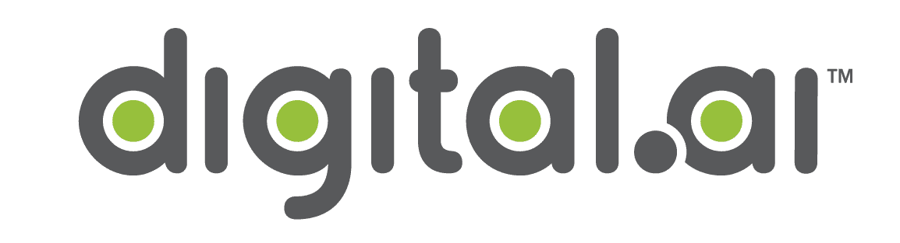

# Digital.ai:之前被称为 XebiaLabs 和 CollabNet Plus 的公司

> 原文：<https://devops.com/digital-ai-the-companies-formerly-known-as-xebia-labs-collabnet-plus/>

在 TPG Capital 进军 DevOps 的持续故事中，又落下了一只鞋。XebiaLabs 和 CollabNet VersionOne 合并而成的公司现在是 [Digital.ai](http://digital.ai) 。此外，该公司还收购了应用程序保护领域的领导者 Arxan。

我有机会采访了 Digital.ai 的首席执行官阿肖克·雷迪和阿尔山·首席运营官·马克·洛里昂，他们将成为 Digital.ai 未来平台的首席运营官。我们讨论的视频也可以在 [TechStrong 上找到。电视](https://techstrong.tv)，出现在下方。

## 他们说了什么

雷迪非常明确地表示，Digital.ai 不满足于简单地将这家 AppSec 公司加入其中。它还积极参与了其他几项收购的尽职调查。雷迪和 TPG 团队认为，目前新冠肺炎的形势让那些有现金的人可以捡一些便宜货。私人股本公司 TA Associates 拥有的阿尔山公司可能就是这种情况，该公司在 2013 年以 1.32 亿美元收购了阿尔山公司。考虑到目前不稳定的状态，TA 可能已经决定是时候离开旋转木马了。

无论如何，TA 的损失是 Digital.ai 的收获。阿尔山增加了一些急需的安全力量和蓝筹银行客户名单。但是，当然，这里真正的重头戏是建立端到端的 DevOps 公司，与 GitLab、GitHub、CloudBees、JFrog 和其他公司竞争。当最初的合并宣布时，我们在一篇文章中详细介绍了这个市场。

我的看法是，Digital.ai 确实还不是一家完整的公司。它甚至可能不会在 DevSecOps 空间中完成，因为 Arxan 不是典型的 DevSecOps 技术。这可能更像是一次机会主义收购。

此外，就高管团队而言，雷迪一直在悄悄地组建一支团队，该团队由他之前在 IBM、CA/Broadcom 工作过的一些最优秀的人以及被收购公司的高管组成。

请继续关注未来几个月 Digital.ai 的持续发展。

[https://player.vimeo.com/video/407824130](https://player.vimeo.com/video/407824130)

— [Alan Shimel](https://devops.com/author/ashimmy/)