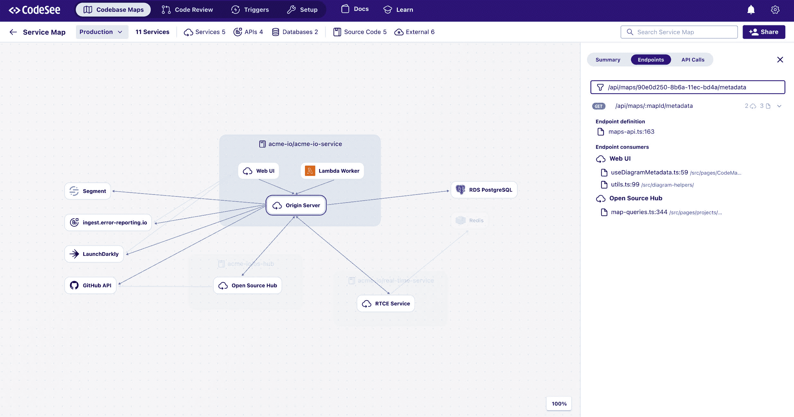

# CodeSee 推出企业代码库可视化平台

> 原文：<https://devops.com/codesee-unveils-enterprise-codebase-visualization-platform/>

CodeSee 本周发布了基于其 codebase 可视化和映射工具的企业平台,这使得开发者更容易导航和了解应用程序是如何开发的。

CodeSee 首席执行官 Shanea Leven 表示，这一功能使得[更容易理解如何构建代码库](https://techstrong.tv/videos/interviews/understanding-codebases-shanea-leven-codesee)，包括应用程序编程接口(API)，而不必阅读每一行代码。她说，组织可以使用 CodeSee 企业平台来审查代码，此外还可以更容易地向项目添加新的开发人员。

CodeSee 企业平台可以自动检测、可视化和链接到用于创建应用程序服务之间的每个连接的代码。该功能对于在部署应用程序之前或之后对应用程序进行的任何安全审查都特别有用。

Leven 指出，代码自动化功能将以前只能从一个开发人员传递给另一个开发人员的代码知识整理并自动化。

开发人员需要花费大量的时间来钻研代码库，以了解他们可以在哪些方面做出贡献。代码库越大，做出有意义的贡献就越有挑战性。

根据定义，微服务时代的应用程序开发现在是一项团队工作。一个单独的开发人员负责整个应用程序的日子已经一去不复返了。问题是找到一种方法，让开发团队在大多数人可能从未见过面的情况下更容易地协作。

自新冠肺炎疫情开始以来，对[开发人员生产力](https://devops.com/?s=developer+productivity)的关注大幅增加，促使各组织加快了一系列[数字业务转型](https://digitalcxo.com)计划。开发人员通常很难招募和留住，尤其是那些熟悉最新的[云原生](https://containerjournal.com)平台来构建和部署应用的人。让开发人员更容易地参与多个应用程序开发项目变得前所未有的重要。

当然，大多数开发人员宁愿花更多的时间写代码，而不是研究代码。用于理解代码库和维护开发环境的时间远远超过了编写代码的时间。如果没有 DevOps 团队的帮助，许多开发人员并不总是能够利用应用程序开发的进步来提供新的工具和平台。

不管怎样，开发和部署应用程序的速度需要加快。不确定的经济前景增加了企业领导者的压力，他们需要通过数字化方式转变流程，以增加收入和盈利能力。应用程序体验尤其重要，因为客户不愿意耐心等待组织长时间地微调他们的数字流程。

然而，不太清楚的是个体开发者可能愿意忍受的压力水平。毫无疑问，他们中的大多数人对雇佣他们的组织的需求表示同情，但这并不一定意味着他们愿意持续加班以实现使用现有工具可能无法实现的目标。