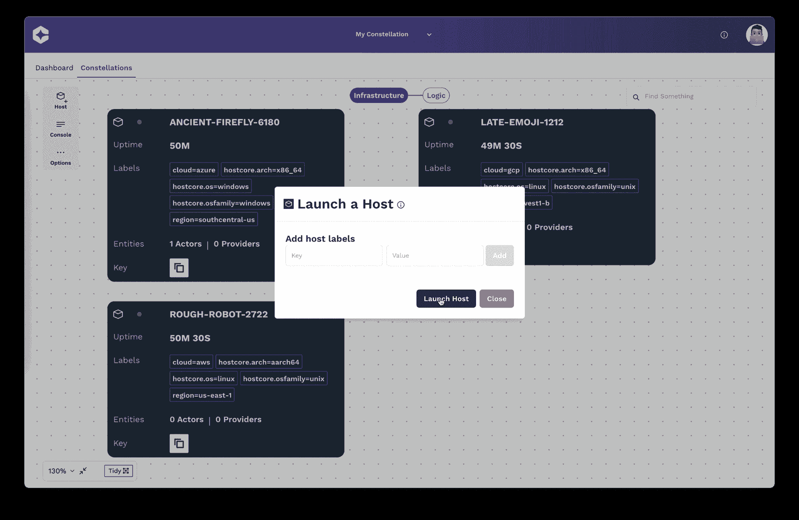

# Cosmonic 预览分布式 Wasm 应用的部署平台

> 原文：<https://devops.com/cosmonic-previews-deployment-platform-for-distributed-wasm-apps/>

Cosmonic 已经提供了一个平台的[预览版](https://cosmonic.com/blog/liftoff/)，用于部署使用可移植 WebAssembly ( [Wasm](https://webassembly.org/) )二进制格式构建的应用程序，这使得应用程序可以部署在任何平台上。

Cosmonic 首席执行官利亚姆·兰德尔(Liam Randall)表示，该公司正在提供对 Cosmonic 平台开发者预览平台的早期访问，以使开发者能够试验一种新型的软件产品，该产品将用于构建一类新的[云原生应用。](https://devops.com/?s=cloud-native+applications)

Cosmonic Platform Developer Preview Platform 是基于 wasmCloud 的，wasmCloud 是一个开源的应用程序运行时，它托管了编写为 Wasm 模块的组件，然后可以松散地连接这些组件来构建应用程序。Wasm 最初是在万维网联盟的支持下开发的，用于构建浏览器应用程序，它是一种可移植的二进制指令格式，用于构建描述内存安全的沙盒执行环境的软件。

这种方法取代了当前主流的构建软件的方法，这种方法依赖于缺乏明确界限的软件组件的集合。正是由于缺乏明确的界限，使得恶意软件能够如此容易地从一个软件模块流向另一个软件模块。最初由 Cosmonic 开发的 wasmCloud 运行时提供了一个部署分布式 Wasm 应用程序的平台，目前正在云本地计算基金会(CNCF)的支持下进行改进。

Randall 指出，在 Wasm 之前，构建应用程序的每一种格式都会导致“围墙花园”的产生，这导致开发人员被锁定在一个平台上。Randall 说，Wasm 是第一个无需任何修改就能使应用程序在包括 Linux 和 Windows 在内的平台上运行的软件产品。

Wasm 成为构建应用程序的首选产品可能还需要一段时间，但很明显，将一个 It 平台与另一个平台分隔开来的墙即将倒塌。一旦应用程序变得更加可移植，编写一次应用程序，然后将其部署到任何地方的长期目标可能最终会实现。同样重要的是，这些应用程序将在内存安全的沙箱中运行，这比在传统 IT 平台中运行的沙箱更加安全。事实上，随着越来越多的组织审查其软件供应链的安全性，他们可能会决定加速采用 Wasm 来构建更安全的应用程序。

自然，向 Wasm 的过渡将对 DevOps 团队产生重大影响，因为它代表了简化跨多个平台的部署流程的机会。实际上，随着跨多个平台的流程使用 wasmCloud 等平台变得更加自动化，应用程序开发和部署的总成本将会下降。Randall 指出，最终，开发人员今天需要驾驭的大部分基础设施复杂性将被消除。

目前还不清楚 Wasm 将在多大程度上推动向另一个计算时代的过渡，但改变 It 几乎每个方面的潜力已经出现。最终，这个问题将取决于开发人员愿意多快地接受另一个用于构建和部署应用程序的软件构件。显而易见的是，将使 Wasm 实验成为可能的平台数量正开始成倍增加。