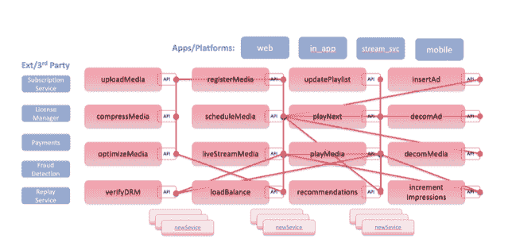

# 微服务解释:不是你爸的 SOA

> 原文：<https://devops.com/microservices-explained-not-your-fathers-soa/>

微服务经常被称为面向服务的架构(SOA)的变体或衍生物，如果本质上不是一回事的话。 有相似之处，两者都是围绕服务的概念来设计的， [就是相似之处的终结](https://medium.com/microtica/microservices-vs-soa-is-there-any-difference-at-all-2a1e3b66e1be)。每一个都是围绕一套不同的原则建立的，旨在解决不同的问题。

微服务架构是围绕关键概念构建的，当应用这些概念时，不仅将其与其他架构区分开来，还能提供 优势，加速软件交付并帮助扩展大型复杂应用。 为了兑现云原生的承诺，微服务必须松散地 耦合，以便最终能够独立部署。任何微服务 都可以更新和部署，只是容器化的微服务，而 不需要更改其他微服务。松散耦合的微服务 意味着它们不共享数据库或维护状态，例如 。

微服务应该有多大？或者换句话说，它应该做多少？答案从“一件单独的事情”到“一小组高内聚的相关代码”不等。另一个因素 是粒度太细会使基于微服务的应用 溢出大量微服务，增加复杂性，并且 使得通过可观察性和跟踪进行分类非常具有挑战性。

扩展基于微服务的应用是另一个重要因素。自主微服务可以使用 [Kubernetes](https://containerjournal.com/?s=) 等容器编排工具复制和扩展性能和 工作负载。

微服务通信是通过精心设计的 API 实现的，围绕微服务提供给 通过 API 参与的任何人或任何事的业务或运营能力而创建。API，以及通过 API 提供的数据 ，通常被称为‘技术独立’更好的说法是 微服务 API 是使用 RESTful 和 [GraphQL](https://devops.com/?s=GraphQL) 等方法在网络上构建的，这些方法不依赖于任何特定的 操作环境、技术或编程语言。JSON，YAML 和 XML 同样表示可以跨技术转移的数据。

下图是一个媒体应用程序，演示了微服务架构的原理。用于调度媒体、数字版权 管理、跟踪印象和添加新广告插入的微服务是松散耦合的 ，是自治的，并且具有定义良好的 API 接口。 每一个微服务都可以独立于其他微服务进行快速变更、增强和部署 。

面向服务的架构(SOA)的出现是为了解决一个非常不同的问题；单片应用程序的庞大规模和复杂性。单片应用程序有非常大的代码库，通常不能很好地划分功能或业务逻辑。这使得对 代码库的修改甚至对那些非常了解 代码库的开发者来说都是一个挑战。

SOA 中的服务通常被用来将相似的业务逻辑集合在一起，然后根据需要将它们作为服务与 应用程序的其他部分共享。像消息总线这样的技术被用来发出 服务请求，并作为跨 多个服务和应用程序其他部分的请求的流量管理器。虽然可重用性是一个关键的设计考虑因素，但是 SOA 服务仍然很大，并且高速部署服务并不是一个重要的设计考虑因素。在作为更大的软件版本的一部分进行部署之前，SOA 服务通常需要花费相当多的时间来编码和测试 服务，包括跨应用程序其他部分的相互依赖性 。

重要的一点是:微服务和 SOA 架构各有利弊；没有一个比另一个更好。使用哪种架构主要取决于您正在构建的应用程序的目的。对于需要与许多其他应用程序集成的更大、更复杂的企业应用程序环境，您可能会选择 SOA。这比不需要中间件元素来管理应用程序内部或其他应用程序之间的请求的小型应用程序更适合。另一方面，微服务更适合较小的、划分良好的基于 web 的系统。它们正在成为当今云原生应用的标准，也非常适合开发移动或 web 应用，因为它们给了开发人员更多的控制权。