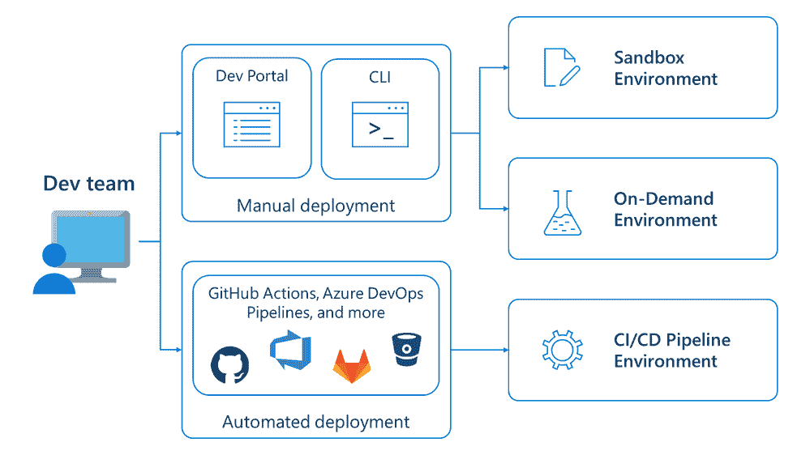

# 微软在云中扩展 DevOps 产品组合

> 原文：<https://devops.com/microsoft-expands-devops-portfolio-in-the-cloud/>

在本周举行的 Ignite 大会上，微软发布了一系列对其 DevOps 产品组合的更新，作为简化云应用构建、管理和安全的努力的一部分。

微软正在增加预览版中可用的 Azure 部署环境，使开发者团队能够调用一组最佳实践，使用基于项目的模板快速构建应用基础设施。

微软还在为 Dev Box 提供 Visual Studio Image，这是一个用于访问微软 Azure cloud 上的工作站的自助式环境。这些图像使得访问 Visual Studio 函数和补充工具变得更加简单。微软还发布了最新版本的 Visual Studio 2022 应用开发平台。

此外，微软已经与 Postman 签署了[协议，就集成进行合作，该协议承诺加速应用程序编程接口(API)的开发，首先是从 Azure API management 向 Postman 导入和导出 API 的能力。](https://techcommunity.microsoft.com/t5/apps-on-azure-blog/enhanced-api-developer-experience-with-the-microsoft-postman/ba-p/3650304)

微软也正在普遍提供一种预测工具，该工具采用机器学习算法来自动扩展 Azure 上的虚拟机。此外，Azure Monitor 日志服务的[更新现在可以以当前成本的五分之一接收日志，并将其存档长达七年。微软现在还提供从传统日志代理迁移到 Azure Monitor 代理(AMA)的工具，并添加了 Java profiling 和 Java Flight Recorder (JFR)工具，该工具从 Java 虚拟机和 Java 应用程序收集数据。](https://techcommunity.microsoft.com/t5/azure-observability-blog/general-availability-get-more-value-from-your-logs-with-azure/ba-p/3643129)

在管理应用程序环境方面，微软现在已经[扩展了 Azure Automanage](https://techcommunity.microsoft.com/t5/azure-governance-and-management/generally-available-simplify-management-and-operations-with/ba-p/3647522) 的范围，除了在 Azure 云上运行的虚拟机之外，现在还包括通过该公司的 Arc 管理平台管理的服务器。添加到 Azure Automange 的其他功能包括增强的备份设置和计算服务器基线的不同审计模式，以及指定自定义日志分析工作区和 Azure 标签以基于设置识别资源的能力。

微软还预览了一个增强的 Azure 远程支持服务，微软人员将通过该服务收集日志和命令来帮助解决问题。

最后，在保护应用程序方面，GitHub Advanced Security for Azure devo PS 工具现在可以在 private preview 中使用，它承诺使用 CodeQL 代码扫描器在软件生命周期中更简单地识别和修复暴露的秘密和易受攻击的开源依赖。

与此同时，微软正在[提供 Microsoft Defender for DevOps](https://www.microsoft.com/security/blog/2022/10/12/5-cybersecurity-capabilities-announced-at-microsoft-ignite-2022-to-help-you-secure-more-with-less/) 以更好地保护为配置云而创建的代码。此外，它还将使 DevOps 团队能够更好地确定跨多个云的多管道 DevOps 环境的补救工作的优先级。Microsoft Defender for DevOps 在预览版中提供，支持 GitHub 和 Azure DevOps，并计划在未来支持其他 DevOps 平台。

preview 中提供的另一个安全功能是 Microsoft Defender 云安全态势管理(CSPM ),它承诺通过攻击路径分析提供基于风险的上下文信息，使用云安全图表服务来识别最可利用的云资源。微软还为 Microsoft Defender for Cloud 提供了一个通用的多云安全框架，以帮助组织采用 DevSecOps 最佳实践。

微软还预览了对 Microsoft Defender for Servers 的无代理扫描的支持，以及对 Microsoft Defender for Containers 的扩展，该扩展增加了对 Amazon Web Services 弹性容器注册表的支持。

微软首席执行官塞特亚·纳德拉告诉与会者，微软正在共同努力将安全功能嵌入其平台，以降低安全总成本。DevOps 团队目前依赖的许多工具都没有很好地集成，这在应用程序环境随着更多云原生应用程序的部署而变得更加动态的时候是一个挑战。

现在说更好的安全性会吸引组织选择一个云平台还是另一个云平台还为时过早。但几乎可以肯定的是，云服务提供商将有望为保护软件供应链做出贡献。