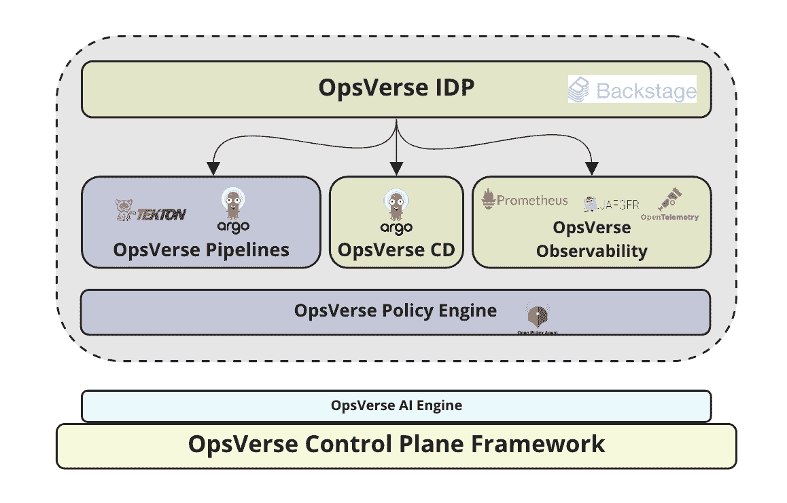

# OpsVerse 向托管 DevOps 服务添加后台目录

> 原文：<https://devops.com/opsverse-adds-backstage-catalogue-to-managed-devops-service/>

OpsVerse 本周为其托管的 DevOps 服务增加了一个用于构建开发者门户的开源后台目录软件。

Backstage 最初由 Spotify 开发，它可以集中管理由多个开发团队构建和维护的多种服务。在云计算原生计算基金会(CNCF)的支持下，Backstage 正在发展。

OpsVerse 首席执行官 Arul Francis 表示，该公司现在正在利用 Backstage 创建一个名为 [OpsVerse ONE](https://www.businesswire.com/news/home/20221018005860/en/OpsVerse-Launches-Internal-Developer-Platform-Unifying-DevOps-Tools-Microservices-Catalog-and-Documentation) 的集中控制平面，通过它，组织可以更容易地集中管理 DevOps 工具链。他指出，每个应用程序团队都可以看到他们拥有的所有服务和相关资源，然后通过单击启动一个项目。

托管 OpsVerse 平台基于开放源代码软件的管理版本，如 Argo continuous delivery (CD)和 Prometheus monitoring 软件，OpsVerse 使各组织能够将其作为一套软件即服务(SaaS)应用程序进行访问。然后，这些应用程序可以部署在亚马逊网络服务(AWS)、微软或谷歌提供的云平台上，或者部署在内部 IT 环境中。

Francis 指出，OpsVerse ONE 的加入还将使通过目前后台目录软件可用的 80 多个插件来扩展 OpsVerse 工具链变得更加简单。

目前还不清楚组织对托管开发运维平台的接受程度，但至少较小的组织应该会发现，依靠托管服务来接受最佳开发运维实践会更简单。也有很多大型组织可能会认为，在多年来以现在既难以维护又难以保护的方式集成各种工具和平台之后，继续管理 DevOps 工具链已经成为一个问题。OpsVerse 声称，在过去的六个月里，它支持的客户数量已经增加了两倍。

随着应用程序开发在微服务时代变得越来越复杂，许多组织正处于十字路口。他们需要决定在多大程度上继续投入资源来管理 DevOps 平台比将它们作为云服务来消费更有意义。现在分配给管理 DevOps 平台的许多资源理论上可以转移到构建和部署更多应用程序上。在某些情况下，组织可能会决定继续依赖传统的 DevOps 平台来维护现有的应用程序，同时采用云服务来构建现代的云原生应用程序，这些应用程序比单一应用程序具有更多的依赖性。

无论组织决定在多大程度上依赖托管服务，随着 Backstage 等平台的不断发展，扩展开源工具链将变得更加简单。Spotify 开发后台是为了在决定为开源社区做贡献之前，给自己的内部应用程序开发和部署流程带来一些秩序。虽然 Backstage 仍是 CNCF 的一个孵化级项目，但它已经在多个 DevOps 生产环境中使用，可以更轻松地集成其他工具，而不必牺牲集中管理 DevOps 环境的能力。