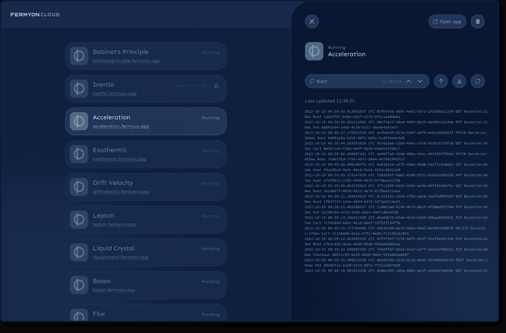

# Fermyon 为构建 Wasm 应用程序添加了托管 PaaS

> 原文：<https://devops.com/fermyon-adds-managed-paas-for-building-wasm-applications/>

Fermyon Technologies 本周推出了一个托管平台即服务(PaaS)环境，被称为 [Fermyon Cloud](https://www.globenewswire.com/news-release/2022/10/24/2540093/0/en/Fermyon-Gives-Developers-Instant-Self-Service-for-WebAssembly-Microservice-Application-Deployment-With-Fermyon-Cloud-Closes-20-Million-Series-A-Funding-Led-by-Insight-Partners-in-Q.html) ，它有望使构建 [WebAssembly](https://devops.com/?s=WebAssembly) (Wasm)应用程序变得更加简单。

在 [KubeCon + CloudNativeCon 北美](https://events.linuxfoundation.org/kubecon-cloudnativecon-north-america/)会议期间的 [Cloud Native Wasm Day](https://events.linuxfoundation.org/cloud-native-wasm-day-north-america/) 活动中宣布，Fermyon Cloud 现已推出公测版。

刚刚筹集了 2000 万美元资金的 Fermyon 首席执行官 Matt Butcher 表示，IT 团队可以使用 Fermyon Spin 开发工具和该公司今年早些时候推出的 Fermyon 平台快速构建和部署 Wasm 应用程序。

Fermyon Cloud 添加了一个由 Fermyon 管理的自以为是的 PaaS 环境，它可以在不到一毫秒的时间内启动 Spin 应用程序。Butcher 指出，它使用无服务器应用程序编程接口(API ),可以在加载应用程序时对其进行缓存和优化。

Wasm 最初是由万维网联盟(W3C)在五年多前开发的，目的是为执行 JavaScript 代码的浏览器创建一种通用格式，现在它被用来快速构建可以部署在任何服务器平台上的轻量级应用程序。实际上，在最初引入 Java 编程语言大约 25 年后，能够编写一个应用程序并将其部署到任何地方的承诺终于实现了。

Wasm 不一定会取代现有的构建应用程序的方法，至少短期内不会，但它确实为开发运行速度更快的轻量级应用程序提供了无服务器计算框架的替代方案。

此外，在组织越来越关注应用程序安全性的时候，Wasm 的吸引力是显而易见的。构建应用程序的现有方法依赖于软件组件的集合，而这些组件之间往往缺乏明确的界限。因此，恶意软件感染应用程序的所有组件变得相对容易。相比之下，Wasm 代码在沙箱环境中运行，沙箱环境隔离执行环境，以消除恶意软件在应用环境中横向移动的能力。

Butcher 指出，Wasm 特别适合于构建以前可能部署在无服务器计算框架上的轻量级应用程序。他补充说，开发人员在使用无服务器计算框架时遇到的问题是，这些框架基于启动时间相对较慢的容器。

Wasm 在接下来的几个月中获得了多少牵引力还有待观察，但 Butcher 表示，他预计大多数后端服务，如数据库，将继续使用容器来构建。然而，Fermyon 认为，未来许多由普通开发人员构建的云原生应用程序将使用 Wasm 来构建。Butcher 说，从长远来看，Wasm 也将很快用于构建注入机器学习算法的应用程序。

与此同时，DevOps 团队应该为更多 Wasm 代码通过持续集成/持续交付(CI/CD)管道做好准备。当然，挑战在于，代码也需要与通过这些管道的所有其他软件工件一起被管理。