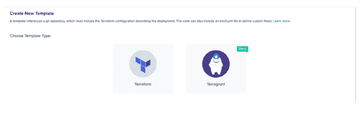

# IaC 框架:特定于供应商还是多重云？

> 原文：<https://devops.com/iac-frameworks-vendor-specific-or-multi-cloud/>

在过去的几年里，我一直在密切关注着向作为代码 T1(IaC)框架的基础设施的转变。随着从整体服务向微服务的转变，以及从主要是虚拟机(VM)向云原生架构的转变，应用程序变得更加复杂，这使得自动化基础架构以快速响应变得更加重要。

在这个意义上，我把 IaC 称为“第三次云革命”纵观云转型的历史，从物理服务器到虚拟机的转变(大约 20 年前由 VMware 领导)将是第一次云革命。从虚拟化数据中心到公共云的迁移(大约 10 年前由 AWS 领导)将是第二次云革命。随着向公共云的转移，人们突然能够点击按钮来提供新的资源，包括“硬件”

然而，在过去的几年里，我们看到了更少的点击和更多的代码。工程师编写并维护 IaC，然后某个东西执行代码。工程师对基础设施的影响比过去大得多，这是第三次云革命。我们主要看到了推动这场革命的四个 IaC 框架——[Terraform](https://github.com/hashicorp/terraform)和 [Pulumi](https://github.com/pulumi/pulumi) (均为多云) [CloudFormation](https://aws.amazon.com/cloudformation/) 和 [ARM](https://docs.microsoft.com/en-us/azure/azure-resource-manager/management/overview) (特定于供应商)。

我最近与 Pulumi 的首席执行官 Joe Duffy、Azure 的首席技术官 Mark Russinovich 以及 AWS 社区英雄和 Hashicorp 大使 Anton Babenko 进行了交谈，他是微软 Terraform 的负责人，IBM Cloud 的 Terraform 负责人，也是 Gruntwork 的创始人之一。在我们的头脑风暴会议之后，很明显我们都同意 IaC 将对云操作产生巨大影响。在这篇博客中，我将分享我对多厂商 IaC 和单厂商 IaC 框架的看法；讨论它们与 iOS 和 Android 之间的差异相比如何，以及我认为哪个方向会胜出。

大型云供应商似乎在“全力以赴”并创建完整的生态系统，iOS 风格，他们让一切都与相关的服务和工具配合得很好。AWS 刚刚发布了 [AWS Proton](https://aws.amazon.com/proton/) ，它可以与 CloudFormation 一起工作。他们说 Terraform 在他们的路线图上，但时间会证明一切。微软似乎提供了更多基于 ARM 的解决方案，比如[二头肌](https://github.com/Azure/bicep)。当我与这些公司的高管交谈时，他们坚信这种供应商锁定/封闭方法的巨大价值。他们真的相信这将会以最好的方式帮助他们的客户。也许他们是对的。

另一方面，当我与社区交流时，我听到了不同的意见。Azure customers 的 DevOps 工程师不会争论是选择 Terraform 还是 ARM。AWS 客户的 DevOps 工程师不会争论是选择 Cloudformation 还是 Terraform。三年前是这样，现在不是了。现在，真正的争论是选择 Terraform 还是 Pulumi。工程师们更喜欢一种多厂商、开源、无厂商限制、兼容其他开源解决方案(如 Open Policy Agent 和 Terragrunt)的语言来帮助 Terraform 用户。这是安卓风格的方法——开放平台。

此外，我从社区中听到了新的短语，这让我认为未来将朝着这个方向发展。Cloud Posse 的 Erik Osterman 开始使用 TACOS 的缩写——Terraform 自动化和协作软件(见视频[此处](https://www.youtube.com/watch?t=59&v=4MLBpBqZmpM))。这需要时间，但是，向前看，开发人员和社区将掌握 IaC 未来的关键，而不是高管和大型供应商。

当然，你可以反驳说，“iOS 是一个伟大的操作系统。”这显然是真的，但我认为这是一个很大的区别，为什么 Android 的方法赢得了 IaC 市场。答案在于最终用户；苹果生态系统是面向最终用户和消费者的解决方案，而 IaC 是关于更大规模的基础设施决策。就像从整体服务到微服务的转变一样，开发者更喜欢小而孤立的部分，而不是一个大系统。有了 Terraform 和 Pulumi，开发者获得了更多的自由。也许公司会从 AWS 转移到 GCP 或 Azure，反之亦然。也许它也需要一个 Auth0 provider，并希望以同样的方式管理它。也许使用开放策略代理来管理部署会成为现状。开发者需要自由，而消费者只需要一个伟大的产品。

但问题仍然没有答案:Terraform 还是 Pulumi？现在下结论还为时过早，而且坦率地说，IaC 的空间对两者来说都绰绰有余。也许更多的开源和多厂商框架将会出现，一个未知的框架将会统治这一天。Terraform 提供了一个由提供商、支持者和维护者组成的庞大生态系统。Pulumi 已经开始提供所有这些，以及它的命令式方法，这似乎对开发人员更有吸引力。