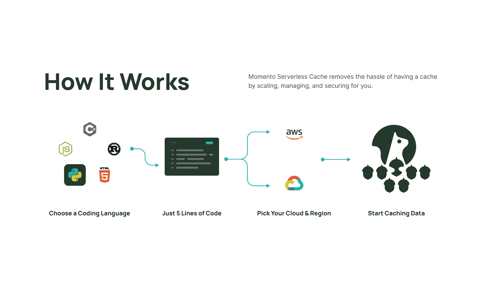

# Momento 推出弹性云缓存服务

> 原文：<https://devops.com/momento-launches-elastic-cloud-caching-service/>

Momento 本周秘密发布了一个弹性的[无服务器缓存](https://www.globenewswire.com/news-release/2022/11/02/2546839/0/en/Founded-by-Former-AWS-DynamoDB-Engineering-Leadership-Momento-Reinvents-Caching-for-Cloud-Databases-With-15-Million-in-Seed-Funding-Led-by-Bain-Capital-Ventures.html)平台，该平台有望提高部署在云中的数据库上运行的应用程序的性能，同时降低成本。

刚刚筹集了 1500 万美元的种子资金，Momento 首席执行官兼联合创始人 Khawaja Shams 表示，无服务器高速缓存使 IT 团队能够访问一个用于访问高速缓存的[无服务器](https://devops.com/?s=serverless)计算框架，可用于提高应用程序的交互性。

当然，缓存已经被广泛用于提高运行在云中数据库上的应用程序的性能。但是，如今的组织需要调配额外的缓存内存来应对性能工作负载峰值。他指出，随着时间的推移，这种方法会增加云计算的总成本。

无服务器高速缓存使得更容易共享弹性内存池成为可能，该弹性内存池可以通过应用编程接口(API)在几秒钟内调用，API 本身通过向应用添加五行代码来调用。Shams 说，Momento 缓存服务每秒可以处理数百万个事务，这些事务可以分布在多个应用程序中。

Momento 无服务器缓存服务还可以自动管理热键，保持较高的缓存命中率，并保持较低的尾部延迟。

Shams 说，已经在亚马逊网络服务(AWS)或谷歌云平台(GCP)上使用 Momento 的组织包括哥伦比亚广播公司、NTT Docomo 和 Wyze Labs。

Shams 指出，总的来说，在经济衰退之后，对云成本的审查要多得多。他补充说，越来越多的 IT 团队开始注意到这样一个事实，即各种云原生平台使他们能够更有效地消耗云资源。

一个简单的事实是，太多的组织正在以与管理内部 IT 环境几乎相同的方式管理云资源。容量被专用于虚拟机，以确保应用程序可用性，而更少考虑成本，因为人们认为云使得在任何问题上投入硬件资源变得很容易。挑战在于，这些云资源的账单往往会在每个月底增加。Shams 指出，事实上，云数据库服务是最昂贵的消费之一。

目前还不清楚在未来几周和几个月内，有多少组织将优化云资源的消耗，但显然需要更多的监管。历史上，组织让开发人员以敏捷的名义提供资源，很少或根本不考虑成本。既然财务团队希望至少确保云资源得到最佳利用，那么无疑会有更多关于云支出模式的审查。

与此同时，许多组织还可能决定加快采用云原生技术的速度，以优化支出。Kubernetes 集群和无服务器计算的一个更具吸引力的特性是，它们可以更轻松地根据需要扩展和缩减计算资源，从而消除过度配置云基础架构的需求。当然，挑战在于获取和掌握这些技术的成本仍然很高。