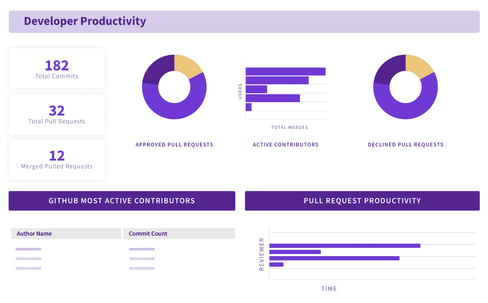

# Opsera 为 GitHub Actions 带来 DevOps 智能

> 原文：<https://devops.com/opsera-brings-devops-intelligence-to-github-actions/>

Opsera 今天宣布，它已经扩展了收集 DevOps 情报的平台，以包括对 GitHub Actions 持续集成/持续交付(CI/CD)平台的支持。

Opsera [首席执行官 Kumar Chivukula](https://techstrong.tv/videos/interviews/software-delivery-opsera) 表示，随着 GitHub Actions 被更广泛地采用，越来越需要实时提供基于 Git 的工作流的更大可见性。他补充说，用于 Opsera 平台的 GitHub Actions Insights 模块可以跟踪这些工作流程中的关键绩效指标(KPI)。

Chivukula 指出，我们的目标是通过识别瓶颈来简化数据驱动的决策，从而更好地优化这些工作流。

Opsera 平台通过扫描所有存储库和分支(包括提交历史记录)来展现这种智能，并在超过 KPI 阈值或合规性要求时生成警报和通知。DevOps 团队还可以使用该平台，使用一组由 Google 定义的 [DevOps 研究和评估](https://devops.com/?s=DORA+metrics) (DORA)指标来评估他们的整体 DevOps 成熟度。展望未来，Opsera 还计划开始基于软件工件的供应链级别(SLSA)框架来保护软件供应链，该框架也是由 Google 定义的。

Opsera 等平台使得[将分析应用于开发运维工作流](https://techstrong.tv/videos/interviews/software-delivery-opsera)成为可能，因为它们变得越来越复杂。例如，各种应用程序模块之间存在的依赖关系的数量使得 DevOps 团队很难人工识别一个项目的延迟可能对任何数量的其他下游项目产生的影响。

此外，许多组织热衷于发现其他应用程序开发团队应该采用什么样的最佳实践。

最后，Chivukula 指出，许多开发人员倾向于将存储库作为各种软件工件的垃圾场。他补充说，DevOps 团队需要一个智能工具，能够识别哪些工件对业务来说是最重要的。Chivukula 指出，否则，手动在存储库中查找工件就相当于大海捞针。

GitOps 本质上是一种更有主见的 DevOps 方法，它依赖于开源 Git 存储库的一个实例作为关于环境的真实信息的单一来源，而不是一组应用程序或服务器配置文件。GitHub 将 GitOps 视为使用 GitHub Actions 平台将代码库扩展到 DevOps 工作流领域的一种方式。尚不清楚 GitHub Actions 以牺牲其他 CI/CD 平台为代价获得了多少吸引力，但对于相对不熟悉 DevOps 并已经使用 GitHub 作为代码库的组织来说，它提供了一条阻力最小的途径。

不管组织为什么采用 DevOps 智能平台，在经济衰退期间，优化工具链之间的工作流程的需求变得更加迫切。越来越明显的是，在[数字业务转型](https://digitalcxo.com)的时代，应用交付延迟的成本会直接影响组织的收入水平。