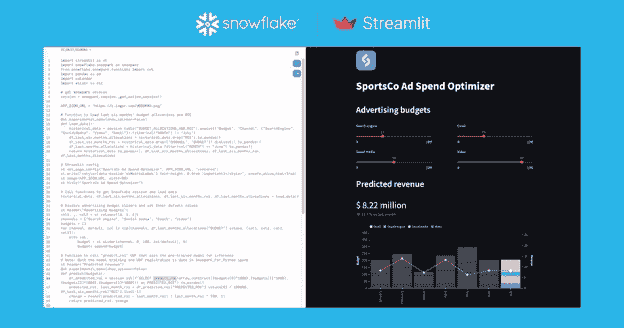

# 雪花为在平台上构建和部署应用创造了条件

> 原文：<https://devops.com/snowflake-makes-case-for-building-and-deploying-apps-on-platform/>

在 Snowday 2022 活动期间，Snowflake 本周采取措施，简化在其云平台上构建管理数据的应用程序，并增强平台的整体安全性。

该公司已经推出了 Snowpark T1，这是一个构建 Java、Scala、SQL 或 Python 应用的框架。雪花还承诺在 2023 年初提供一个开源的 Streamlit 框架，用于构建雪花今年早些时候收购的 Python 应用程序。

雪花还透露，它正在向该平台添加[可观察性](https://devops.com/?s=observability)工具，以使其更容易构建、测试、调试、部署和监控数据管道，包括警报工具(私人预览)、日志记录功能(私人预览)、事件跟踪(私人预览)、任务图表和历史(公共预览)。

雪花产品管理总监 Torsten Grabs 表示，这些功能将更容易提醒开发团队在雪花平台上部署的应用程序可能出现的问题。

与此同时，雪花还通过使无服务器任务功能普遍可用，使构建数据管道变得更加简单。此外，该公司正在预览一个模式推理引擎，它使摄取数据变得更简单，并提供一个动态表功能，以声明方式管理数据管道。

添加到该平台的其他功能包括查询加速服务的公开预览，以按需提供额外的计算资源。除了提供搜索优化，雪花还通过连接消除提高了查询效率。

现在还有一些成本优化工具，使 IT 团队能够对雪花服务进行成本效益分析，此外还有一些工具使跨运行雪花平台的多个云计算环境复制数据变得更加容易。

IT 团队现在还可以通过 public preview 中的功能复制流和任务，该功能使数据管道能够无缝地在二级雪花帐户上工作，并使用私有测试版中提供的图形工具配置故障转移。

最后，雪花还增强了其跨云 Snowgrid 功能，除了应用标签和搜索屏蔽数据之外，还可以更容易地共享公共和私有数据列表。

雪花平台的最新版本出现在越来越多的组织开始采用 [DataOps](https://devops.com/?s=DataOps) 最佳实践来管理数据的时候。Snowflake 现在正在一个平台上构建和部署应用程序，该平台可以自动管理应用程序用来访问数据的数据管道。

目前还不清楚雪花平台将在多大程度上用于托管应用程序，但该公司显然认为驻留在其云平台上的数据量将吸引广泛的应用程序开发人员，而这些开发人员反过来需要 DevOps 团队的支持。

当然，Snowflake 并不是唯一一家有类似野心的数据仓库或数据湖提供商。然而，无论平台如何，有一点是明确的，即随着 IT 组织寻求简化目前驻留在云中的大量数据的管理，开发运维与数据运维工作流的融合正在进行中。