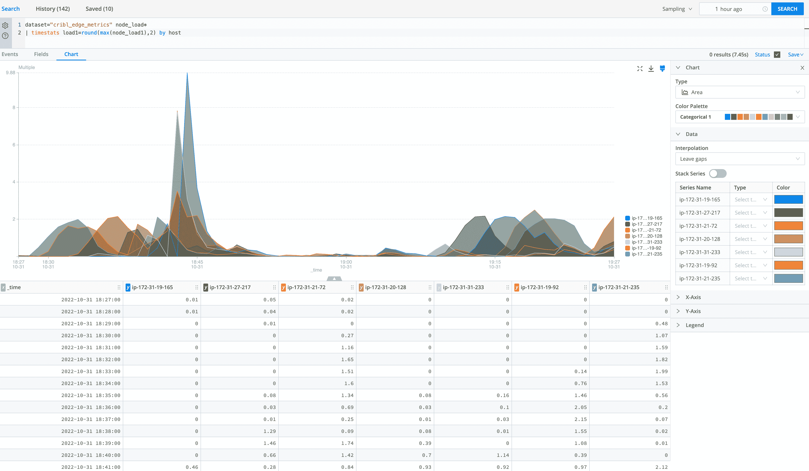

# Cribl 简化了遥测数据分析

> 原文：<https://devops.com/cribl-simplifies-telemetry-data-analytics/>

Cribl 今天宣布了搜索功能的普遍可用性，这使得查询可观测性数据变得更加简单，而不必首先收集和集中存储它。

Cribl 市场战略高级总监 Nick Heudecker 表示, [Cribl Search](https://www.prnewswire.com/news-releases/cribl-announces-general-availability-of-cribl-search-and-expands-observability-innovations-301672723.html) 使遥测数据在其来源点或存储在低成本对象存储平台时进行分析成为可能，从而最大限度地降低成本。

随着收集的遥测数据量持续增长，DevOps 团队正在努力消化这些数据。Cribl 利用其创建的平台对遥测数据的收集进行流式传输和标准化。Heudecker 说，Cribl Search 增加了在数据所在的端点查询数据的能力。

虽然[可观察性](https://devops.com/?s=observability)一直是 DevOps 的核心宗旨，但实现它却是一个重大挑战。除了部署和管理代理软件来管理 IT 环境之外，还需要花费大量的时间和精力来建立将数据传输到平台进行存储和分析所必需的管道。收集的数据越多，存储成本就越大。Cribl 正在使用一层软件将这些任务自动化，该软件将数据抽象成一种更容易收集和分析的格式。

总的来说，可观察性是连续监控的下一个逻辑发展。现有的监控工具使开发运维团队能够跟踪特定的预定义指标。可观察性平台旨在使查询遥测数据变得更容易，以发现一组预定义指标无法跟踪的问题的根本原因。

目前还不清楚 It 组织是否认为可观察性是监控的一种发展，还是一种明显独立但互补的能力，但很明显，IT 团队需要比他们过去使用遗留监控工具所能获得的更多的上下文。企业中使用的每个平台通常都有自己的监控工具，由负责管理它的 IT 团队使用。每当出现问题时，DevOps 团队通常会花费数小时来关联来自多个工具的数据，以确定问题的根本原因。可观察性平台承诺通过对从多个平台收集的数据进行分析来减少时间和精力。面临的挑战是找到一种有效收集所有数据的方法，这在过去常常需要数据工程师建立一个跨越多个遥测数据源的管道。

无论如何，可观察性平台应该使开发团队更容易更主动地管理 it 问题。一如既往，我们的目标是在问题造成重大破坏之前发现问题。从这个意义上说，可能很难证明部署一个可观察性平台的 ROI。然而，最好的 IT 事故总是从未发生过，或者至少从未升级到显著中断的程度。