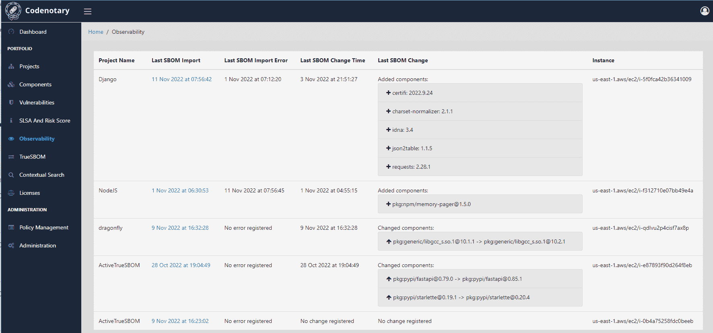

# code 公证人自动创建 SBOM

> 原文：<https://devops.com/codenotary-automates-sbom-creation/>

code 公证人今天推出了一款工具，通过在源代码中添加一行代码，该工具可以使应用程序自动生成软件材料清单(SBOM)。

code 公证人首席执行官 Moshe Bar 表示, [TrueSBOM](https://www.businesswire.com/news/home/20221114005177/en/Codenotary-Revolutionizes-Software-Security-Introduces-Automated-Software-Bill-of-Materials) 使得向任何第一次使用它们的组织自我报告用于构建应用程序的组件成为可能。他补充说，相比之下，现有的 SBOMs 仅提供应用程序最初创建时的组件快照。

IT 组织被要求信任应用程序提供商，SBOM 中指定的所有模块都是正在使用的唯一组件。case 公证人正在寻找一种方法，使使用该软件的组织能够按需实时旋转 SBOM。

从 DevSecOps 的角度来看，向应用程序添加一行代码来启用 TrueSBOM 也应该消除创建和维护单独的文本文件来生成 [SBOM](https://devops.com/?s=SBOM) 的需要。

自从拜登政府的[行政命令](https://devops.com/?s=executive+order)明确表示联邦机构将从明年开始要求任何软件提供商提供 SBOMs 以来，人们对 SBOMs 需求的认识急剧上升。在一系列高调的网络安全违规事件发生后，许多企业 IT 组织可能会效仿，作为更大规模努力的一部分，以更好地保护软件供应链。

Bar 补充说，这种方法还使组织在发现新的零日漏洞时，能够更容易地准确定位组件实际运行的位置。

每个应用程序堆栈每年的价格为 1450 美元，也有更低成本的 TrueSBOM 实例可供基于无服务器框架或使用可移植的 [WebAssembly](https://devops.com/?s=WebAssembly) (Wasm)格式的应用程序使用。

Bar 说，大多数内部 DevOps 团队已经很好地处理了他们部署的应用程序所采用的软件组件。他补充说，问题是使用该软件的组织无法轻易验证使用了哪些组件。这是有问题的，因为一个组织可能因为一个已知的漏洞而决定禁止部署特定的软件组件。Bar 指出，TrueSBOM 允许应用程序的用户保持对其软件环境的控制，而不是信任由应用程序提供商创建的文本文件。

现在还不清楚大多数组织将如何操作 SBOMs，因为更多的 SBOMs 正在创建中。理想情况下，组织应该能够只批准其组件已经被验证为安全的软件。有了这些见解，随着时间的推移，开始用更安全的应用程序减少安全技术债务应该会变得更简单，Bar 补充道。

当然，挑战在于代码公证解决方案需要在应用程序中增加一行代码。然而，随着 SBOM 指令变得越来越严格，越来越多的应用程序提供商渴望遵守保护软件供应链的规则。现在的问题是为软件的开发者和消费者找到一种方法来简化验证过程，在目前的形式下，验证过程过于繁琐，难以有效管理。