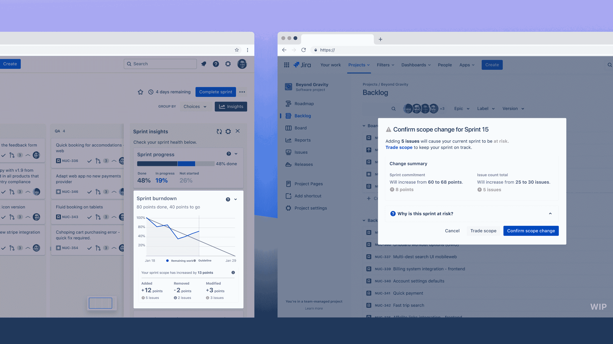

# Atlassian 将吉拉的触角延伸至 DevOps 工作流程

> 原文：<https://devops.com/atlassian-extends-jiras-reach-into-devops-workflows/>

Atlassian 今天为其吉拉项目管理应用程序增加了[一系列功能，使管理软件开发项目变得更加容易，包括一个工具链页面，可以简化任何给定项目的工具发现。](https://www.atlassian.com/blog/devops/software-teams-devops-toolchains)

此外，Atlassian 还在该页面上提供了一个 Discover 选项卡，通过提供任何给定项目的目标的更多上下文，可以跟踪活动并设置优先级。

Atlassian 表示，它还计划在本月晚些时候添加范围变化洞察，并在 2023 年第一季度，自动检测卡住的问题将被添加到现有的预测应用程序开发项目何时完成的能力中。

该公司还在吉拉的代码选项卡中添加了一个拉请求活动馈送，以便更容易地比较和对比问题，识别异常并发现推进工作的机会，以及跟踪分支、提交、拉请求和部署活动的代码洞察视图。

吉拉的 Releases 选项卡现在显示了开发、构建和部署状态旁边的 flag 状态。在 Atlassian 提供的 Confluence wiki 应用程序中，还可以自动生成发行说明。最后，在 2023 年，Atlassian 承诺为运行吉拉提供一个黑暗模式选项，这是一些 DevOps 团队更喜欢的。

Atlassian 的 DevOps 产品负责人 Suzie Prince 表示，所有这些吉拉更新都是该公司今年早些时候推出的 [Open DevOps 倡议的扩展](https://devops.com/atlassian-extends-open-devops-ambitions/)，该倡议将吉拉与各种 DevOps 工具集成在一起。目标是让 DevOps 团队更简单地跟踪项目进度，而不必部署例如单独的分析应用程序。作为这一努力的一部分，Atlassian 还透露，吉拉已经与 Compass 集成，Compass 是今年早些时候推出的一个可扩展目录，用于跟踪软件组件，现已推出测试版。

实际上，Atlassian 通过自动从各种其他 DevOps 工具中提取数据，为吉拉成为软件开发项目跟踪中心提供了一个案例。吉拉与各种工具的集成不需要项目经理向单个开发人员发送多个更新请求并手动输入数据，而是既可以提取相关数据，又可以应用分析，从而更简单地识别对截止日期有负面影响的问题。

然后，这些见解可以更容易地与开发团队和业务中的其他利益相关者共享，这些利益相关者在确保项目期限得到满足方面有既得利益。它还可以使应用程序开发团队更容易证明对额外资源的需求。

当然，项目管理是那些吃力不讨好的任务之一，并不总能得到应有的重视。然而，随着自动收集关于任何给定项目状态的数据变得越来越容易，任务本身应该变得不那么侵扰。希望随着这些任务变得更加自动化，应用程序开发团队和项目经理之间经常存在的摩擦也将平息。