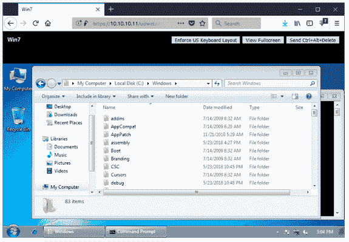

# 面向 Hyper-V 管理员的 VMware 备份指南

> 原文：<https://devops.com/vmware-backup-guide-for-hyper-v-admins/>

乍一看，Hyper-V 和 VMware 虚拟环境似乎很相似，但仔细观察后，这两个虚拟化平台之间的许多重要差异变得显而易见。最初，为 VMware vSphere 执行管理可能会给熟悉 Hyper-V 的管理员带来一些挑战。企业可能会从 Hyper-V 转向 VMware 有几个原因。该公司可能正在部署多虚拟机管理程序环境，例如，将 Hyper-V 用于基于 Windows 的虚拟机(VM ),同时为运行 Linux、免费 BSD、Solaris 等的虚拟机引入 VMware vSphere。这篇博客文章旨在帮助 Hyper-V 管理员了解这两个主要虚拟化平台之间的差异和相似之处，从而使向 VMware 的过渡更加容易。

## 比较虚拟机管理程序设计

### 服务器和工作站的 Hyper-V 角色

Hyper-V 用户不仅可以在 Windows 服务器操作系统(OS)上设置 Hyper-V 角色，还可以在 Windows 的桌面版本(如 Windows 7、8 或 10)上设置。服务器和桌面解决方案的安装是相似的。Hyper-V 被归类为 1 类虚拟机管理程序，这意味着它直接在硬件上运行。除了在 Windows Server 上安装 Hyper-V 角色，还有一个轻量级的替代方法:Microsoft Hyper-V Server。Hyper-V Server 是安装在裸机上的独立产品。

### 面向工作站的 VMware Workstation 和面向服务器的 VMware ESXi

VMware 提供 VMware Workstation，用于安装在基于 Windows 和 Linux 的操作系统的台式机上。VMware Workstation 是第 2 类虚拟机管理程序。第 2 类虚拟机管理程序安装在底层操作系统上。如你所见，Hyper-V 和 VMware 都支持在用户的电脑上安装。如果您想要在裸机上安装类型 1 虚拟机管理程序，您应该使用 VMware ESXi 服务器。使用 VMware vCenter Converter，可以将 VMware Workstation 上运行的虚拟机迁移到 ESXi 服务器。

## 管理工具

### vCenter 作为 SCVMM 的模拟

**System Center Virtual Machine Manager**(scv mm)是微软为 Hyper-V 主机、集群、虚拟网络和存储的集中虚拟化管理而打造的特殊通用产品。SCVMM 对于管理复杂的多站点和多域环境非常有用。

**Hyper-V 管理器**是一个通用工具，在安装 Hyper-V 角色时默认可用。使用 Hyper-V 管理器，您可以连接到可用的 Hyper-V 主机。您可以管理主机、驻留在该主机上的虚拟机、这些虚拟机的虚拟设备以及虚拟机复制。您还可以创建虚拟机检查点、启动或停止虚拟机以及连接到虚拟机，以便与来宾虚拟机的用户界面进行交互。

**故障转移集群管理器**是一个管理故障转移集群和集群内虚拟机的工具。使用该工具，您可以创建一个故障转移群集。故障转移群集管理器不能替代 Hyper-V 管理器；您仍然需要后者来管理非集群虚拟机、Hyper-V 主机、虚拟交换机等。

VMware vSphere 中 SCVMM 的等效物是 vCenter Server **、**，它可以执行故障转移群集管理器和 Hyper-V 管理器在 Hyper-V 环境中处理的任务。借助 vCenter Server，您可以管理 vSphere 的几乎所有组件，包括主机、集群、虚拟网络(包括标准虚拟交换机和分布式虚拟交换机)、数据存储、虚拟机虚拟设备等。vCenter 安装在虚拟机上，然后可以通过浏览器访问 vCenter web 界面。您可以使用 vSphere Web Client(有基于 HTML5 或基于 Flash 的版本)通过 Web 浏览器访问 vCenter。为此，只需在浏览器的地址栏中输入 vCenter server 的 IP 地址。

如果您有一台独立的 ESXi 主机，同样可以使用带有 vSphere client 的浏览器来访问该主机。在浏览器的地址栏中输入 ESXi 服务器的 IP 地址。请注意，使用 vSphere client 访问独立 ESXi 主机时，您无法创建数据中心、配置分布式虚拟交换机或执行虚拟机迁移。

在下面，您可以看到通过带有 vSphere Web Client 的浏览器访问 vCenter v.6.5。如果你想访问虚拟机的用户界面，点击**启动 Web 控制台**。

将打开一个新选项卡，您可以与来宾操作系统进行交互。

访问虚拟机用户界面的另一种方式是使用 VMware Workstation。要从 VMware Workstation 连接到 ESXi 主机上运行的虚拟机，请单击**文件** > **连接到服务器**。

输入 vCenter 或 ESXi 服务器的 IP 地址，以及访问该服务器所需的用户名和密码。点击**连接**。

在 VMware Workstation 界面的左侧窗格中，您可以看到驻留在您所连接的 ESXi 主机上的虚拟机列表。如果连接到 vCenter，您会看到由 vCenter Server 管理的数据中心、ESXi 主机和虚拟机等对象。

### PowerShell 与 PowerCLI

对于 Hyper-V 平台，使用 GUI 管理虚拟环境的替代方法是使用 PowerShell。PowerShell 是基于 Windows 的系统上提供的命令行 Shell，允许用户管理系统组件。PowerShell 使用 cmdlets 和脚本的组合来提供自动化。

在 VMware vSphere 中，您应该使用 PowerCLI 替代 GUI。 [PowerCLI](https://www.nakivo.com/blog/basic-powercli-scripting-vmware-vsphere/) 是一款基于 PowerShell 构建的脚本工具。它扩展了 PowerShell，包括一组 600 多个 cmdlets。您可以 [自动安装和配置](https://www.nakivo.com/blog/introduction-vmware-vsphere-automation-powercli/) 任何功能、虚拟机、系统补丁等。

## 簇

### VMware HA 和 DRS 群集与带 PRO 的 Hyper-V 故障转移群集

Hyper-V 虚拟环境提供故障转移群集功能。故障转移群集提供虚拟机从故障主机到群集中正常主机的自动故障转移。主机出现故障时，故障主机上的虚拟机将在集群中的其他 Hyper-V 主机上重新启动。性能和资源优化(PRO)功能收集虚拟环境中资源使用情况的数据，并生成 PRO 提示，建议迁移或重新配置虚拟机，以便更合理地使用硬件资源。从 Windows Server 2012 开始，PRO 被动态优化取代。

VMware vSphere 中通常使用两种类型的群集，即高可用性(HA)群集和分布式资源调度器(DRS)群集。 HA 集群提供虚拟机的高可用性，并在集群内主机出现故障时执行自动虚拟机故障转移。在故障 ESXi 主机上运行的虚拟机将在运行正常的 ESXi 主机上重新启动。 [DRS 集群](https://www.nakivo.com/blog/what-is-vmware-drs-cluster/) 用于负载均衡。vCenter server 监控硬件资源的使用情况，例如群集中虚拟机和 ESXi 主机的 CPU 和内存。如果在对这些指标进行计算和分析后，DRS 认为某些虚拟机可以从一台 ESXi 主机迁移到另一台主机(例如，从一台过载的主机迁移到一台具有几乎空闲的可用资源的主机),以便更合理地使用资源，那么就会生成迁移建议。根据您的 DRS 配置，可以手动或自动应用这些建议。

### 电源优化与分布式电源管理

**电源优化**是 Hyper-V 中的一项动态优化功能。电源优化允许虚拟机从工作负载较低的 Hyper-V 主机迁移到集群中拥有足够资源的其他主机。然后关闭未使用的主机，以节省能源。一旦群集需要关闭的主机的硬件资源，它们就会重新打开。

**分布式电源管理** (DPM)是 VMware vSphere 虚拟环境中 DRS 集群的一个组件。与动态优化类似，DPM 执行虚拟机迁移，从负载较低的 ESXi 主机迁移到有足够资源运行迁移的虚拟机的 ESXi 主机。释放的 ESXi 主机会关闭电源(进入待机状态)以节省电力。当负载增加且群集再次需要更多硬件资源时，这些 ESXi 主机会重新通电。

## VMware HA 群集中的容错能力

VMware 还为 HA 群集提供了一个有用的功能:容错。如果您使用高可用性群集，在 ESXi 主机出现故障的情况下，从虚拟机出现故障到虚拟机被加载到另一个运行正常的主机上，会有一段虚拟机停机时间。在 HA 群集中使用容错功能有助于避免任何停机。这是因为第二台虚拟机(ghost replica)已经在群集内的另一台 ESXi 主机上运行，它是受容错保护的虚拟机的精确副本。在主虚拟机出现故障之前，ghost 副本处于非活动状态(其网络连接和输出被禁用)。当运行主虚拟机的主机出现故障时，ghost 副本会立即变为活动状态，并且副本的网络连接会变为启用状态。切换到 ghost 副本很流畅；如果您要 ping 受保护虚拟机的 IP 地址，您只会注意到一个数据包的延迟稍高。如果您使用容错，就不会有数据丢失或服务中断。

## 移民

### 实时迁移与 vMotion

Hyper-V 有两种类型的虚拟机迁移:实时迁移和快速迁移。快速迁移将虚拟机置于保存状态，这类似于休眠。虚拟机的内存保存在其他虚拟机文件所在的磁盘上。一旦虚拟机进入保存状态，在新主机上注册之前，会有一小段虚拟机停机时间。实时迁移用于 Hyper-V 主机之间的虚拟机迁移(包括故障转移群集),而不会失去服务可用性。迁移过程包括不同的阶段。实时迁移最重要的阶段是虚拟机内存页面的迭代转移。

VMware vSphere 中的 Hyper-V 实时迁移类似于 vMotion。借助 [vMotion](https://www.nakivo.com/blog/configuring-esxi-vmotion-network/) ，正在运行的虚拟机可以从一台 ESXi 主机迁移到另一台主机，而不会中断主机上正在运行的虚拟机和服务。当从源 ESXi 主机到目标主机的虚拟机迁移过程启动时，将执行以下操作。

首先，检查兼容性以确保虚拟机可以在目标主机上运行。在目标 ESXi 主机上保留硬件资源，并启动虚拟机进程。创建虚拟机内存检查点；所有进一步的虚拟机内存更改都被写入一个特殊区域。创建检查点之前存储在内存中的数据被复制到目标虚拟机。源虚拟机正在运行，一些内存页面发生了变化(这些页面称为脏页)。它们被写入更改缓冲区，这些缓冲区被复制到目标虚拟机并集成到目标虚拟机的内存中。复制脏页的过程会一遍又一遍地重复(一个迭代过程)，直到源虚拟机的内存与目标虚拟机的内存相比没有任何内存变化。然后，vMotion 会停止源虚拟机的 CPU，复制最后的更改缓冲区，并将该缓冲区中存储的内存更改集成到目标虚拟机的虚拟 RAM 中。源 ESXi 主机上的磁盘访问停止，而目标 ESXi 主机上的磁盘访问开始。vMotion 向物理交换机发送反向 ARP(地址解析协议),以更新 MAC 和 IP 地址映射。然后关闭源虚拟机，并删除源 ESXi 主机上的虚拟机进程。

## 存储迁移与 Storage vMotion

**Hyper-V 存储迁移**可以将虚拟机配置文件、检查点文件、虚拟硬盘和装载的 ISO 文件移动到新位置。当虚拟机必须继续在同一台 Hyper-V 主机上运行，但必须迁移到另一个存储位置时，可以使用存储迁移。如果虚拟机必须在另一台主机上运行并放置在另一个存储位置，则实时迁移或快速迁移必须与存储迁移一起使用。

**Storage vMotion** 是 Hyper-V 的存储迁移的 vSphere 模拟。Storage vMotion 可以将虚拟机组件(如虚拟机虚拟磁盘(VMDK 文件)和虚拟机配置文件)实时迁移到另一个存储(如 ESXi 本地数据存储、共享 SAN 数据存储等)。).首先，复制存储在虚拟机主目录中的虚拟机元数据(包括配置、交换和日志文件)，然后复制虚拟磁盘。

更改数据块跟踪用于跟踪源虚拟机虚拟磁盘首次复制后的更改。当源虚拟机运行时，磁盘更改会通过多次迭代复制到目标虚拟磁盘，直到源虚拟磁盘和目标虚拟磁盘之间没有差异。

虚拟磁盘可以从密集资源调配磁盘转换为精简资源调配磁盘，反之亦然。在使用 Storage vMotion 进行迁移的过程中，运行虚拟机的 ESXi 主机不会发生变化。当虚拟机必须立即更改主机和数据存储区时，Storage vMotion 与 vMotion 一起使用。

## 储存；储备

### 集群共享卷(CSV)与 VMFS 集群文件系统

**集群共享卷**旨在为集群中的多个 Hyper-V 主机提供对同一磁盘的同时访问，以读取和写入数据。具有 NTFS 或 ReFS 文件系统的磁盘卷必须用于 CSV。

**VMFS** 是一种虚拟机文件系统，针对虚拟机进行了优化，适用于 vSphere 中的集群。群集中的多个 ESXi 主机可以共享一个 VMFS 来读取和写入数据。这种高性能文件系统保存具有元数据的文件，并具有特定的锁定机制，以防止由多个主机并发写入元数据而导致的数据损坏。

### 中小企业 3.0 与 NFS

**SMB 3.0** 是微软开发的一种网络共享协议，可用于 Hyper-V 环境以及一般 Windows 环境中的 Hyper-V 主机访问文件级共享存储。

**网络文件系统** (NFS)是由 Sun Microsystems 开发的共享协议，提供对文件级共享存储中的文件的访问。不同的供应商、不同的操作系统以及具有不同体系结构的网络都可以使用 NFS。vSphere 中的 ESXi 主机可以使用 NFS 来访问位于共享存储上的虚拟机文件。

### VHDX 与 VMDK(虚拟机虚拟磁盘)

**VHDX** (VHD)是 Hyper-V 虚拟机虚拟磁盘的一种文件格式。第一代虚拟机可以使用 VHD 或 VHDX 虚拟磁盘文件。第二代虚拟机只能使用 VHDX 虚拟磁盘文件格式。

**VMDK** 是由 VMware 开发的 VMware VM 虚拟磁盘的一种开放文件格式。

### 动态磁盘与精简配置磁盘

**动态磁盘**是为 Hyper-V 虚拟机动态扩展的虚拟磁盘。使用动态磁盘的主要目的是节省存储空间。创建动态磁盘时，并非所有调配的空间都被虚拟磁盘文件占用。最初，虚拟磁盘是一个小文件。它随着数据写入磁盘而增长。

**VMware 虚拟环境中的精简配置磁盘**类似于 Hyper-V 的动态磁盘。经过精简资源调配的磁盘在创建时具有最小大小，并随着数据写入虚拟磁盘而按需增长。

### 检查点与快照

**Hyper-V 检查点**用于保存虚拟机在给定时间点的状态。您可以创建检查点，使用虚拟机，然后将虚拟机恢复到创建检查点时的状态。

**VMware 快照**类似于 Hyper-V 检查点；它也用于保存虚拟机的当前状态。您可以随时拍摄 [快照](https://www.nakivo.com/blog/vmware-snapshots-vsphere-how-to/) ，例如，在更新软件配置、更新安装、测试新软件等之前。即使虚拟机正在运行，也可以拍摄快照。快照捕获以下虚拟机数据:虚拟磁盘状态、虚拟内存内容和虚拟机设置。拍摄快照时，会创建以下文件并将其存储在虚拟机目录中:。vmdk，vmdk，。vmsn 和. vmsd。

### 直通磁盘与原始设备映射

**直通磁盘**是一种物理磁盘，装载到虚拟机上，在 Hyper-V 环境中代替(VHD/VHDX)虚拟磁盘使用。

**原始设备映射** (RDM)是使用虚拟磁盘访问 vSphere 中虚拟机磁盘的替代方法。根据您的设置，您可以在使用 RDM 时让虚拟机直接访问物理存储设备。RDM 可以在虚拟兼容模式或物理兼容模式下使用。

虚拟兼容模式提供映射设备的完全虚拟化；可以使用快照。

在物理兼容模式下，客户操作系统可以直接访问硬件；提供最小的 SCSIvirtualization。如果拍摄了虚拟机快照，RDM 磁盘将不会包含在该快照中。

例如:

假设 DiskName.vmdk 是一个磁盘头文件。

DiskName-rdmp.vmdk 是映射文件(由-rdmp 后缀证明)。

映射文件类似于指向映射设备的符号链接。

### RCT 对 CBT

**弹性更改跟踪** (RCT)使得在对 Hyper-V 虚拟机执行增量 [备份时，可以仅复制自上次备份以来发生更改的数据块。RCT 技术随 Windows Server 2016 一同发布。带有的文件。RCT 和。启用 RCT 时会创建 MRT 延伸。](https://www.nakivo.com/hyper-v-backup/)

**更改数据块跟踪** (CBT)是针对 Hyper-V 的 vSphere 模拟，有助于执行增量备份。CBT 允许备份软件跟踪自上次备份以来发生更改的数据块，并仅拷贝发生更改的数据块。带有的文件。为每个 VMDK 虚拟磁盘和快照文件创建 CTK 扩展。在虚拟化层跟踪数据块更改。VMware VSP here API for Data Protection 允许第三方软件访问 CBT 功能，以便更高效地执行备份和复制。 [更改数据块跟踪](https://www.nakivo.com/blog/vmware-changed-block-tracking-works/) 是 VMware 于 2009 年在 ESX 4.0 中推出的。

### 存储空间与虚拟存储区域网络

**Windows 存储空间**是一种从物理磁盘中提取存储的技术，用于存储虚拟化和配置。借助存储空间，您可以通过使用配备 HDD 设备的服务器，为 Hyper-V 虚拟环境创建经济高效、可扩展、高度可用的软件定义存储。

**VMware vSAN** (虚拟存储区域网络)相当于 Windows 存储空间。 [vSAN](https://www.nakivo.com/blog/configure-vsan-cluster/) 提供分布式数据存储概念，在集群级别与 vSphere 集成，并从硬件磁盘中抽象出来。必须使用通过 vCenter 管理的 ESXi 主机来部署 vSAN。这种方法允许 ESXi 主机的磁盘用于 vSAN 存储，而 ESXi 主机用于运行虚拟机。固态硬盘可用于缓存数据，而硬盘则用于存储数据。磁盘组被聚合成可供整个群集访问的池。数据可以在一台或多台主机上镜像，这确保了针对故障的保护。这由“失败次数”设置定义。使用 vSAN，您可以实现可靠且可扩展的企业级存储。

### 动态内存与虚拟内存过量使用

**动态内存**允许虚拟机使用其当前需要的内存量，而不是为该虚拟机调配的所有虚拟内存。Hyper-V 服务器上的硬件 RAM 可以通过这个特性更合理地使用。

**VMware 虚拟内存过量使用**是 VMware 的等效功能。这两个特性都使用动态内存分配方法，但方法略有不同。借助 VMware，您可以为虚拟机分配比 ESXi 主机更多的内存，从而提高主机上虚拟机的密度。这样做的目的是优化物理内存消耗，因此，可以在 ESXi 主机上运行更多的虚拟机，但不能保证在给定的时间点可以将为其调配的所有内存提供给特定的虚拟机。使用内存过量使用假设可以根据需求在虚拟机之间重新安排内存。在 ESXi 主机上保留 25%未使用的内存，以防其虚拟机的内存需求突然增加。

### Hyper-V 集成服务与 VMware 工具

**Hyper-V“集成服务”**是一组工具和驱动程序，用于提供子虚拟机的正常功能和时间同步。安装 Integration Services 后，鼠标、键盘、磁盘控制器和网络控制器的标准驱动程序将被 Integration Services 套件中包含的驱动程序所取代，以获得更好的性能和用户体验。

**VMware Tools** 是驱动程序、模块和实用程序的集合，相当于 Hyper-V 集成服务。VMware Tools 提供高级功能来提高性能、用户与来宾虚拟机的交互以及集成。安装 VMware Tools 后，您可以从 vSphere client 或 VMware Workstation 中的菜单直接关闭来宾操作系统。视频分辨率和图形性能得到提高。其他有用的功能，如拖放&，共享文件夹，时间同步，虚拟机和主机之间的复制/粘贴，以及抓取/释放鼠标光标也变得可用。VMware Tools 通常以 ISO 映像或操作系统特定包(OSP)的形式提供。

### **从 Microsoft Hyper-V 迁移到 VMware vSphere 平台**

如果 vSphere 虚拟化平台能更好地满足贵公司的需求，从 Hyper-V 过渡到 vSphere 会很有用。首先，你要准备好硬件和软件。检查 VMware 的硬件兼容性列表，以确保您的硬件得到官方支持。安装 ESXi 服务器、vCenter 和您需要的其他软件。下载并安装 VMware vCenter Converter。运行 VMware vCenter Converter 并点击**转换机器**。

选择 **Hyper-V 服务器**作为源类型。选择 Hyper-V 服务器的 IP 地址或服务器名称。在本演练中，vCenter Converter 安装在 Hyper-V 服务器上，输入 *localhost* 作为服务器名称。

接下来，输入有足够权限执行该操作的帐户的用户名和密码。本例中使用的是 Windows 管理员帐户。点击**下一个**。

选择要转换的虚拟机。点击**下一个**。

选择 **VMware 基础架构虚拟机**作为目标类型。键入 vCenter Server 或 ESXi 主机的 IP 地址，然后输入用户名和密码。点击**下一个**。

选择转换后应应用于目标虚拟机的文件夹和名称。点击**下一个**。

选择目标位置，包括 ESXi 主机和数据存储区。点击**下一个**。

为目标虚拟机配置选项。您可以在下面提供的屏幕截图中看到如何更改虚拟磁盘资源调配的类型。在**数据复制**区点击**编辑**。

在下拉列表中，选择磁盘资源调配类型(密集或精简)。点击**下一个**。

检查摘要，如果满意，点击**完成**。

等待转换任务完成。

虚拟机转换完成后，您可以在浏览器中使用 vSphere Web client 打开 vCenter，并找到转换后的虚拟机。在本演练中，虚拟机名称为 *Server2016-01* 。正如您在预览屏幕截图中看到的，虚拟机正在成功运行。点击**启动 Web 控制台**进入虚拟机用户界面。现在，您可以调整虚拟机并安装 VMware Tools。

现在，您已经知道如何从 Hyper-V 迁移到 VMware vSphere。

### **结论**

了解 VMware 和 Hyper-V 环境功能之间的差异和相似之处，可以使从一个平台到另一个平台的[迁移](https://devops.com/?s=migration)变得更加容易，并且对于多虚拟机管理程序环境的管理员尤其有用。了解这两种虚拟化平台的架构和工作原理，以及它们的功能集，有助于管理员在维护不太熟悉的平台时舒适而有效地工作。有一条重要规则适用于 VMware 和 Hyper-V 环境:虚拟机必须定期备份。强大的虚拟机备份可以保护您的业务关键型数据免受自然灾害、技术故障、人为错误和病毒攻击的影响。