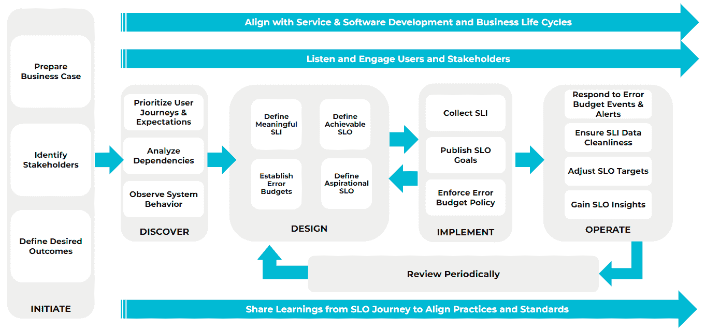

# Nobl9 为管理 SLO 的 SaaS 平台添加了免费层

> 原文：<https://devops.com/nobl9-adds-free-tier-to-saas-platform-for-managing-slos/>

Nobl9 本周宣布，它将提供其软件即服务(SaaS)平台的[永久免费层](https://www.businesswire.com/news/home/20221129005263/en/Nobl9-Adds-New-Perpetual-Free-Edition-and-Updates-Pricing-to-Ease-Adoption-of-Service-Level-Objectives-SLOs)，用于管理服务水平目标(SLO)。

AWS re:Invent 2022 大会上宣布了免费等级，该公司还修改了定价。Nobl9 Teams Edition(以前的 Nobl9 Hydrogen)现在包括 50 个 SLO，以前是 25 个，每月 850 美元。Nobl9 企业版还将包含的 SLO 从 75 个增加到 150 个。

最后，Nobl9 还推出了 SLOcademy，帮助 IT 团队了解如何最好地创建和管理 SLO。

Nobl9 平台使用从超过 24 个广泛使用的 DevOps 工具(包括 Prometheus)以及 Datadog、New Relic、Dynatrace、Google、Amazon Web Services (AWS)和 Splunk 提供的服务中收集的指标和可观察性数据，简化了 SLO 的创建和跟踪。

Nobl9 的首席增长官 Kit Merker 表示，该公司的平台从日志、指标和跟踪中收集信号，以定义任何给定服务的正常情况。平台的免费层有一些限制，但它确实提供了对全功能平台的访问，使 it 团队能够开始管理 SLO。

当然，SLO 并不是一个新想法。几十年来，它们一直被用作跟踪 IT 服务性能的指标。目前尚不清楚这些年来对 SLO 的依赖是否已经减弱，或者应用程序环境是否变得过于复杂而无法跟踪有意义的指标。然而，随着应用程序越来越多地被视为服务，SLO 在现代应用程序环境中被更广泛地采用只是时间问题。当然，挑战在于定义 SLO 比维护它要容易得多——尤其是在当今高度动态的云原生应用环境中，具有大量依赖性的服务往往会出乎意料地出现、改变和消失。

Nobl9 正在为“SLO 即代码”方法提供案例，这种方法可以更简单地跟踪服务水平。Dimensional Research 最近代表 Nobl9 对 300 多名 IT 经理和高管进行的调查发现，只有 29%的受访者没有实施 SLO 的计划。已经实施或计划实施 SLO 的受访者中有整整 94%的人打算将其直接映射到业务运营中，其中 91%的人报告说他们期望这种努力能够改善决策。超过 80%的受访者还表示，他们的组织正在计划增加 SLO 的使用，87%的受访者表示 SLO 应该能够提高微服务的整体性能。

挑战在于大多数组织对其 IT 环境的了解有限。例如，该调查发现，不到一半的受访者(46%)了解其所有 IT 环境。分别只有 45%和 35%的人声称对容器和微服务有可见性。超过四分之三(78%)的人说混合云使得[的可观测性](https://devops.com/?s=observability)更加困难。具有讽刺意味的是，45%的公司报告说他们已经使用了 11 种或更多的观察和监控工具。另一方面，31%的公司已经雇佣了现场可靠性工程师(sre ),而将近一半(46%)的公司计划设立该职位。

大多数 It 团队围绕应用程序即服务的概念组织起来可能还需要一段时间，但随着 IT 管理的不断发展，这种方法成为常规而非例外只是时间问题。