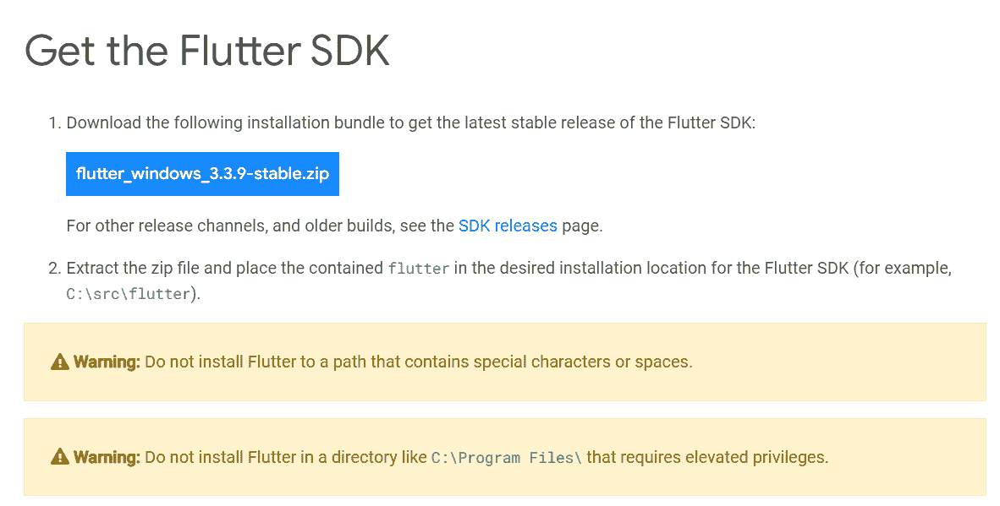
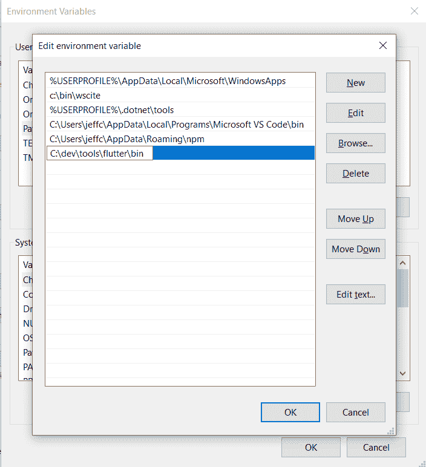
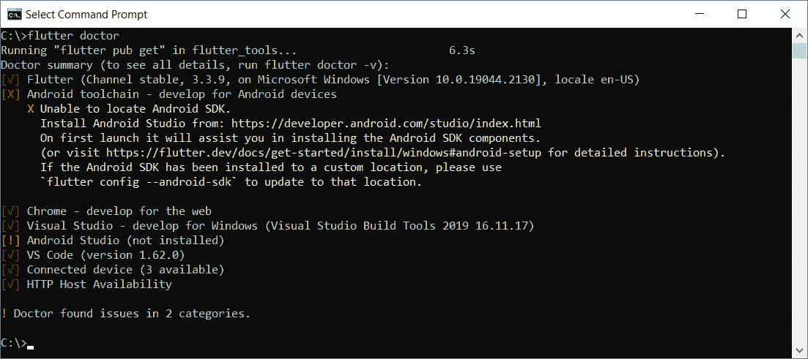
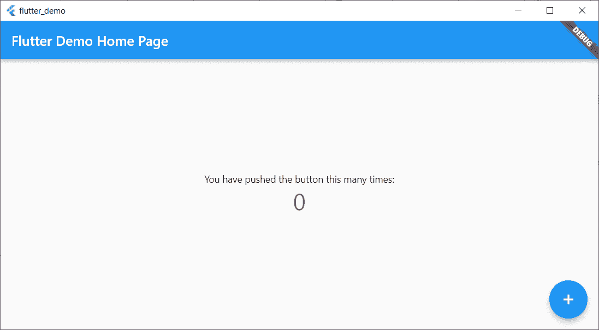
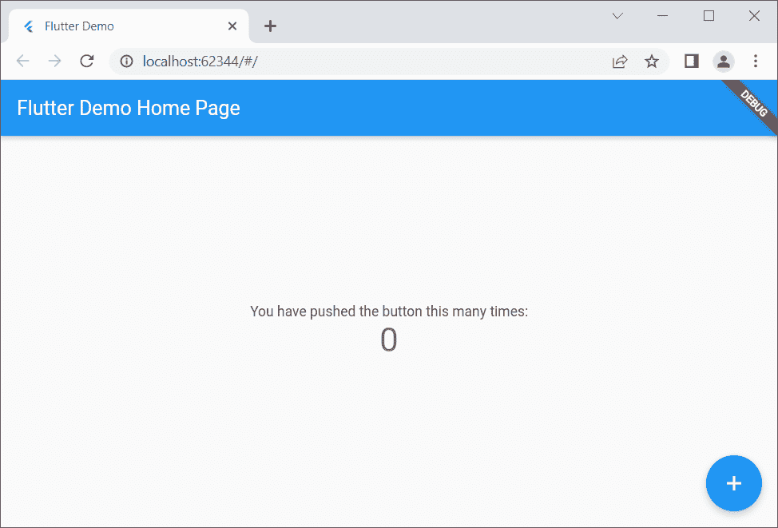
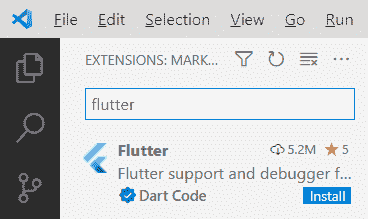

# 颤振介绍

> 原文：<https://devops.com/introduction-to-flutter/>

[Flutter 是一款创建跨平台应用的开发工具](https://flutter.dev/)。Flutter 由谷歌创建，旨在帮助开发人员创建几乎可以在任何操作系统上运行的前端，包括 Android、iOS、Mac、Linux、Windows 桌面和 web。

准备好检查了吗？您首先需要安装 Flutter 软件开发工具包(SDK)。

# 安装颤振

要使用 Flutter SDK，你需要在电脑上安装 git 以下是根据您的操作系统安装它的一些提示:

*   Windows:这里下载[。](https://git-scm.com/download/win)
*   Mac:虽然你可以手动安装 Git，但是你最好的选择是简单地安装 Xcode，它包括 Git；你以后会需要 XCode 的。
*   Linux:除了 Git，您还需要这里列出的其他几个工具。如果你使用的是 Ubuntu 或 Debian，你可以用这个简单的命令得到它们:sudo apt install git zip unzip curl xz-utils libglu 1-mesa
*   ChromeOS:这个选项要求你在 ChromeOS 上启用 Linux。然后，您将需要安装我刚才为 Linux 列出的相同的包。

满足以上先决条件后，就可以去[这个链接](https://docs.flutter.dev/get-started/install)下载 Flutter 了。

您可以下载适用于您的操作系统的 SDK，也可以从 GitHub 获得。只有在您熟悉克隆 Git 库的情况下才尝试 GitHub 选项。

在本例中，我将通过单击 Windows 链接来下载 Windows 版本，这将弹出如下所示的屏幕。特别是对于 Windows，要密切注意关于在哪里安装 SDK 的警告。(我喜欢有一个名为 c:\dev 的文件夹，我把所有的开发工作放在那里，在这个文件夹下有一个名为 c:\dev\tools 的文件夹。所以后者是我放 SDK 的文件夹。)



下载文件后，将其解压缩到一个位置，如 c:\dev\tools。

对于 Windows，Linux 和 ChromeOS，下一步是更新您的路径，以便系统可以找到在 Flutter 文件夹的 bin 文件夹中找到的工具。(Mac 用户不需要做这一步。)Flutter 安装文档在这里很有帮助:

*   Windows:确保使用完整的路径，从解压 zip 文件的文件夹名开始。例如，在我的机器上，应该是 C:\dev\tools\flutter\bin，如下图所示。更新路径后，您需要关闭并重新打开命令行 shell(Windows CMD 或 Powershell)。有关详细说明，[请点击此处](https://docs.flutter.dev/get-started/install/windows#update-your-path)。
*   Linux:按照这里的[指令](https://docs.flutter.dev/get-started/install/linux#update-your-path)操作。
*   ChromeOS:遵循这里的[说明](https://docs.flutter.dev/get-started/install/chromeos#update-your-path)。



现在，通过转到 Flutter 的 bin 文件夹之外的一个文件夹并键入以下命令来测试 Flutter 命令，以确保它能够工作:

```
flutter --version
```

您应该会看到如下消息:

```
Flutter 3.3.9 • channel stable • https://github.com/flutter/flutter.git
Framework • revision b8f7f1f986 (2 weeks ago) • 2022-11-23 06:43:51 +0900
Engine • revision 8f2221fbef
Tools • Dart 2.18.5 • DevTools 2.15.0
```

这将告诉您安装是否可能准备好了。相反，如果您看到一条没有找到命令的消息，请仔细检查您的路径是否正确；这通常是该错误最可能的原因。

为什么我说“可能”？因为通过运行这个命令，Flutter 本身可以告诉您是否需要任何其他工具:

```
flutter doctor
```

下面是我运行它时看到的一个例子:



这告诉我，我已经安装了一些必要的工具，但不是全部:

*   Flutter 本身，以及随之而来的所有工具
*   Android toolchain:我没有这个。
*   Chrome 浏览器:你需要它来调试你的应用程序的网页版本。
*   Visual Studio:这是微软的完整 IDE 如果你想为 Windows 桌面开发你的应用，你将需要它。你可以使用免费的社区版本。为此，请点击[这里，选择免费的社区版本](https://visualstudio.microsoft.com/downloads/)。
*   安卓工作室:我没有这个。
*   VS 代码:这里指的是 Visual Studio 代码，微软的免费编辑器/IDE，和 Visual Studio 不一样。这是一个独立的工具，两者互不依赖。在你安装它之前，请阅读我下面的注释。

在安装任何其他东西之前，您需要决定您的目标平台。如果你要将 Android 包括在列表中，你需要下载并安装 Android 工具链和 Android Studio。在这种情况下，您将在 Android Studio 中进行开发。

但是如果你的目标不是 Android，你不需要安装 Android 工具链或者 Android Studio。官方安装文档在这一点上有点模糊，所以我自己测试了一下。我能够瞄准 Windows 桌面和浏览器，而不需要安装任何 Android 工具。

如果你的目标不是 Android，那么你会希望安装 VS 代码来从内部进行开发。你可以在这里找到它。

# 构建应用程序

对于这个例子，我将继续使用 Windows，我将构建一个快速的 Windows 桌面应用程序。

在命令 shell 中，我将首先通过键入以下命令在 c:\dev 中创建一个文件夹来保存我的项目:

```
cd c:\dev
md projects
cd projects
```

我准备通过键入以下内容来制作一个名为 flutter_demo 的 Flutter app。(在键入此内容之前，请确保您在项目文件夹中):

```
flutter create flutter_demo
```

请注意，项目的名称必须全部是小写字母，并且可以包含下划线。例如，使用大写字母会导致错误:

如果我输入这个:

```
flutter create FlutterDemo
```

我看到了这个:

```
"FlutterDemo" is not a valid Dart package name.
See https://dart.dev/tools/pub/pubspec#name for more information.
```

如果操作正确，您将看到如下输出:

```
Creating project flutter_demo...
Running "flutter pub get" in flutter_demo... 1,186ms
Wrote 127 files.
All done!
In order to run your application, type:
$ cd flutter_demo
$ flutter run
Your application code is in flutter_demo\lib\main.dart.
```

在我们打开代码之前，让我们运行它！首先，进入 flutter 创建的新文件夹:

```
cd flutter_demo
```

然后通过键入以下命令来运行它:

```
flutter run
```

这个命令运行当前文件夹中的任何 Flutter 应用程序。在本例中，这是您刚刚创建的应用程序。

当你启动它的时候，它会要求你做一些选择。因为我没有安装 Android 或模拟器，所以我只看到 Windows 桌面和 Chrome 及 Edge 的选项。(Edge 是基于 Chrome 的，所以也可以用。)下面是我看到的:

```
Multiple devices found:
Windows (desktop) • windows • windows-x64 • Microsoft Windows [Version 10.0.19044.2130]
Chrome (web) • chrome • web-javascript • Google Chrome 107.0.5304.107
Edge (web) • edge • web-javascript • Microsoft Edge 106.0.1370.37
[1]: Windows (windows)
[2]: Chrome (chrome)
[3]: Edge (edge)
Please choose one (To quit, press "q/Q"):
```

按下 Windows 的选项。这将构建 Windows 桌面版本(可能需要一分钟左右的时间)并启动它，产生如下所示的窗口:



这并不多，但是有一个例子，你可以点击加号，看到中间的增量。仅此而已。

现在让我们尝试在 Chrome 中运行相同的应用程序。首先，关闭应用程序窗口，按下向上箭头键或重新键入:

```
flutter run
```

这次，选择 Chrome 的选项。

现在，Flutter 构建了一个可以在 Chrome 上运行的 web 版本，启动一个本地 web 服务器来托管应用程序，启动 Chrome 并向 Chrome 推送一个 URL 以从本地 web 服务器加载应用程序。这是浏览器窗口:



请注意，它看起来与桌面版本几乎相同，但这次是在浏览器中。

如果您是 web 开发人员，我建议您在浏览器应用程序中右键单击并选择查看页面源代码。注意，有一行代码加载了一个名为 flutter.js 的文件，还有一些 JavaScript 代码响应窗口的 Load 事件，该事件调用 flutter。您不会编写 JavaScript 代码，但是至少对您的前端正在做什么有一些了解总是好的！

# 添加到代码中

现在让我们给示例代码添加一点内容。为此，我将使用 VS 代码。在应用程序的主文件夹(在我的例子中，是 c:\dev\projects\flutter_demo)中输入

```
code .
```

(一定要把单词代码后面的点包含进去；否则，VS 代码将在它最后运行的文件夹中打开。)

在深入研究代码之前，您需要为 VS 代码安装一个特殊的 Flutter 扩展。单击左下角的齿轮，然后单击扩展。在标有 Marketplace 中的搜索扩展的框中，键入 flutter。(不要点击回车；请稍停片刻，搜索将会开始。)找到下载量超过 500 万的 Flutter，如下所示:



单击安装按钮。在下载和安装扩展时，该按钮将显示“正在安装”。

安装完扩展后，VS Code 会询问您是否想在当前项目中使用它。您可能还会看到一条关于更新 Dart 扩展的消息，它与 Flutter 一起出现。对于颤振，单击“是”;单击获取 Dart one 的包。(可以忽略关于打开设置文件的消息。)

现在你已经有了所有几个可用的颤振工具与代码的扩展调色板。按 Ctrl+Shift+P 打开调色板。输入 flutter，你会看到完整的列表。

然而现在，让我们先运行这个应用程序。单击“运行”菜单，然后单击“不调试运行”。您将看到 Windows 应用程序再次打开。

现在回到 VS 代码。即使您不熟悉 Dart，如果您知道其他“花括号”语言，如 C++、C#、Java、JavaScript 等，您也可能能够读懂代码。有一个名为 main()的函数启动应用程序，提供了一个名为 MyApp 的类。该类在代码中处于较低的位置。仔细看看所有的评论。仔细阅读并从中学习。MyApp 类包含一个构建函数，它返回一个带有“home”成员的对象；该成员是 MyHomePage 的一个实例，也是这个文件中的一个类。继续研究这些代码，您会看到其中提到了小部件和布局。仔细看看名为 _incrementCounter 的函数，以及稍后如何通过 onPressed 事件触发它。

# 结论

摆弄代码；例如，试着改变一些字符串文字，直到你非常熟悉它。然后深入研究由谷歌的 Flutter 人员提供的第一个演示，[你可以在这里找到](https://docs.flutter.dev/get-started/codelab)。很快你就可以运行你自己的 Flutter 应用程序了，你可以在任何设备上运行它！