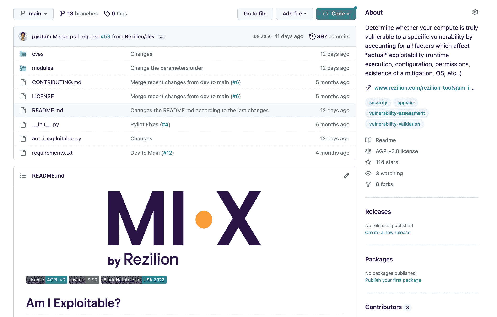

# Rezilion 更新开源 MI-X 工具，以更好地保护应用程序开发

> 原文：<https://devops.com/rezilion-updates-open-source-mi-x-tool-to-better-secure-app-development/>

Rezilion 已经[更新了其开源 MI-X 漏洞发现工具](https://www.rezilion.com/blog/rezilion-unveils-new-updates-to-mi-x-an-open-source-tool-that-determines-vulnerability-risk-at-black-hat-europe/)以包括缓解和补救建议。

此外，该工具现在可以生成 JSON 或 CSV 格式的机器可读输出。

最后，该公司在 Windows 环境中添加了对 Heartbleed 和 SpookySSL 漏洞的 Windows 支持。

MI-X 使得使用命令行界面(CLI)工具来识别和确定 20 多个众所周知的常见漏洞和暴露(CVE)的可利用性成为可能。

Rezilion 的漏洞研究主任 Yotam Perkal 说，Rezilion 开发了这个工具，作为其努力创造一个平台，使组织能够更好地保护其软件供应链的一部分。他补充说，该平台的主要目的是通过为开发人员提供了解漏洞潜在严重性所需的背景，首先防止漏洞被引入应用程序。

毫无疑问，开发人员需要能够让他们在编写代码时轻松识别漏洞的工具。然而，将漏洞的责任完全转移给开发人员并不是应用程序安全的灵丹妙药。DevOps 团队需要采用 DevSecOps 最佳实践，以确保由多个开发人员创建的构建是安全的，并且应用程序运行的运行时环境也没有恶意软件。

挑战在于，实现这一目标需要超越向 [DevOps 工作流](https://devops.com/?s=DevOps+workflow)添加额外的工具。最大的挑战是缩小开发者和负责发现漏洞的网络安全团队之间的历史文化鸿沟。大多数网络安全专业人员不了解应用程序是如何开发的，因此在应用程序中发现的每个漏洞实例对他们来说都是一样的——不管实际代码是否可从外部访问。

与此同时，DevOps 团队正试图在修补无数漏洞与构建和部署额外应用程序之间取得微妙的平衡。Perkal 指出，最重要的是，这些团队需要能够根据漏洞的实际和理论严重性来确定修补工作的优先级。

解决应用程序环境多年来积累的所有应用程序安全债务可能永远都不可能。然而，随着应用程序的建立和应用程序安全问题得到更积极的解决，网络安全状况应该会有所改善。当然，问题是网络罪犯现在瞄准了软件供应链；将恶意软件插入到 DevOps 工作流中可能会危及任意数量的下游应用程序。组织现在正在争分夺秒地保护他们的软件供应链。

好消息是，没有开发人员会有意构建不安全的应用程序。只是太多的人习惯于将安全性视为他们需要克服而不是解决的障碍。然而，为他们提供的修复尽可能多的漏洞的工具越多，相关的每个人都会过得越好。