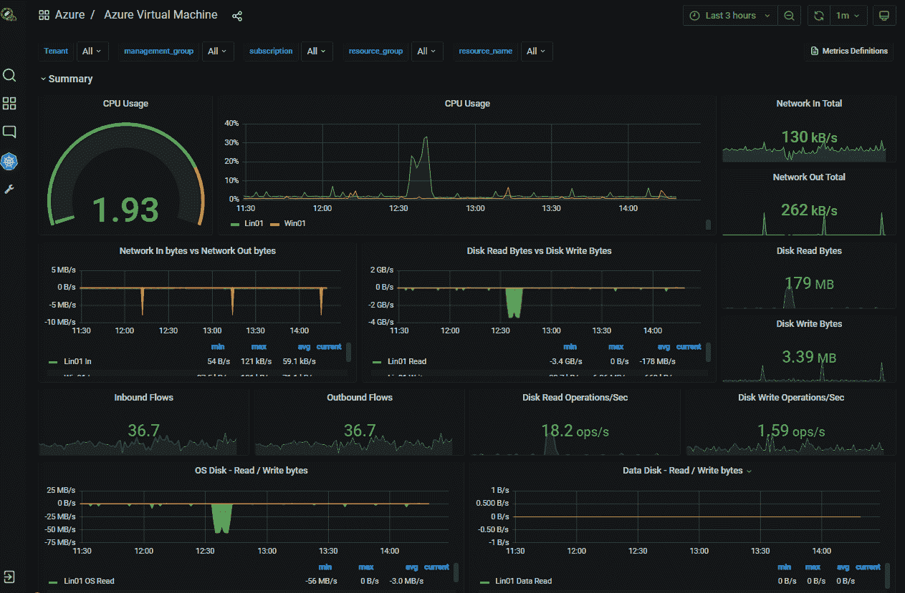

# Opvizor 将监控范围扩展到了云端

> 原文：<https://devops.com/opvizor-extends-monitoring-reach-to-the-cloud/>

code 公证人的一个部门 Opvizor 已经[将其监控能力扩展到云计算环境](https://www.businesswire.com/news/home/20221206005905/en/Opvizor-Delivers-Risk-and-Performance-Monitoring-across-Multiple-Clouds-and-On-Premises-Data-Centers)，开始支持亚马逊网络服务(AWS)和微软 Azure。

more 公证人首席技术官丹尼斯·齐默(Dennis Zimmer)表示，Opvizor 聚合数据，以提供一种更有效的方法来将分析应用于表面性能和风险问题。

之前，Opvizor 针对在内部 IT 环境中运行的 VMware vSphere 实例进行了优化。现在，code 公证人的部门，[一个生成软件材料清单](https://devops.com/codenotary-launches-cloud-service-to-generate-sboms/) (SBOMs)的服务提供商，正在将这些监控能力扩展到云端。

这一转变正值许多组织寻求在监控预定义指标和可观察性平台之间取得平衡之际，可观察性平台使发现可能对 it 环境产生负面影响的未知潜在问题成为可能。Zimmer 说:
就[可观察性](https://devops.com/?s=observability)而言，现在还为时尚早，因此 Opvizor 专注于与大多数 It 团队会面，因为他们今天正在进一步拥抱云计算。

一般来说，可观察性不仅可以查询日志和指标，还可以查询应用于特定流程的分布式跟踪。这样，可观察性允许组织检测没有预先定义的模式。实际上，可观察性平台使得调试应用程序环境变得更加简单，在这种环境中，服务之间存在的依赖关系变得过于复杂，以至于无法手动跟踪，更不用说破译了。如果没有可观察性平台的帮助，可能需要数周时间才能发现应用程序性能下降的确切原因。

当然，这些应用程序将需要使用能够生成平台所需的数据可观测性的代理软件。幸运的是，OpenTelemetry 等开源项目有助于降低仪器的总成本。

然而，在缺乏可观察性的情况下，大多数 IT 团队将依赖现有的监控工具。Zimmer 指出，Opvizor 正在为跨多个平台的集中监控提供案例，以降低成本。

进入 2023 年，每个 IT 团队都需要决定如何以及何时依赖传统监控工具和可观察性平台。许多可观察性平台提供商正在根据成本和消除多种监控工具需求的能力来证明购买新平台的合理性。然而，it 组织是否愿意同时使用这两种监控工具来跟踪预定义的度量以及可观察性平台，还有待观察。

不管采用哪种方法，现实情况是 IT 环境变得越来越难以管理。除了在多个云平台和内部 IT 环境中运行工作负载之外，组织还在部署基于容器的新兴云原生应用，以及部署在传统虚拟机上的现有整体应用。随着工作负载部署在多个平台上，IT 总成本开始上升。控制这些成本的一个方法是标准化一套可以应用于多个平台的工具。

在任何经济不确定时期，合理化工具集的压力只会增加。当然，挑战在于说服一个团队放弃他们喜欢的工具而选择另一个来降低成本。