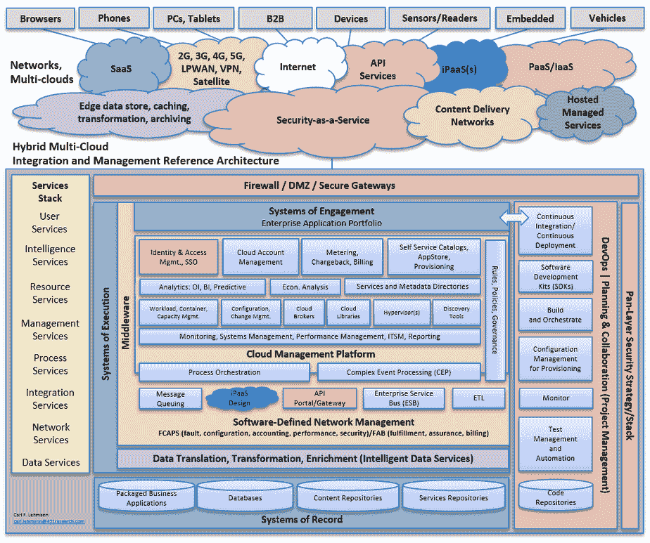

# 管理您的云计算环境的 12 个技巧

> 原文：<https://devops.com/12-tips-managing-multi-cloud-environment/>

没有任何一家云供应商能够为您独特的业务环境提供完美的解决方案。最大化云服务对您的企业的好处的唯一方法是与几家云提供商打交道，并同时监控他们。这就相当于倒立炒鸡蛋时唱咏叹调。(不完全是，但看起来是这样。)

在规划贵公司的云计算战略时，请谨记以下 12 点:

*   绘制您的整个网络，然后确定云在其中的位置。清楚了解云在您的整体系统管理战略中的作用，以避免填补业务经理和其他客户的数据需求缺口。不同的业务线将由不同的云提供商提供最佳服务。
*   与对意外事件做出快速积极反应的供应商合作。当你拼接多个云服务时，总会出现不可预见的情况。您的合作伙伴应该定期报告他们的服务、增强功能和新功能的状态。
*   **自动执行低级监控和维护任务。**采用云服务的两个主要原因是节省成本和提高运营效率。实现这两个目标的一个方法是减少保持系统运行所需的人工监督。

*本流程图展示了多种云管理的潜在复杂性，其中包含许多需要精确整合的元素。这些低级操作中的许多必须自动化，以优化您的策略。来源:卡尔·p·莱曼，* [*451 研究*](https://451research.com/report-short?entityId=89913&referrer=marketing&utm_source=website_homepage&utm_medium=website&utm_term=business_applications&utm_content=apply_for_trial&utm_campaign=2016_market_insight)

*   跟随你的用户。密切关注应用和系统的“消费者”实际上是如何使用这些工具的。它们是哪些过程是最大的生产力助推器的最佳指示器。您还可以了解用户发现的帮助他们更快、更高效和/或更经济地完成工作的任何新服务。这让您可以了解用户将来最可能需要的工具种类。
*   在成本控制上加倍努力。你不能控制你看不到的东西。与多家供应商打交道会使新服务的申请流程变得复杂。为了避免快速实现有用的新服务的不必要的障碍，设计一个像服务本身一样灵活的购买过程。然而，在服务蜜月期后不久，评估每项新服务是否证明是值得的，是否有更好和/或更便宜的替代方案。
*   **应用生命周期继续决定着云迁移。**数据中心可能正在缩小，但绝对不会消失。出于与安全性、合规性、保险和许多其他因素相关的原因，在可预见的未来，一些系统将留在内部。你当然希望避免尝试将内部应用升级并转移到云服务，尤其是那些只有几年历史，因此还没有收回成本的应用。一旦一个较旧的系统准备好进行改造，就更容易成为云原生的商业案例。
*   **利用可预先占用的虚拟机的能力。**根据《计算机周刊》的 Matthew Cooter 在【2016 年 11 月的一篇文章中的说法，由于可预先清空的虚拟机持续时间不会超过 24 小时，因此它们是批处理和容错部署的良好选择。可预先占用的虚拟机比谷歌的常规实例便宜 80 %,其固定价格有助于公司规划和管理成本。
*   **采用专为虚拟环境设计的集成数据中心管理系统。**云服务提供商 Embotics 总裁兼创始人 Jay Litkey 在[2016 年 11 月 21 日《虚拟战略》杂志的文章](http://virtual-strategy.com/2016/11/21/strategies-for-multi-cloud-management-interview-with-jay-litkey-president-and-founder-of-embotics/)中表示，这是确保您的服务器、存储、网络、安全、运营和应用团队作为一个整体朝着共同目标努力的唯一方式。任何围绕传统物理基础架构边界构建的组织都注定要努力适应向混合和云计算环境的转变。
*   **确定您组织中最适合云原生实施的应用。**传统应用是整体式的，作为虚拟机运行，使用纵向扩展架构，通常更难以开发、部署和维护。相比之下，云原生应用更加模块化和面向服务，由容器和服务的集合组成，基于横向扩展架构，易于自动化、移动和扩展。

*关注您组织中最能从云原生方法中受益的应用程序，等待那些通过部署在传统数据中心平台上而得到更好服务的应用程序。来源:* [*TechTarget*](http://searchcloudcomputing.techtarget.com/ebook/The-benefits-of-a-multi-cloud-approach/Deciding-what-goes-where-in-a-multi-cloud-environment)

*   **将您的应用与发挥其优势的服务相匹配。**VMware 和 AWS 等知名服务已经发展成两个分支，以满足客户的不同需求。例如，VMware 基于 vSphere 的企业混合云面向传统应用，而该公司的原生混合云则面向模块化、基于微服务的系统。同样，AWS 的弹性计算云、弹性块存储、EFS 文件系统和 VPC 专用网络模仿了内部数据中心，同时该公司还支持更高级别的服务，如 NoSQL 数据库、BI 处理、类似 Hadoop 的集群、消息队列、推送通知服务、媒体代码转换器和搜索引擎。
*   **跨云环境自动执行策略。**使用多种云服务的唯一有效方法是拥有一个可自动应用于每个环境的单一策略标准。这些政策涵盖虚拟服务器、工作负载、数据存储、流量、合规性/法规、报告和安全性等领域。当您拥有跨不同基础架构的单一配置时，应用更新和更改也更容易，因为更改会无缝地从一个环境传播到另一个环境。
*   **供应商锁定成为过去。**当您仅依赖一个公共云服务时，将虚拟机和其他资源迁移到另一个服务可能会很困难。要考虑的因素包括可比的读/写负载、数据传输需求和网络延迟。相反，通过依赖您定制的云服务组合(所有云服务都共享策略和配置)，您会发现自己在管理变化，而不是变化在管理您。

— [布莱恩·惠勒](https://devops.com/author/bwheeler/)