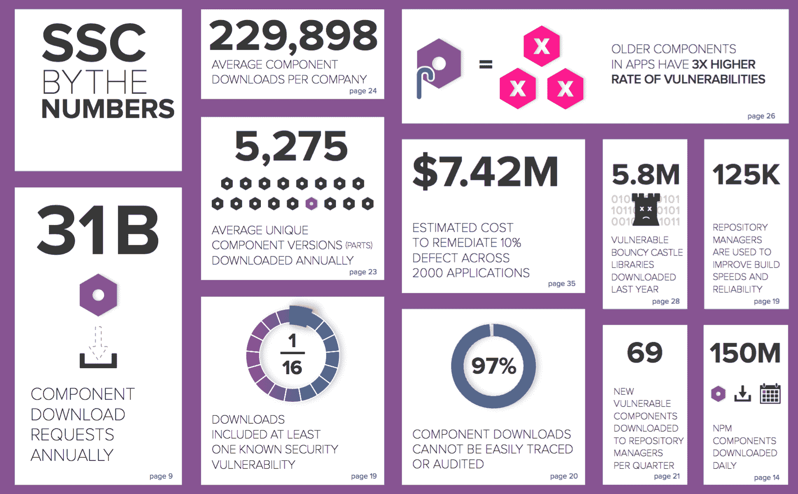

# 2016 年软件供应链状况报告在这里

> 原文：<https://devops.com/2016-state-software-supply-chain-report/>

我们的 [软件供应链状况报告](http://www.sonatype.com/software-supply-chain) 刚刚发布。在过去的一年里，我们积累了大量的数据，这些数据涉及到通过软件供应链流入开发环境的数量惊人、种类繁多的开源组件。今年，我们评估了 **3，000 家企业** 的行为，并对超过 **25，000 份申请** 进行了深入分析。

我们发现的结果从令人震惊到发人深省不等。例如，我们测量了每年平均消耗 229，000 个组件的组织。好消息是，这些组件有助于公司加速发展和创新。与此同时，我们看到应用程序中使用的 **6.8%的组件标记有至少一个已知的安全漏洞**——增加了高水平的安全债务。并非所有组件都是生而平等的。

Software supply chain infographic from 2016 report.  See full image [here](https://cdn2.hubspot.net/hubfs/1958393/SSC/2016_SSC_Infographic.pdf?t=1468330671265).

[2016 年软件供应链状况报告](http://www.sonatype.com/software-supply-chain) 将公开和专有数据与专家研究和分析相结合，揭示了以下内容:

*   开发人员正在狼吞虎咽地享用不断扩大的开源组件。去年有数十亿的开源组件被下载。

*   开源组件供应商的庞大网络正在快速发展。每天都有超过 10，000 个新版本的开源组件推出。

*   就质量而言，软件组件的种类繁多，数量庞大。16 个零件中有 1 个包含已知的安全缺陷。

*   顶级企业、联邦监管机构和行业协会已经接受了软件供应链自动化的原则，以提高软件的安全性、质量和安全性。

我们邀请您到 [阅读报告](http://www.sonatype.com/software-supply-chain) 并利用这些见解来了解贵组织的实践与其他组织相比如何。然后，让我们知道你的想法 [@sonatype](http://info@sonatype.com) 。

如果您想参加今年报告的现场讨论，请参加我们 7 月 13 日星期三的活动。在这里保留你的座位[。](http://www.sonatype.com/ssc-webinar?__hstc=31049440.fff56b041308a66b74cf93c40ea2030a.1456347809383.1467926971046.1467944811184.231&__hssc=31049440.11.1467944811184&__hsfp=4064732717)