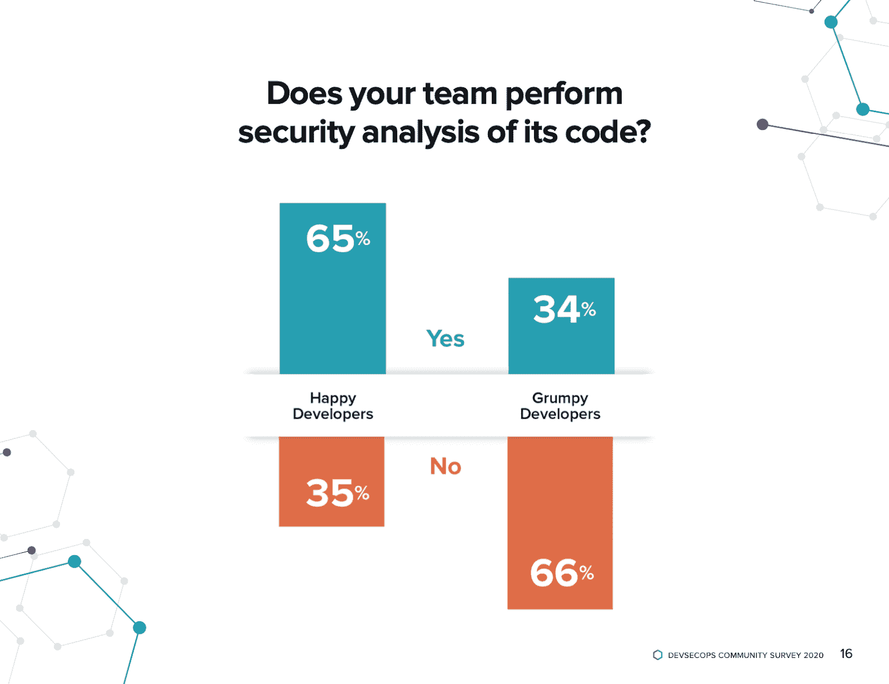
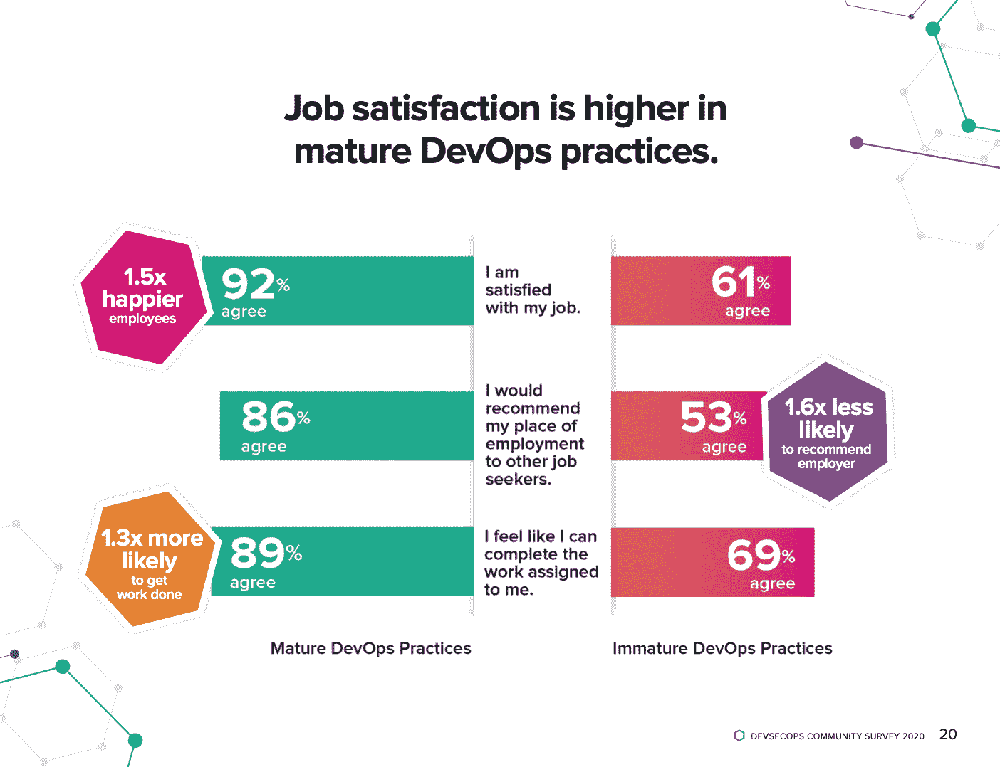

# 2020 年 DevSecOps 社区调查:在 5045 名开发者中，猜猜有多少是快乐的？

> 原文：<https://devops.com/2020-devsecops-community-survey-of-5045-developers-guess-how-many-are-happy/>

我们刚刚发布了第七届年度 [DevSecOps 社区调查](https://www.sonatype.com/2020survey) 。我们抓住了 102 个国家 5000 多名开发人员的脉搏。我们在 DevSecOps 中了解到的趋势会让你大吃一惊——尤其是关于快乐如何影响公司文化、软件安全和商业竞争力的部分。

当我们统计结果时，我们很快发现了一些有趣的相关性。拥有成熟的 DevSecOps 实践的组织更快地创新并生产更安全的软件。为什么？归结起来就是拥有更快乐的开发人员。成熟实践中的开发人员说他们喜欢他们的工作的可能性是 1.5 倍。成熟的 DevSecOps 实践使用自动化安全工具的可能性也是 1.8 倍，这无疑使开发人员的生活更加轻松。

这里是我们发现的一些有趣的小故事。

## **快乐影响文化**

“我们一直都知道 DevSecOps 是关于文化的。Verica.io 研究主管 James Wickett 表示:“2020 年 DevSecOps 社区调查首次揭示了清晰而令人信服的经验证据，表明当安全性成为数字化转型和 DevOps 之旅的一部分时，开发人员会更开心、更有效率。”

就像你买不到幸福一样，你也买不到好的文化。你得培养它。调查显示:

*   获得安全编码和编程机会的开发人员享受其工作的可能性增加了五倍。  
*   相比之下，只有 19%不开心的开发人员得到类似的培训。不开心的开发人员说他们对工作不满意，正在积极寻找其他机会。你可以看到为什么他们是脾气暴躁的猫。  
*   快乐的开发者不会依赖谣言——至少不会因为安全事故。相反，他们关注来自更好集成的工具和安全团队的经验证据。在成熟实践中工作的开发人员 3.8 倍不太可能依赖谣言。

## **快乐影响安全感**

“成熟的开发运维实践会不断测试、部署和验证软件是否满足所有要求，并允许在出现问题时快速恢复。因此，我们可以很容易地说，DevSecOps 是 DevOps 做得对的，’”卡耐基梅隆大学软件工程学院的技术总监兼兼职教员 Hasan Yasar 说。

快乐的开发人员构建更安全的代码。他们是这样做的:

*   成熟的 DevOps 实践有 1.7 倍的可能拥有完整的[【SBOM】](https://blog.sonatype.com/why-you-need-a-software-bill-of-materials-more-than-ever)，包括依赖关系。这使得查找和修复开源组件变得更快更容易。
*   代码质量？检查。快乐的开发人员忽视安全性的可能性降低了 3.6 倍。这是因为，有了合适的工具，他们可以把精力集中在重要的事情上。  
*   与在更成熟的 DevSecOps 实践中工作的更快乐的开发人员相比，脾气暴躁的开发人员忽略安全警告的可能性高 2.6 倍。

## **快乐影响商业成果**

“我们无法达到更高的 DevOps 成熟度，除非我们理解人们在转换过程中是如何紧密地交织在一起的。最重要的是，DevSecOps 的成功取决于人类的努力，”DevOps Institute 的首席执行官 Jayne Groll 说。

商业依赖于快乐的人们构建的安全代码。看看这些发现:

*   快乐的开发人员遵循公司开源治理政策的可能性增加了 1.4 倍。这是风险管理的一个重要部分。忽视政策和降低软件供应链的安全性会带来灾难性的商业影响。  
*   快乐的开发人员向同事和朋友推荐其雇主的可能性增加了 1.8 倍，这对于在竞争激烈的环境中吸引和留住人才来说是一大福音。  
*   快乐的开发人员完成工作的可能性是普通人的 1.7 倍。如果生产力是游戏的名字(它经常是),那么拥有成熟的开发团队的企业会在竞争中胜出。

下载完整报告 [点击这里](https://www.sonatype.com/2020survey) 。还有，4 月 17 日一定要报名 [全天 DevOps |春假](https://www.alldaydevops.com/spring-break) 。我会做一个深入研究报告的会议，你不会想错过的。

— [DJ 施林](https://devops.com/author/dj-schleen/)