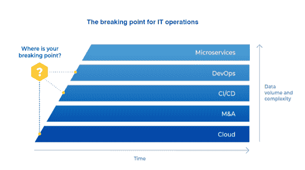

# 自主 IT 运营的三大支柱

> 原文：<https://devops.com/3-pillars-of-autonomous-it-ops/>

想象一个人类 IT 操作员和智能系统在虚拟操作室中一起工作的未来；当人类监督时，系统做繁重的工作。这看起来像科幻小说，但事实是我们已经在通往未来的路上。虽然真正的人工智能增强团队还有很长的路要走，但人工智能/人工智能工具正在缓慢但肯定地在 IT Ops，NOC，DevOps 和 SRE 团队中变得更加普遍，并带领我们进入这个不太遥远的未来。

在过去的五年里，互联网用户的数量增长了 50%。仅在过去两年， [产生的数据](https://www.uschamberfoundation.org/bhq/big-data-and-what-it-meanshttps://www.uschamberfoundation.org/bhq/big-data-and-what-it-meansz) 就超过了当时人类历史的总和。今天，智能设备每天 产生 5 万亿(即 18 个 0)字节的数据 [。这些海量数据对数字化运营产生了巨大影响。](https://financesonline.com/how-much-data-is-created-every-day/)

纵观企业，我们看到了类似的趋势:更多的工具产生更多的数据，随之而来的是更大的复杂性。这归因于许多因素，包括向云的过渡、将新工具和数据引入现有组织的 M&A 活动，以及采用 CI/CD、微服务等新技术和方法。在某个时候，数据如此之多，一切都变得如此复杂 [，以至于 IT 运营团队达到了一个临界点](https://start.bigpanda.io/200824_Report-IDG_2020_and_Beyond_LP.html) ，他们再也无法手动管理正在生成的数据。

当达到这一点时，停机和服务中断将成为日常现实，因为 IT 团队将从其战略性的业务关键型项目中抽身出来，投入到基本的消防工作中。

实现更多的可观察性和监控工具只会加剧这个问题，并且从长远来看，扩展团队是不划算的。更具前瞻性的解决方案是自动化，更重要的是自治。

## **IT 运营自主之路**

自主性是指 IT 运营能够在最少甚至没有人工干预的情况下运行。它依赖于事故管理生命周期的自动化，因此只需要人来监督，就像一个操作员可以监督一个现代化的高度复杂的机器人汽车装配线一样。

我们如何能够实现 IT 运营自主？  下面提出的三大支柱可以作为指引:

支柱一:自动化

支柱二:预测和预防

支柱三:民主化

## **支柱一:自动化**

我们必须尽可能自动化事故管理各个方面的每个步骤。这不会在一夜之间发生，但随着时间的推移，在人工智能/人工智能的帮助下，这是可行的。

考虑一下自动驾驶的类比。

就在几年前，汽车还是手动的，几乎没有自动化。然后，我们通过部分自动驾驶走到了今天的位置——有条件自动驾驶——汽车可以在理想的条件下自动驾驶。这是我们开始接受的自动化水平；我们有些人小心翼翼，有些人更热情！与此同时，更高水平的自动驾驶技术也在不断进步，在这种情况下，车辆将能够在大多数情况下自动驾驶。也许有一天，我们会实现完全自主的圣杯，汽车会自动驾驶——也许我们甚至不需要方向盘！

同样，在 IT Ops 中，自动化是一个过程，不仅需要时间来建立所需的能力，还需要时间来建立对 AI/ML 技术的必要信任。这样的旅程通常从人工驱动的自动化开始，因为“如果-那么-否则”类型的自动化是手动添加的。例如，如果出现某个警报，票证将自动分配给特定的人。随着我们信心的增长，下一个阶段可能是人工智能驱动的建议，人工智能应用它从以前的人类行动中学到的东西来建议自动化什么，但人类专家决定是否接受建议。

在某个时候，我们将允许人工智能部分自动化一些任务——也许是那些风险较小的任务，例如收集诊断信息并将其添加到警报中，以便事件响应者自动接收这两项任务。我们甚至可以自动化我们系统的某些部分；也许在一个非生产关键的试运行环境中，这是一个验证自动化是否按预期工作的好地方。随着时间的推移，随着我们的人工智能和人工智能能力的发展，以及我们对它们的信任的增加，我们最终可能会实现完全人工智能驱动的自动化，完全没有人类的参与——人工智能将简单地检测故障*并*解决它。

## **支柱二:预测和预防**

通常，当分配事件时，响应者会记录事件的优先级。但是他们也将依靠他们的常识和过去的经验来决定如何应对。因此，例如，如果 P3 事件最近在 30 分钟内升级为 P1，而类似的 P3 事件现在再次出现，我们的响应者可能会优先考虑它，甚至优先于其他事件，以避免类似的升级。

虽然这是人类逻辑的优势之一，但另一方面，我们工作的 IT 环境是巨大而复杂的，没有人能够记住每一个潜在的相关细节。更重要的是，在我们的例子中，如果一个不同的响应者处理先前的事件，当前的响应者将不会有相同的洞察力。我们需要的是一个丰富的元素，可以将领先指标输入到平台中，供下一个操作员查看并采取行动以防止事故发生。

这就是 AI 可以帮忙的地方。

通过识别数据干草堆中的模式——例如，将不同的事件与同一根本原因联系起来——人工智能不仅可以产生有助于更快解决这些事件的见解，还可以*预测*某种结果。这是通过预测未来的一连串事件来实现的，以便在事件发生之前采取适当的*预防*措施。目前，这种预防措施可能由操作员手动采取，但在未来的某个时间点，自动化可能会使问题在导致断电之前由人工智能识别并修复，而无需人工干预。

## 支柱三:民主化

帮助我们实现 IT 运营完全自主的最后一个支柱是人工智能的民主化。AIOps 不应该只对拥有大量数据科学家在幕后工作的先进、成熟的组织开放。正如如今任何人只需点击几下鼠标就可以在网上完成几乎任何事情一样，*任何*组织都应该能够采用 AIOps 并享受其带来的好处！

民主化就是让任何需要的人都能在需要的时候获得相关信息，而且是以一种易于应用和操作的方式。AI 应该可以通过简单的用户界面访问，不需要编码；机器学习的好处应该对不(需要)理解机器学习模型的人开放。

这种民主化可以通过使 AIOps 平台变得简单并对所有人(从管理员到用户)开放来实现。例如，AIOps 平台可能会自动建议管理员应该如何为操作员区分事件的优先级，以使分类更容易，并提供即使是非专家也可以遵循的说明。AIOps 平台内置的此类特性越多，AIOps 就会变得越大众化。

未来几年，数据量将继续呈指数级增长，最终战胜海量数据的唯一方法是实现 IT 运营的自主化。

如果您是 AIOps 供应商，请记住这三个支柱，这样您的客户就可以继续向自治发展。  如果您是 IT 运营主管或工具架构师，并且 IT 运营自治是您愿景的一部分，请确保您的 AIOps 供应商的平台和工具是根据这些支柱及其原则设计的。

我们离实现自主还有多远？只有时间能证明一切。但有一点是肯定的——我们*将*到达那里，如果新冠肺炎·疫情教会了我们什么，那就是我们可能会很快看到机器增强的团队。