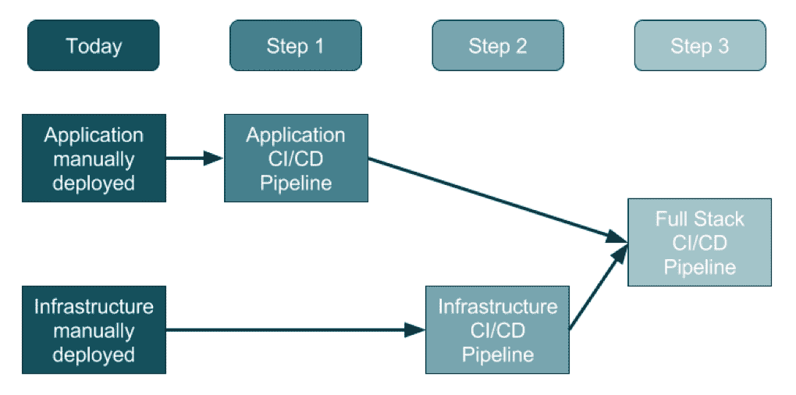
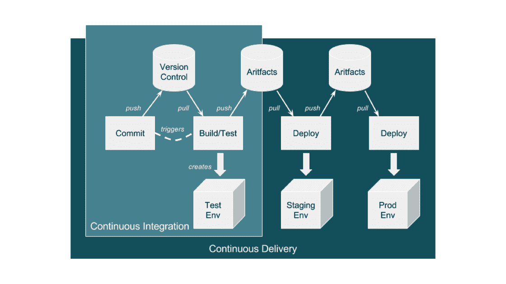
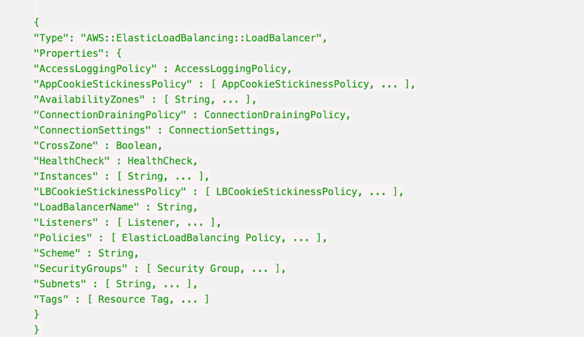
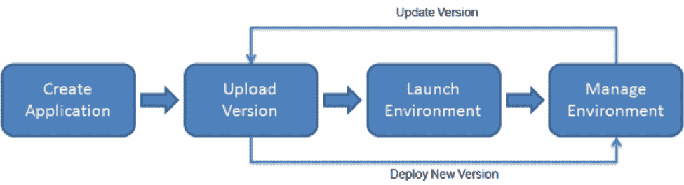

# 使用 DevOps 的 3 个实际步骤

> 原文：<https://devops.com/3-practical-steps-employing-devops/>

每个人似乎都在谈论 DevOps，但是，如果你是新手，这可能会有点让人不知所措。DevOps 最难的事情之一是知道从哪里开始。这是因为要"[做 DevOps](https://blog.sysaid.com/entry/please-dont-just-do-devops) "似乎你必须突然立刻开始使用许多新的流程和工具。

对于目前不使用 DevOps 的组织来说，采用这种三步方法将会保证一种总体上干净的方法。

Source: [https://ukcloud.pro/](https://ukcloud.pro/)

## 步骤 1:创建应用程序管道

不管应用程序的类型如何，从远处看，管道都非常相似。目标是将应用程序版本编织成一个新的协调流程，如下所示:

1.  开发人员对他们的笔记本电脑/PC/Mac 进行本地更改，并在完成时(包括测试等)。)发出拉请求。
2.  代码审查开始了，开发人员的变更被审查和接受，新的发布可以被创建。
3.  某个人，或者系统，运行一个过程来创建一个[发布工件](https://www.visualstudio.com/en-us/docs/build/concepts/definitions/release/artifacts)，它可以是一个 Java JAR 文件、 [Docker 文件](https://www.digitalocean.com/community/tutorials/docker-explained-using-dockerfiles-to-automate-building-of-images)或者任何其他类型的[部署单元](http://sce.uhcl.edu/helm/rationalunifiedprocess/process/artifact/ar_prdct.htm)。
4.  有人或系统将工件复制到 web 或应用服务器，并重启实例。
5.  数据库迁移/更新可能会被额外应用，尽管数据库经常被留在应用发布过程之外。

如下图所示，通过使用一个工具集来自动化流程，该流程演变为一个自动化的仅应用程序的持续集成和持续部署( [CI/CD](https://en.wikipedia.org/wiki/Continuous_integration) )管道:

Source: [https://ukcloud.pro/](https://ukcloud.pro/)

***典型的 CI/CD 管道***

但是，请注意这还不理想，因为此时只有应用程序被发布(注入)到现有环境中。

为什么这是一个潜在的问题？如果开发人员改变了本地环境和应用程序，但是这些本地环境的改变不是发布的一部分，那么它们就不受版本控制。而且，如果它们没有与应用程序同时应用，那么应用程序将会崩溃，常见的问题是:“好吧，它在我的机器上工作！”解决方案是同步应用程序和基础架构版本，也就是第 2 步和第 3 步。

## 步骤 2:创建基础设施管道

理想情况下，基础架构团队已经从开发团队的 DevOps 和 CI/CD 管道之旅中吸取了经验，并可以针对基础架构(日益成为公共云)对其进行扩展和调整。

基础设施管道存在一些差异，特别是在部署单元方面，这些部署单元现在是环境中的基础设施层，围绕应用程序的东西，如 DNS、负载平衡器、虚拟机和/或容器、数据库以及大量其他复杂和互连的组件。

这里最大的不同是，基础结构不再是在 Visio 图表中描述的:它在代码中、在配置文件中、在版本控制中变得生动起来，这就是基础结构代码(IAC)。

在此之前，负载平衡器是在 IP 和配置的 Visio 图表、Word 文档和 Excel 电子表格中描述的。现在，在一个配置文件中，它被用来描述关于负载平衡器的一切。

下面是一个负载平衡器的 AWS CloudFormation 配置示例:

每当该文件在版本控制中改变时，例如改变负载平衡器可以指向的子网，自动化引擎就可以更新现有的基础设施环境以反映该改变以及任何改变的依赖关系。

这还意味着您可以将该模板应用于多个环境，例如，只需将环境名称从 staging 更改为 production，并且确信所有环境都是一致的，从开发人员的笔记本电脑到产品。

还可以使模板动态化，以根据环境改变它们的行为，因此在生产中，环境将跨三个数据中心扩展，但在开发人员的笔记本电脑上，它将使用本地 VirtualBox 单一系统。

## 步骤 3:创建全栈流水线

全栈管道的目标是确保应用程序和基础设施随时间的变化是同步的，包括跨每个管道阶段的版本控制和发布部署。开发人员永远不应该说，“它在我的笔记本电脑上工作！”当产品发布失败时。

流行的 CI/CD 工具现在可以自动化整个堆栈，因为一切都是可编程的。这意味着一切都可以在版本控制中捕获，同样的配置可以使用动态输入参数在开发人员的笔记本电脑上构建环境，或者在云中构建 QA 系统，或者更新产品。

想象一下，一个开发人员对应用程序进行了更改，这也需要对数据库、web 实例扩展配置和 DNS 进行更改。所有这些变更都在一个版本控制分支中被捕获，开发人员从这个分支在他们的笔记本电脑上构建一个系统，并测试它。

这就是平台即服务系统所能做的。通过在与应用程序相同的代码库中添加环境配置文件，可以确保将应用程序绑定到基础结构。

## **AWS 弹性豆茎示例**

这是最终目标，尽管需要大量的练习和学习才能达到。观看构建和部署，看到自动化使用标记和动态配置来构建或更新应用程序和基础设施变化的目标环境，这可能是非常令人满意的。

## 关于作者/莎拉·拉哈夫

Sarah Lahav 是 SysAid 技术公司的首席执行官。自 2003 年以来，作为该公司的第一名员工，莎拉·拉哈夫一直是 SysAid 科技公司(T2)与其客户之间的重要纽带。她是 SysAid 现任首席执行官和前客户关系副总裁，这两个职位激发了她对客户服务的热情。在 [LinkedIn](https://www.linkedin.com/in/sarahlahav/) 和 [Twitter](https://twitter.com/sarahlahav?lang=en) 上与她联系。