# 构建数据科学模型的 3 个步骤

> 原文：<https://devops.com/3-steps-to-building-data-science-models/>

您是否考虑过用一些数据科学来补充您的开发技能？扩大您的研究范围，并遵循本快速教程，学习如何使用开放数据集、Jupyter 笔记本和顺序模型构建您自己的预测模型。

## **挑选你的数据游戏**

学习数据科学的第一步是找到一个符合你兴趣的数据集。一个可以找到灵感的强大平台是 [Kaggle](https://www.kaggle.com/) ，这是一个面向机器学习爱好者的基于网络的数据科学环境。它不仅提供开放数据集，还提供竞赛，甚至免费的 T2 微型课程。

也许你想改变世界，帮助科学研究。也许你想参加一场赞助挑战，赢得 65，000 美元。或者你可能想从一些[机器学习](https://devops.com/developing-simple-and-stable-machine-learning-models/)技术开始。有大量的数据可以搜索，并且总有一些公开的比赛可以参加。

在本教程中，我们将使用一个名为“[组织病理学癌症检测](https://www.kaggle.com/c/histopathologic-cancer-detection/overview)”的竞赛数据集不仅要理解我们将要处理的数据，还要理解这次挑战的主要目的，这一点非常重要。看我们的例子，我们读到如下:*在淋巴结切片的组织病理学扫描中识别转移组织。*

通俗地说，目标是基于淋巴结扫描的数据集来确定/识别/发现给定图像中是否存在肿瘤组织的迹象。这是足够的信息，知道我们的模型将不得不以二元方式回答这个问题:如果在给定的图像中有转移组织，答案是肯定的；如果没有，答案是否定的。

## **选择游戏计划**

机器学习主要有两种，有监督的和无监督的。

在我们的例子中，我们有一个训练集和一个基本事实——训练标签。换句话说，我们预先知道训练图像的输出值应该是多少。因此，如果我们有一个地面真理，那么我们知道我们正在处理监督机器学习。

这里的目标是学习一个基于示例输入输出对的函数。有了这个函数，任务就是将新的给定输入映射到预测输出。听起来合理吗？让我们进入竞争来源，看看我们是否有我们需要的。

**训练集:**这个集合包含您将训练您的模型的数据。这是一组我们已经知道正确答案的简单图像。

**Train labels:** 您可能已经猜到了，这个文件包含了 Train 集合中每个图像的正确答案。

测试集:一组我们不知道答案的图像。

我们的目标是创建一个新文件(类似于训练标签),其中包含测试集中图像的预测答案。

## 游戏开始了！

为了这个机会，我决定探索一下[谷歌合作实验室](https://colab.research.google.com/notebooks/welcome.ipynb#recent=true)。这是一个使用 Python 3 的免费 Jupyter 笔记本环境，不需要设置，完全在云中运行。如果你以前没有用过 Jupyter，现在是一个很好的入门机会。使用 [Jupyter](https://jupyter.org) 笔记本，您可以编写和执行代码，保存和共享代码，甚至访问强大的计算资源，所有这些都可以通过浏览器完成。

我们通过将需要的文件导入到 Google Colaboratory 来开始我们的游戏。方法如下:记住复制导入，因为我们以后会需要它们。

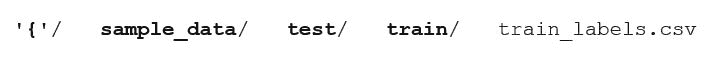

我们将使用 Kaggle 官方 API(你可以阅读更多关于设置和获取所需密钥的信息[这里](https://github.com/Kaggle/kaggle-api))轻松地将大型数据集直接检索到服务器环境中。

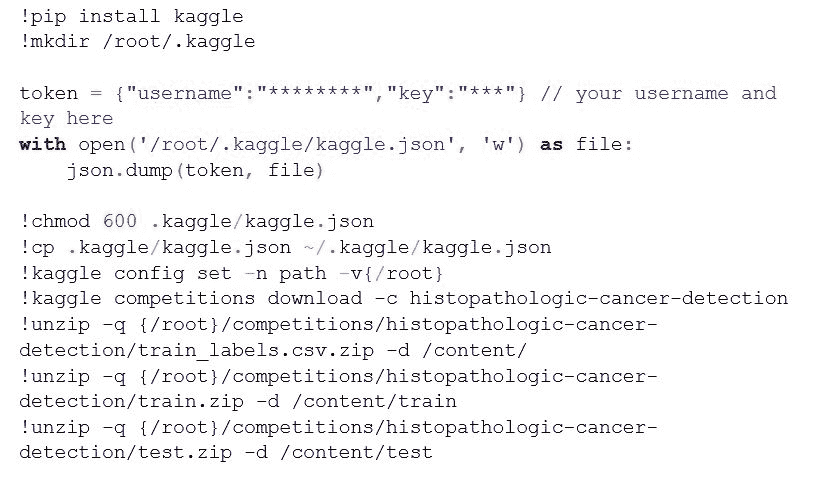

现在，当您执行 ls /content/时，您应该看到:

我们将把数据集读入熊猫数据框。

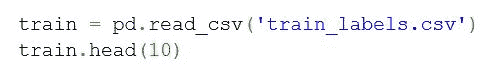

输出应该如下所示:

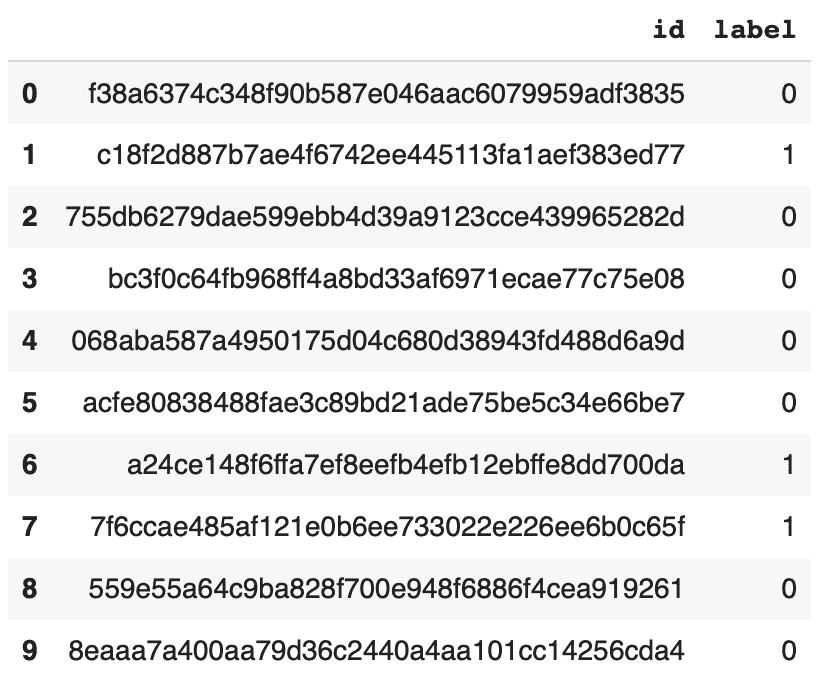

所有数据就绪后，我们就可以开始构建我们的第一个模型了。

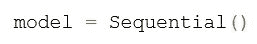

顺序模型是层的线性堆叠。模型需要知道它应该期望什么样的输入形状。因此，第一层(也是唯一的第一层)需要接收关于其输入形状的信息。你可以在这里阅读更多关于 Keras 序列模型[的构建。](https://keras.io/getting-started/sequential-model-guide/)

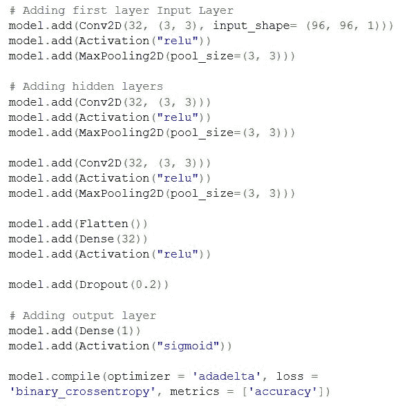

我们需要声明一些辅助函数来转换数据以满足我们的需要(用火车标签映射火车集)。

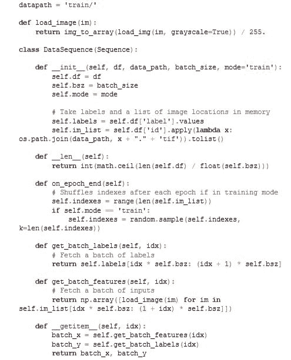

执行下面的代码，放上你最喜欢的电视节目…这需要一些时间来编译！记得把硬件加速器换成 GPU。它是免费的，可以将建模时间提高五倍。转到运行时，然后更改运行时类型，将无更改为 GPU。

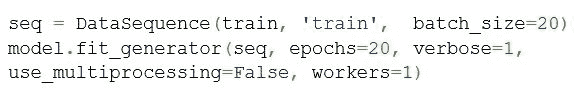

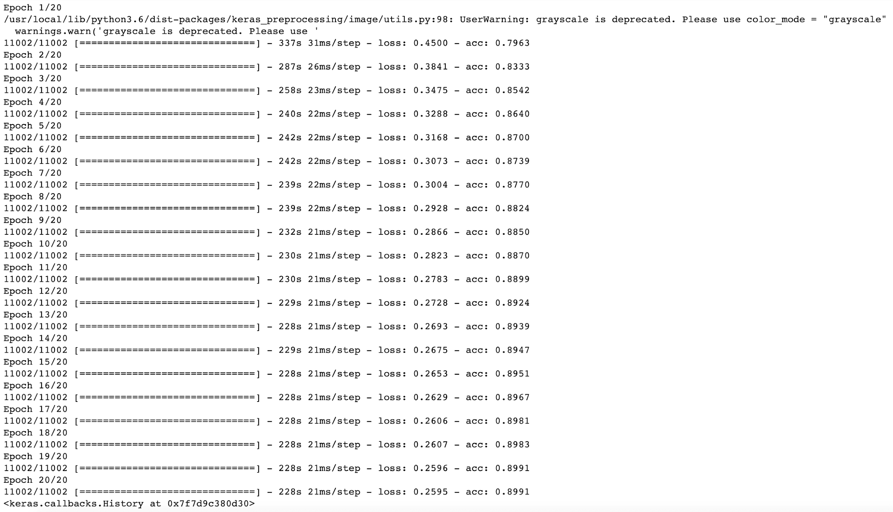

## **数据科学的最后阶段**

在我们生成预测之前，我们可能应该保存我们的模型(安全比遗憾好)。

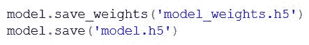

最后一步是获得测试集中图像的答案。当所有的计算完成后，我们可以看到前两张图片的预测。

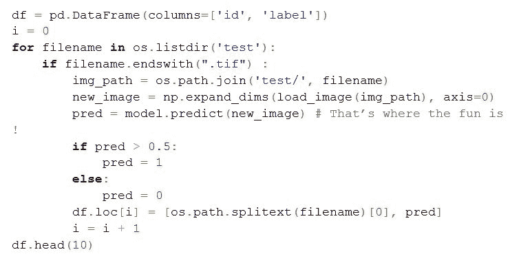

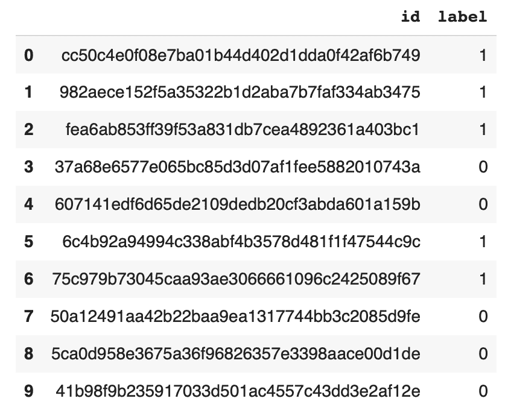

要保存最终结果并下载它们，请运行以下命令:

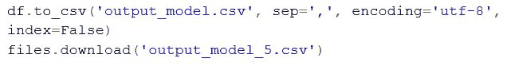

是时候把文件上传到 Kaggle，等着看我们最后的百分比分数了。

**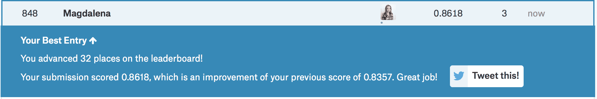**

## **提升您的数据科学游戏**

没有什么比良性竞争更好的了。既然我们正在参加一场真正的竞赛，我们必须考虑到会有一些赢家和一些输家。毫无疑问，我们希望成为第一组，但我们迄今为止训练的模型并不能保证这一点。我们应该尽可能地提高预测能力(尽管要小心过度拟合)。

有许多技术可以做到这一点，包括添加更多的数据，算法调整或集成方法。列出它们很容易，但选择那些确实会提高我们分数的就不那么容易了。

有无限的可能性来增加这个或任何模型的预测能力。选择一个新的数据集，并尝试拓展您的数据科学技能。

[马格达莱纳巴拉克](https://devops.com/author/magdalena-baracz/)