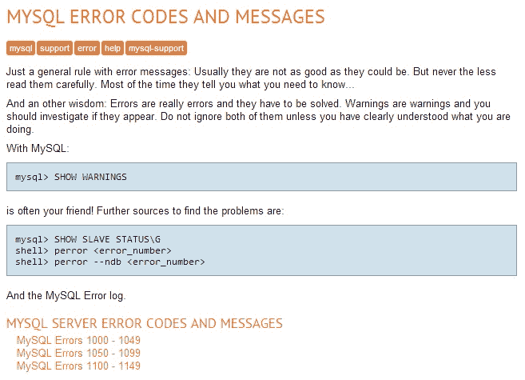
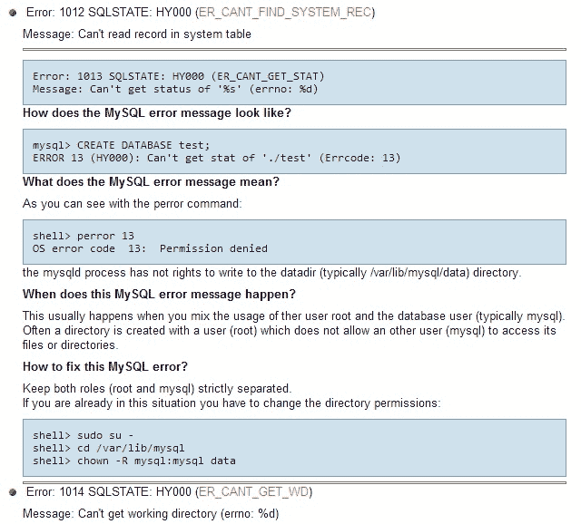

# 每个程序员都会犯的 4 个 n00b MySQL 错误

> 原文：<https://devops.com/4-n00b-mysql-mistakes-every-programmer-makes/>

即使是经验丰富的程序员有时也会因为这些常见的 MySQL 错误而陷入无限循环或者其他代码失败。

当数据库应用程序崩溃时，原因通常可以追溯到草率的编码。时不时地，行为不端的应用程序的原因是平台本身的特质。以下是如何防止你的数据库被这些常见的 MySQL 错误绊倒。

## 处理数值溢出

在 2014 年 8 月 11 日数据库杂志的一篇文章[中，Rob Gravelle 描述了 MySQL 处理数值溢出的方式中的一个“陷阱”(不是一个 bug)。当自动化脚本或应用程序提供的值超出列数据类型的范围时，MySQL 会将该值截断为可接受范围内的条目。](http://www.databasejournal.com/features/mysql/mysql-numeric-overflow-gotcha.html)

通常，数据库系统将通过生成指示脚本继续或中止的错误来响应无效值，或者将无效错误替换为它对想要哪个有效条目的最佳猜测。当然，截断或替换输入的值几乎肯定会在表中引入错误。Gravelle 解释了如何覆盖 MySQL 对溢出条件的默认处理，以确保它生成错误，这是大多数其他数据库中对无效条目的标准响应。

## 主键的误用

据科技共和国网站上的贾斯汀·詹姆斯所说，最常见的数据库编程禁忌是滥用主键。

James 坚持认为主键应该与一行中的应用程序数据完全无关。如果它们不是由系统管理的系统值，那么当您更改底层数据或将数据迁移到另一个系统时，很可能会遇到问题。

## 使用存储过程作为支撑

程序问题的另一个常见原因是存储过程的过度使用，James 将其描述为“维护灾难”没有简单的方法来确定哪些应用程序正在使用特定的存储过程，所以当您对应用程序进行重大更改时，您最终会编写一个新的存储过程，而不是修改现有的存储过程。相反，James 建议您使用高级对象关系映射器(ORM)。

然而，并不是每个开发者都对 ORM 感兴趣。在他的[实验思想博客](http://thoughts.davisjeff.com/2012/02/26/taking-a-step-back-from-orms/#more-498)上，杰夫·戴维斯解释了他为什么回避 ORM。因为 ORM 在应用程序和数据之间增加了更多的代码行，它们会带来更多的语义错误。Davis 指出，当您可以像查询应用程序一样查询数据库时，SQL 中的调试会更简单。应用程序错误和数据库之间的代码行越多，就越难找到故障。

## 过度使用 BIGINT

Thomas Larock 在 SQL Rockstar 网站上指出的一个常见的数据库错误是过度使用 BIGINT 数据类型。如果您确定一列中的值不会超过 100，000，那么当 4 字节的 INT 数据类型已经足够时，就没有必要使用 8 字节的 BIGINT 数据类型。您可能认为仅仅 4 个字节并不重要，但是如果这个表最终有 200 万行呢？那么你的应用就浪费了 7.8MB 的存储空间。同样，如果你知道你不需要 1900 年之前或 2079 年之后的日历日期，使用 SMALLDATETIME 将使我们的应用程序更加高效。

## GUIDs 的误用

在 SQL Skills 网站上，Kimberly Tripp [强调了另一个常见的数据库设计错误](http://www.sqlskills.com/blogs/kimberly/guids-as-primary-keys-andor-the-clustering-key/):使用无序的全局唯一标识符，或 GUIDs。除了在基表中创建碎片之外，非顺序 GUIDs 的宽度是基于 INT 的标识的四倍。

你的 app 无法上线是因为打字技术差吗？

也许开始寻找编码错误的最好方法是通过打印输出，而不是使用调试器。这是 fpweb.net 的 SQL 错误故障排除教程的建议。该问题可能是由于缺少单引号，或者在字符串中误用了双引号。如果收到“没有为一个或多个必需的参数指定值”的错误消息，请确保列名和表名拼写正确

同样，如果错误说明“条件表达式中的数据类型不匹配”，您可能在仅为数值设置的列中插入了字母或符号(反之亦然)。FromDual 站点提供了 MySQL 错误代码和消息的完整列表，包括许多代码的解释、错误的可能来源以及纠正许多错误的说明。

FromDual 站点解释了如何找到关于 MySQL 错误消息的信息来源。

对于许多 MySQL 错误消息，FromDual 索引提供了解释、错误消息出现的原因以及潜在的修复方法。

通过一点工作和大量的便笺，这些常见的 MySQL 错误是相当容易修复的。没有什么比看起来像一个不入流的程序员并破坏你的应用程序的完整性更糟糕的了。所以请保持敏锐，仔细检查您的 MySQL 查询。