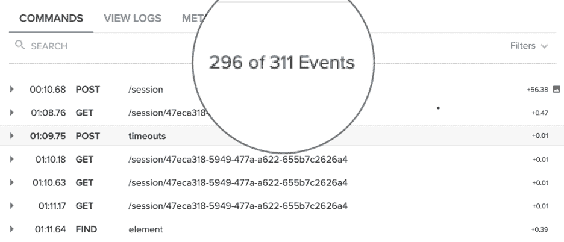
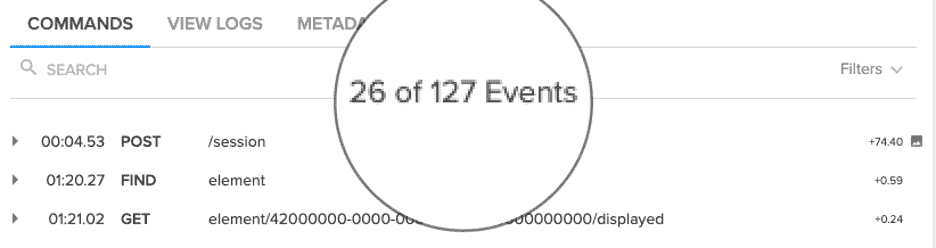

# 实现测试运行时间减少 66%的 4 个步骤

> 原文：<https://devops.com/4-steps-to-achieve-a-66-reduction-in-test-run-time/>

***这里有一些组织可以减少他们的测试运行时间来提高速度和效率的方法***

查阅任何最近的 DevOps 调查，都会出现相同的主题:测试仍然是阻碍组织更快地交付更好软件的最大障碍之一。然而，与过去不同的是，当时敏捷开发仍处于相对初级阶段，测试投资落后于交付管道的其他领域，今天的组织越来越意识到持续测试在快速交付高质量软件中的关键作用，并积极投资于必要的测试工具和技术。

不，今天的问题不是缺乏意识或工具。问题很简单，就是测试很困难，而且随着组织寻求大规模地推动自动化，测试只会变得更加困难。这个挑战在组织与测试质量的持续斗争中表现得最为明显。最近的一项研究显示，只有 24.37%的组织通过了至少 90%的桌面测试，只有 25.45%的组织通过了至少 90%的移动测试。记住，敏捷开发的目的是加速应用程序交付，缩短发布周期。如果组织不得不不断地手动跟踪以确定重复测试失败的来源，他们就什么也做不了。

## 做正确的事

组织必须找到提高测试质量和速度的方法。这么多测试失败的一个主要原因是它们运行的时间太长。运行的时间越长，就越有可能以失败告终。根据上述研究，那些在两分钟或更短时间内完成的人通过考试的可能性是那些持续超过两分钟的人的两倍。

记住这一点，让我们看看测试人员和开发人员可以实现的减少测试运行时间的四个关键步骤。

### 编写原子测试脚本

没有比运行原子测试更重要的创建更好更快的自动化体验的最佳实践了。这些测试只关注应用程序的一部分功能，比评估多部分功能的更长时间的测试执行起来更快更容易。

让我们看看这在实践中是什么样子的。假设一家在线零售商需要验证用户是否可以登录、查看礼品卡余额、将商品添加到购物车、继续结账并成功处理交易。即使是有经验的测试人员也会经常犯这样的错误，编写一个测试来验证这五个功能。更好的方法是编写五个独立的测试，每个测试专门关注一个功能，特别是如果目标是减少运行时间和提高测试质量的话。这五个“原子”测试独立但并行运行，执行时间比一个更长的测试要短得多。

### 并行运行测试

当然，如果这五个原子测试按顺序执行——也就是说，一次一个，一个接一个——它们将比一个屏幕流测试花费更长的时间来完成，从而抵消了任何潜在的运行时优势。这就是为什么并行运行测试是任何减少测试运行时间的策略的一个同等重要的组成部分。考虑一个假设的例子，一个测试套件有 100 个原子测试，每个测试需要两分钟来执行。按顺序运行这 100 个测试，需要三个多小时才能完成。并行运行它们，所有 100 个任务将在两分钟内完成。

还要记住，不要被给定套件中的大量测试所困扰。人们很容易认为，一个包含 10 个长测试(每个测试需要 5 分钟完成)的套件会比一个包含 100 个原子测试(每个测试需要 1 分钟完成)的套件执行得更快。但是，即使并行执行，具有 10 个长测试的套件仍然需要 5 分钟来运行——比具有 100 个原子测试的套件长 5 倍。

### 减少 Selenium 命令的数量

测试脚本中有太多的 Selenium 命令与原子测试背道而驰，这是导致测试时间长和不稳定的最常见的潜在原因之一。每一个命令都需要时间来执行，并代表着出错的新机会。最大限度地减少执行测试用例所需的命令数量，运行时间也会相应缩短。

### 使用显式等待

减少测试运行时间的另一个有效方法是使用显式等待，而不是隐式等待。隐式等待在测试脚本中的每个步骤或命令之间设置一个默认的等待时间，这样后续的步骤只在预定义的时间量过去之后才执行。另一方面，显式等待使脚本中的下一步能够在前一步完成后立即执行。尽管实现起来更复杂，但仅使用显式等待可以对测试运行时间产生显著的积极影响。

## 把它放在一起

下面的例子展示了一个未优化的测试套件，其中有 311 个针对移动设备运行的命令。这个例子花了 1，265 秒(或超过 21 分钟)来执行。如果目标是更快地交付更好的软件，那是行不通的。

然而，将上述策略应用于针对同一设备执行的相同测试套件，将命令总数降至仅 127 条，并使套件仅在 430 秒(或 7 分钟多一点)内执行，测试运行时间提高了 66%。

****

尽管减少测试运行时间的前景可能令人望而生畏，但是通过关注一组有限的关键策略和最佳实践，更短、更稳定的测试的最终目标确实是可以实现的。