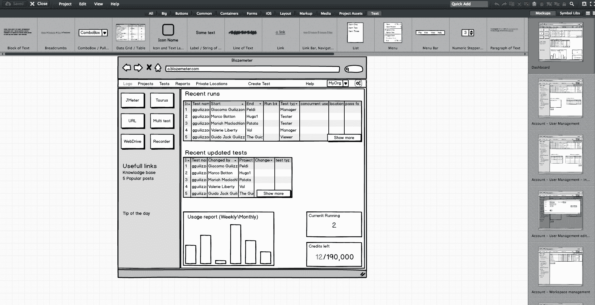
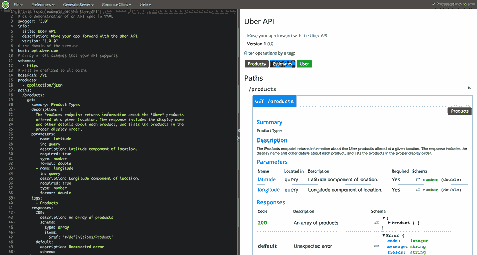
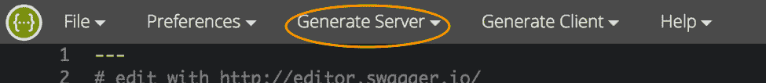
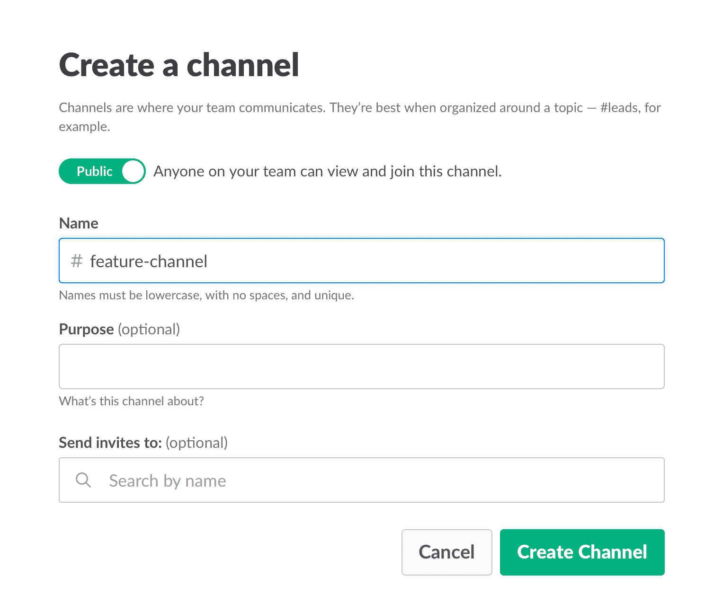
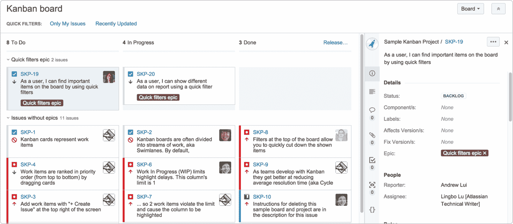

# 开发新功能的 4 大技巧

> 原文：<https://devops.com/4-top-tips-team-developing-new-feature/>

作为 [CA BlazeMeter](https://a.blazemeter.com/app/sign-up?utm_source=devopscom&utm_medium=external_article&utm_campaign=top-tips-team-developing-new-feature) 的后端开发人员，我最近有机会为我们的 web 应用程序开发一个大功能。这个特性需要对我们的后端代码进行大规模更改，对我们的前端进行大规模更改，并进行多次迁移。你知道我在说什么——这是开发商害怕的项目之一。

但是，我从这个项目中获得了很多宝贵的经验。我们不仅提供了一个很棒的功能，我还学到了开发新东西时团队合作和耐心的重要性。有了这两个价值，以及正确的工具和技术，您就可以快速有效地交付一个新特性。

以下是我学到的一些东西，不管你是在开发一个主要特性还是只需要少量代码修改的特性，这些东西都应该是有帮助的。

### **提示 1:计划了解开发需求**

开发过程在你开始编码之前就开始了，有计划。在[产品](https://devops.com/product-managements-role-devops-world/) [经理](https://devops.com/product-managements-role-devops-world/)决定需要开发什么之后，R & D 需要了解成本:该功能需要多少天(或几周)的开发，需要多少人，需要哪些 API。

要做到这一点，产品经理需要与后端、前端和 QA 领导进行至少三次“梳理”会议。培训会议从产品经理介绍产品流程和需求开始。

由于没有人想阅读大量的文本(除了这篇文章的优秀读者)，产品经理应该准备模型。他们不一定要设计好或色彩鲜艳，但他们需要向团队展示他或她的*愿景* **中的功能是什么样子。**在我们的梳理会议期间，我们使用了 [Balsamiq](https://balsamiq.com/) ，它可以让你创建产品外观、感觉和工作方式的屏幕草图。

*使用 Balsamiq 编辑屏幕草图*

在最初的陈述之后，会议应该包括许多公开讨论——提问、检查答案和检查合规性等。—直到每个人都满意并理解该特性对他们和其他人的要求。

这是前端、后端和 QA 给出他们对时间表的意见，并警告和标记开发或极端用例中任何潜在问题的时间和地点。产品团队的角色是回答问题，改变流程和需求，直到没有 R&D 拒绝。

之后，前端和后端领导需要创建一个功能开发计划，坐下来确定他们需要什么数据来将产品愿景转化为现实。或者换句话说，每个流程或按钮需要哪些 API，每个步骤需要多长时间，包括缓冲区，以及开发的顺序。API 是开发团队之间约定的“契约”。确定合同条款后，每个团队可以单独进行。

我建议你用 [Swagger](http://swagger.io/) 编写你的 API，它将 YAML 文件转换成包含所有 API 的详细的 HTML 页面。

*招摇编辑*

这个计划需要对参与项目的每个人都是透明的。事实上，如果每个项目参与者都能添加和描述场景，那就更好了。工具如 [TestLink](http://testlink.org/) 和 [Atlassian](https://www.atlassian.com/) 就是这么做的。然后，当代码准备好了，开发人员可以检查列表，看到所有的内容都被覆盖了。

我们将需要坚持这个时间表，特别是当新的需求与特性无关时，比如修复 bug。坚持这个计划是区分开发过程中好坏的最好方法。

### **尽快开始编写自动化程序**

计划好之后，我们希望每个人都开始工作，而不仅仅是后端。为了做到这一点，后端可以准备模拟，要么通过外包服务，如显示输入和输出的 [JSON 服务器](https://github.com/typicode/json-server)，要么通过编写虚拟代码。

我之前提到过，我们使用 Swagger 来编写[API](https://devops.com/internet-apis/)。我们还使用它在 NodeJS/Python 中生成了一个服务器，如下所示:

*通过 Swagger 生成 JSON 服务器*

从这一刻起，前端可以开始编写和构建屏幕，QA 可以开始编写 API 自动化测试，使用工具如 [JMeter](https://jmeter.apache.org/) 。此时，frontend 和 QA 拥有响应代码和响应主体；他们知道哪些功能应该放在哪里；以及他们需要哪些 API 以及如何使用它们。

QA 也知道他们遗漏了哪些数据，比如字段名和字段数据。当然，后端代码还没有准备好，所有自动化考试都将返回“红色”而不是“绿色”，但主要问题是确保每个人都尽可能做好准备。

这包括负载和性能测试。可以使用 JMeter 之类的开源工具，CA BlazeMeter 对其进行了[增强](https://www.blazemeter.com/jmeter-load-testing?utm_source=devopscom&utm_medium=external_article&utm_campaign=top-tips-team-developing-new-feature)。通过将我们的测试脚本上传到，配置虚拟用户的数量和加速时间，确定测试的地理位置，并分析 KPI 以确定趋势和我们系统的健康状况，我们可以确保我们的产品在不崩溃的情况下交付给客户。

将代码发送给 QA 也是如此:开发人员应该自己测试他们的代码，并确保当他们提交代码时，它在 99.9%的时间里都可以工作。

通过尽早开始自动化，您可以最小化开发过程中的未来瓶颈。

### **确保团队沟通并一起工作**

就像我之前说的，团队合作是创建新功能时最基本的要求。这是因为在开发过程中会出现新的问题，并且需求会发生变化。所以团队里每个人都需要时刻同步，从产品经理、设计师到开发人员、QA。

开放的沟通渠道是至关重要的，因为每个人都在同一时间开发同一个产品，但是每个开发人员或 QA 应该开发产品的不同部分和不同的功能。沟通确保每个人的工作与团队的其他工作相协调。这可以节省时间，防止沮丧和冗余，并确保最大限度的专业性。

为了确保每个人都知道发生了什么，我们使用了 [Slack](https://slack.com/) 并为这个功能的创建开放了一个专用通道。我们也有每日(短！)我们讨论我们拥有什么和缺少什么的站立会议。

*打开松弛通道*

沟通还包括团队和任务管理。 [JIRA](https://www.atlassian.com/software/jira) **，**我们主要的问题跟踪工具，提供看板风格、Scrum 和完全可定制的板，显示每个开发任务的进度，包括分配给它的开发人员，以及他或她的确切状态或阶段。

这有助于你了解其他人在做什么，同样重要的是，他们在哪里停滞不前。如果可以的话，让所有人在一个开放的空间工作，在中间放一个大屏幕。这可以让您始终保持同步。

我们也使用 JIRA 来打开和管理 bug。当多个 QA 发现同一个 bug 时，这很有帮助。重要的是要仔细选择哪些门票打开，并把它们放在一个史诗，所以每个人都保持专注。

*JIRA 仪表盘*

沟通的另一个重要方面是确保每个人都使用相同的术语，因为有时人们可能使用相同的术语来描述不同的事物，或者使用不同的术语来描述相同的事物。为了防止可能浪费你时间的混乱，确保每个人都在同一页上。比如你说“系统管理员”还是`<name blazemeter>`管理员”？

### **在相同的开发环境中工作**

重要的是，每个人都在相同的开发环境下工作，甚至使用相同版本的工具和库。否则，它可能导致(不)兼容混乱，包括许多不必要的来回，甚至可能导致错误弹出。这种环境需要尽可能与生产环境相似，但只是在较小的规模上。

## 结论

现在看看所有这些工作[在这里](https://www.youtube.com/watch?v=rfOsKxOmv04)产生的特性。我很感激我有机会和一个很棒的团队一起工作。

我希望这些最佳实践能在您下次开发新特性时帮助您。不要忘记在开发和交付之后保持敏捷，在连续的环境中运行测试，比如每次提交都运行 [Jenkins](https://www.blazemeter.com/jenkins?utm_source=devopscom&utm_medium=external_article&utm_campaign=top-tips-team-developing-new-feature) 。

CA BlazeMeter 与 Jenkins 合作，确保您可以在云中加载测试，并在左移时分析您的数据。你也可以使用不同的 APM 工具，比如 [New Relic](https://newrelic.com/) 、 [AppDynamics](https://www.appdynamics.com/) 和 [CA APM](https://www.ca.com/us/products/ca-application-performance-management.html) 在 QA 之前提醒你错误，这样可以节省时间。

— [多尔·阿蒂亚斯](https://devops.com/author/dor-atias/)