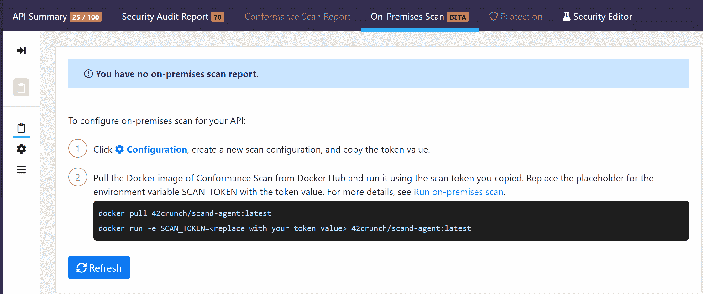

# 42 内部现已提供 runch API 安全平台

> 原文：<https://devops.com/42crunch-api-security-platform-now-available-on-premises/>

42Crunch 宣布，其提供的扫描工具可帮助 DevOps 团队保护应用编程接口(API)的安全，现在[可以在内部 it 部署中部署](https://42crunch.com/42crunch-api-security-platform-march-2021-release/)。

以前只能作为云服务使用，42Crunch API 安全平台也已经更新，为 OASIS 标准团体定义的 REST 接口的 OpenAPI 规范提供了扩展支持。

最后，除了提供与第三方身份管理平台的集成，42Crunch API 安全平台现在还允许 IT 团队在具有不同访问级别的特定团队和用户之间共享 API 集合。

42Crunch 的首席产品官 Dmitry Sotnikov 表示，API 扫描平台的内部版本将使 it 组织，包括那些需要在 IT 环境中部署所有平台的组织，能够对他们的 DevSecOps 工作流进行更多的控制和扩展，以包括对[API](https://devops.com/?s=APIs)的扫描。

Sotnikov 指出，网络犯罪分子越来越多地瞄准不安全的 API，因为它们可能提供对大量数据的访问。索特尼科夫补充说，这些相同的 API 也使网络犯罪分子能够危及整个软件供应链。

Sotnikov 说，由于微服务的兴起，越来越多的组织正在部署 API，显然更需要一种工具，在部署之前动态扫描 API 的漏洞。

Sotnikov 说，总的来说，IT 组织在保护软件的方法上变得越来越复杂。索特尼科夫说，例如，福特汽车公司正在使用 42Crunch API 安全平台来保护内部和外部 API。42Crunch 声称其收入在 2020 年增长了 900%，平台用户超过 150，000 人。

随着各种规模的组织越来越依赖软件，网络安全团队现在正在审查软件是如何构建的。当然，作为向 DevSecOps 最佳流程全面过渡的一部分，安全责任仍在向左转移，但 Sotnikov 表示，网络安全团队仍希望自己验证无论部署什么软件都是安全的。Sotnikov 补充说，IT 组织正在摆脱“打地鼠”式的安全方法，转而采用 DevSecOps。

不幸的是，API 并不总是受到应有的重视。许多开发人员仍然倾向于把它们看作是事后的想法，一旦部署，API 被搁置多年而不被审查或更新的情况并不少见。Sotnikov 说，如果组织希望确保其软件的完整性，确保 API 的安全性需要将动态扫描过程融入 DevOps 工作流。

当然，API 现在无处不在。少数 API 与有限数量的客户和合作伙伴共享数据的日子已经一去不复返了。如今，几乎没有任何构建和部署的应用程序不公开无数的 API。网络安全团队显然跟不上这些 API 的变化速度，因为会添加新的 API，更新或替换其他 API。保护所有这些 API 的责任现在比以往任何时候都更加明确地落在了 DevOps 团队的肩上。