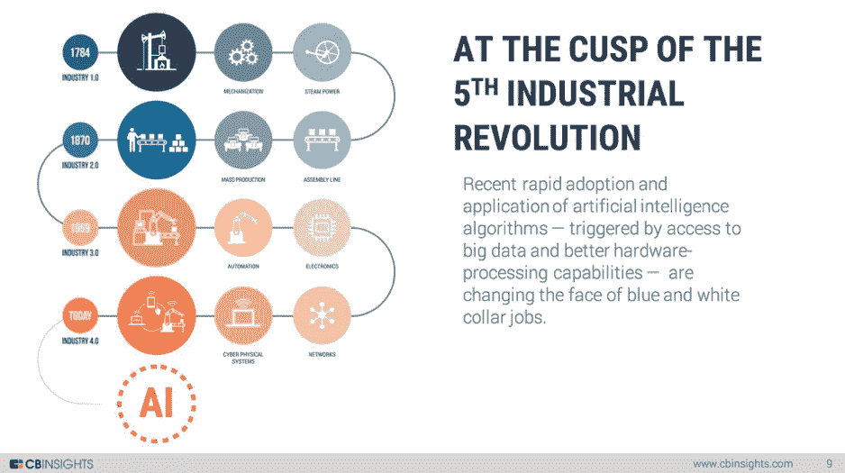
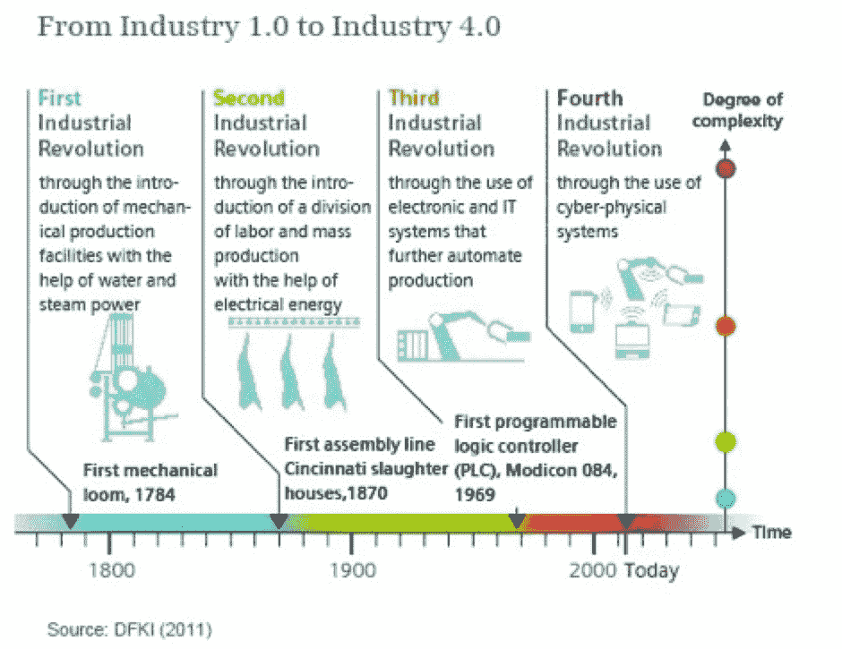

# 第五次工业革命:何时发生，如何发生

> 原文：<https://devops.com/5th-industrial-revolution-will-happen/>

工业革命一直在很大程度上主导和改变着世界。第一次发生在 18 世纪，第二次工业革命发生在将近两个世纪之后，20 世纪的 T2。第三次发生在半个世纪后，而第四次发生在 30 年内。按照这些变革的速度，第五次工业革命已经迫在眉睫。

与之前的技术革命相比，下一次技术革命将会更快、更具扩展性，并且会被更多的人采用。地球上的每个人都将经历一场由他们所掌握的技术带来的“个人”革命。3D 打印，可穿戴技术，机器人。无人驾驶汽车……一切都将唾手可得，并将使生活变得更简单、更快捷。每一次工业革命都带来了 GDP 的大幅增长，人们的生活方式也得到多方面的改善。然而，下一个革命性的技术并不仅仅旨在改善生活方式或帮助人们赚更多的钱；相反，它关注的是更高形式的智慧。现在，人类已经准备好进行一次大的冒险，步入太空。有了 SpaceX 和[负担得起的太空旅行](http://bigthink.com/the-voice-of-big-think/is-a-fifth-industrial-revolution-in-the-works)这样的想法，我们今天无法想象的未来也许明天就有可能实现。

工业革命的定义包括使用复杂的机器使人类的工作更容易和更快。今天，这包括机器人，机器学习，人工智能和许多其他没有人认为有一天会成为工业革命一部分的东西。

未来，我们只能期待技术在各个方面变得更加卓越和复杂:增强现实、大数据、虚拟现实、人工智能和最具颠覆性的技术——加密货币——仅举几例。加密货币是一种革命性的东西，每天都在制造新闻。比特币的价格正在触及天空，加密货币的投资者认为，未来几年价格肯定会触及月亮。随着越来越多的人投资加密货币和持有替代硬币，有一点是肯定的:第五次工业革命“已经”到来。

工业不仅靠机器或思想运转，也靠金钱运转。如今，人们正在花费他们的硬通货和法定货币购买加密硬币，包括比特币、以太坊、莱特币、Ripple、Monero、Dash、假人 IOTA 甚至代币(ico)。一个受欢迎的加密交易所声称它每天增加超过 30，000 个新用户账户——一个不容忽视的数字！

诚然，加密货币目前不受任何政府的监管或控制，但未来政府可能会对其产生的收入征税。让加密货币成为一种有效的货币形式还有很多工作要做。但是，即使像沃伦·巴菲特这样的高端投资者也声称加密货币将会继续存在，而且它确实会带来比预期更大的革命。

第五次工业革命即将到来，今天认为不可想象的事情将成为常态，普遍基本收入(UBI)等概念有助于缓解自动化和大规模失业的痛苦。人类准备向前迈出一步。

世界目前正处于一个破坏性的阶段，因为第五次工业革命将影响我们的生活——无论是好是坏。现在我们等待并观察未来会发生什么。

## **关于作者/艾玛·朗德尔**

艾玛是一名专业内容作家，目前为[教育小鸟](https://edubirdie.com/)提供自由职业服务。艾玛最喜欢谈论的话题包括[商业](http://bookkeepersblog.com/2017/11/guest-post-2/)、[软件](http://www.quertime.com/article/15-tricks-to-use-ccleaner-effectively/)、[高科技](https://appedreview.com/blog/top-5-tricks-excel-will-make-life-easier/)和网络开发。她拥有奥斯汀德克萨斯大学的经济学硕士学位。在推特上关注艾玛。