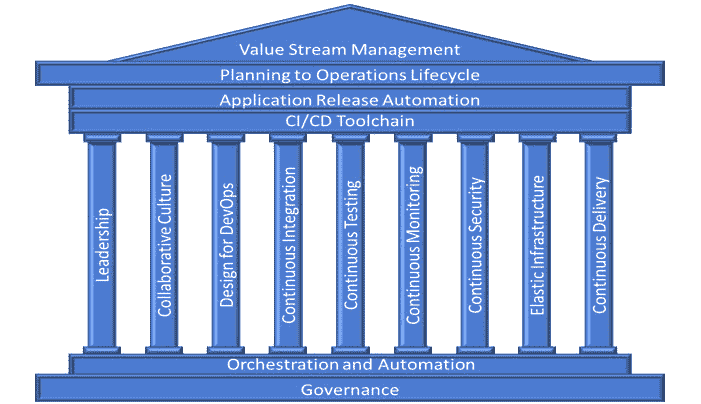

# 持续安全最佳实践的 9 大支柱

> 原文：<https://devops.com/9-pillars-of-continuous-security-best-practices/>

没有对安全最佳实践的适当考虑，由 DevOps 促成的软件变更的持续交付是有风险的。另一方面，如果根据最佳实践将安全性集成到持续交付渠道中，DevOps 提供了降低安全风险的机会。

本博客列举了 DevOps 九大支柱的最佳安全实践:领导力、协作文化、DevOps 设计、持续集成、持续测试、持续监控、弹性基础设施、持续交付/部署和持续安全。列出了每个支柱的最佳做法示例。这些实践可用于评估组织在持续安全之旅中的成熟度，通常称为 DevSecOps。

## 领导力

**领导者**需要理解并提出清晰的安全愿景。

*   领导展示了组织方向、团队方向和三年时间范围(包括安全实践)的愿景。
*   领导者通过鼓励提出新问题和质疑包括安全实践在内的关于工作的基本假设，从智力上刺激团队现状。
*   领导通过表彰团队的出色工作、认可工作质量的提高以及亲自表扬个人的杰出工作(包括安全实践)来提升个人认可。

## **协作文化**

**文化**在与开发运维合作良好的组织中，有一种协作式的持续安全思维。

*   这种文化鼓励跨职能协作、分担责任，并避免开发人员、运营、项目管理、质量保证和安全之间的孤岛。
*   DevOps 系统(工具链)由一个专家团队创建，并由包括安全部门在内的利益相关者联盟进行审查。
*   端到端开发运维工作流的变更由一个专家团队领导，并由包括安全部门在内的利益相关方联盟进行审查。
*   DevOps 文化赋予团队成员权力，并培训他们对安全性、合规性和隐私义务承担个人责任。
*   安全工程师/架构师参与模块化组件的设计，当模块中的安全模式发生变化时，他们也会参与进来。

## 开发运维设计

**快速设计 DevOps 软件**要求应用设计人员掌握持续安全的最佳实践。

*   在提交到集成分支之前，使用静态分析工具预先检查软件源代码变更。这确保了修改后的源代码不会引入严重的软件错误和安全漏洞，例如内存泄漏、未初始化的变量、数组边界问题和 SQL 注入。
*   软件组件分析扫描第三方组件中已知的安全漏洞，并在构建过程中识别风险。
*   所使用的技术堆栈的安全框架(如阿帕奇·希罗或 Spring Security)被记录下来，并与开发人员分享给他们各自的技术堆栈。
*   软件代码变更同行代码评审包括在将代码提交到集成/主干分支之前检查防御代码和安全漏洞。
*   常见的安全组件，如身份、授权、密钥管理、审计/日志、加密、协议等。在模块开发中维护、发布、随时可用和使用。

## **持续集成**

在有多个团队同时从事一个项目和不同代码库的组织中，持续集成(CI)是一项挑战。在集成阶段，从安全角度评估应用程序并理解代码更改的影响至关重要。

*   软件版本管理系统用于管理对用于创建和测试软件的源代码、可执行映像和工具的所有更改的版本。
*   增量静态分析预提交和提交检查被连接到 CI 中，只需扫描发生更改的代码，即可快速捕捉常见错误和反模式。这些检查通过控制流和数据流分析、模式分析和其他技术来识别安全漏洞。这些技术发现与安全相关的问题，例如使用加密函数的错误、配置错误和潜在的注入漏洞。
*   二进制工件经过数字签名并存储在安全的存储库中。
*   对软件源中使用的安全模式(如会话管理、认证、授权和加密代码)的更改会触发对安全工程师的通知或拉式请求。

## **连续测试**

**采用 DevOps 的持续测试(CT)** 在遵循最佳实践的情况下，持续安全性具有显著优势。

*   测试软件变更所必需的新的安全测试与代码一起创建，并与代码一起集成到主干分支中。然后，新的测试用于测试集成后的代码。
*   每个 DevOps 流水线阶段的安全性测试是自动的，并且可以根据预定义的标准自动选择。
*   发布回归测试包括安全性测试。至少 85%的安全回归测试是完全自动化的，如果部分测试必须手动执行，其余的是自动辅助的。
*   指示可能的安全问题的测试结果被标记用于安全分析。
*   动态或交互式应用程序安全测试测试应用程序的安全漏洞。这些测试的结果通过开发人员组织固有的工具和反馈回路交付给开发人员。
*   如果使用容器，则在映像部署期间，会扫描映像存储库以查找具有已知漏洞的映像，对映像漂移进行哈希检查，并对漏洞进行运行时检查。
*   攻击模式、滥用案例和测试是为应用程序模块配置文件构建的。
*   在 CT 期间，围绕边界条件(尤其是边界外条件)进行单元、功能和集成测试。测试包括错误处理、异常处理逻辑和否定测试。
*   自动化安全攻击测试，将 OWASP Top 10 集成到自动化测试中。

## **连续监控**

**安全的持续监控(CM)** 考虑工件和基础设施的动态特性，以及要保护的对象和服务的激增。

*   度量和阈值被自动收集、计算，并向团队中订阅它们的任何人公开。安全指标示例包括:
    *   生产前发现的安全缺陷数量
    *   安全测试的代码覆盖率百分比
    *   由于安全检查而失败的生成数
    *   平均故障检测时间
    *   平均解决时间
*   整合漏洞信息，提供跨工具、管道和应用程序以及随时间推移的漏洞风险和补救的全面视图。
*   生产安全控制的指标和事件，如 WAF、RASP 等。，用于改进安全性测试。
*   对安全威胁和事件的洞察在整个开发运维团队中共享和可见，以支持“攻击驱动的防御”方法。

## **持续安全**

**持续安全(CS)** 本身就是一个独特的支柱，具有跨越所有其他支柱的独立最佳实践。

*   所有正在使用的信息安全平台都通过 API 公开全部功能。
*   采用不变的基础设施思维方式来确保生产系统锁定。
*   安全控制是自动化的，不会妨碍开发运维的灵活性。
*   安全工具被集成到 CI/CD 管道中。
*   构建或测试机器上关键知识产权的源代码只能由具有凭证的可信用户访问。构建和测试脚本不包含任何拥有知识产权的系统的凭据。
*   定期安排外部渗透测试(带外完成)或定期进行深入分析。
*   来自生产安全控制(如 WAF 和 RASP)的遥测数据被传送回开发团队，以通知应用程序更新。
*   所有软件包和版本信息的准确清单通过基础架构以代码形式记录。自动检测用于识别是否有任何软件包具有关联的已知 CVE，并定义特定的补救措施。

## **弹性基础设施**

**弹性基础设施**与传统静态基础设施相比，环境具有优势。但是，弹性基础架构需要遵循最佳实践来实现持续的安全性，因为弹性基础架构提供了更广泛的攻击面。

*   配置代码包括自动检查，包括:
    *   确保不必要的服务被禁用，只有需要打开的端口被禁用。
    *   对文件、审计和日志记录策略的权限得到了实施。
    *   开发工具没有安装在生产环境中。
*   安全认证的操作系统、软件版本和框架用于构建所需的基础设施。在适用的情况下，ACL 和 FIM 等安全相关控制措施被定义为基础架构的一部分。
*   对运行在共享基础设施上的进程实施最低特权模型。
*   较小的集群用于降低团队之间的复杂性。
*   对服务提供商合作伙伴的安全控制进行验证，以确保它们满足共享安全模型领域中的业务需求。
*   IaaS 或 PaaS 服务提供商安全控制经过验证，以确保它们满足共享安全模型领域的业务需求。

## **连续交付/部署**

虽然 DevOps 支持快速向用户交付新功能，但为了最大限度地降低部署期间的风险，以下最佳实践非常重要:

*   发布到生产的决策是根据预先确定的指标确定的，这些指标包括安全性指标。
*   在每个环境(尤其是生产环境)的部署过程中，都会强制实施应用程序分段的白名单策略。
*   连续部署流程触发运行时安全性和合规性检查，包括:
    *   确保不必要的服务被禁用，只有需要打开的端口被禁用。
    *   对文件、审计和日志记录策略的权限得到了实施。
    *   验证开发工具未安装在生产环境中。
*   在连续交付流程的运行时或初始化过程中，用于部署的所有机密都以编程方式进行存储和检索。

在本文中，我们详细介绍了持续安全性的九大支柱的最佳实践，也称为 **DevSecOps** 。显而易见，DevOps 为软件部署提供了巨大的价值，但坚持最佳实践对于降低风险和确保安全性至关重要。每个组织都是不同的，具有不同的安全态势。**根据每个组织的风险评估，适当的具体实践、安全工具和指标可能会有所不同。**

从规划到运营的端到端安全指标的汇总很重要，但超出了本博客的范围。端到端安全监控工具，例如应用于 DevSecOps 和企业安全仪表板的价值流管理，是我们打算在后续博客中讨论的主题。

本文由 Imran Chaudhari 合著。Imran 是 Trace3 的首席安全顾问，他从战略、组织和技术角度帮助客户评估和设计网络安全计划。他的经验涵盖了安全软件开发、应用程序和云安全，以及身份和访问管理和 DevSecOps 评估方面的专业知识。

[马克·霍恩布洛尔](https://devops.com/author/marc-hornbeek/)