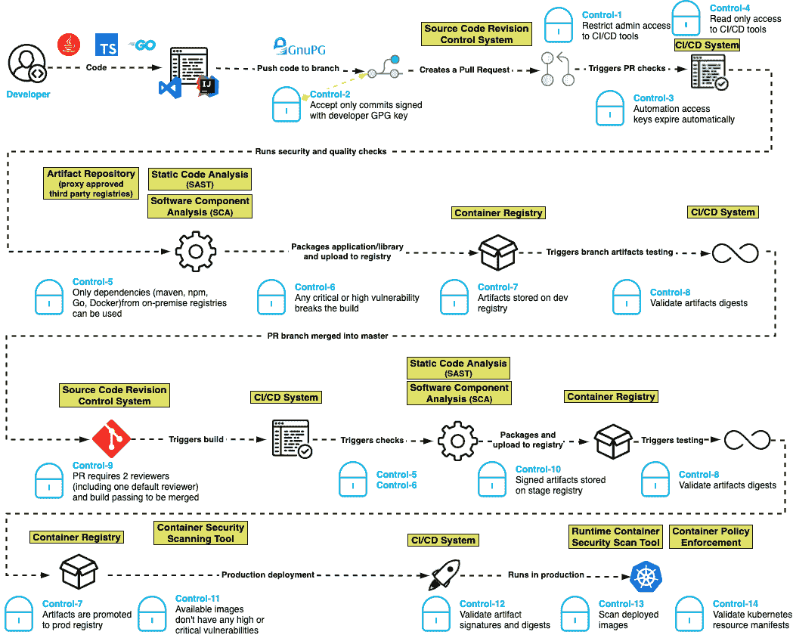

# 保护软件开发的蓝图

> 原文：<https://devops.com/a-blueprint-for-securing-software-development/>

近年来，软件开发发生了巨大的变化，像 DevOps、应用程序容器和原生云这样的技术改变了软件的构建和分发方式。不幸的是，攻击者一直在密切关注这些变化，并重新调整了他们的攻击策略，以利用软件开发和构建环境中相对较弱的安全控制。攻击者认识到安全团队更关注保护基础设施，而不是软件开发和供应链。这就是像网络安全管理软件产品这样的破坏性攻击是如何发生的——攻击者很可能会再次发动攻击，以获得更成功的结果。

需要一种新的方法来保护软件开发管道。此外，这种方法需要由开发软件的工程师来实施，而不是由信息安全团队来实施。工程团队需要负责设计和实施，同时向安全团队提供可见性，并保证控制措施是可操作的，策略是强制执行的。

确保管道安全的新蓝图以一组灵活的控制措施为中心，通过确保正确管理身份验证和授权、在适当的阶段测试软件工件的完整性以及将控制措施放在第三方和开源解决方案中纳入软件，来确保软件构建管道的安全。结果:软件创新和交付降低了供应链篡改的风险，并减少了开发过程中的攻击。

## 务实的设计哲学

这一现代软件安全蓝图基于以下设计理念:

*   **最小权限:**仅授予完成工作所需的访问和权限，仅此而已。
*   **不变性:**工件和基础设施在部署到环境之后不会被修改。如果需要更改，则在开发环境中的映像或脚本中完成，然后通过更高的环境进行提升。
*   **一切如代码:**基础设施、安全策略和管道的其他部分也作为代码实现，并受到与软件工件相同的控制。
*   **可追溯性:**所有的变更，无论是基础设施还是业务代码，都是受版本控制的。

## 控制软件开发管道的蓝图

该软件安全蓝图的基础以一组 15 个控件为中心，这些控件是为现代开发管道而构建的，在现代开发管道中，开发人员、管道和执行可以发生在世界上的任何地方。

**控制一:限制对 CI/CD 工具的管理访问。**确保只有经过授权的人员才能对 CI/CD 系统进行管理更改，从而防止未经授权对管道定义进行更改。

控制二:只接受用开发者 GPG 密钥签名的提交。未签名的代码提交很难追踪，甚至可能对代码库的完整性造成风险。

**控制三:自动化访问密钥自动过期。**通过确保自动化使用的访问密钥定期过期，开发人员可以在密钥泄露时缩短攻击时间。

**控制四:将自动化访问减少到只读。** CI 系统应遵循最低权限访问原则，对源代码库进行只读访问。

控制五:只能使用来自可信注册中心的依赖项。通过将依赖性管理器配置为仅允许连接到授权的注册表列表，可以通过阻止公共注册表中的恶意包进入管道来减弱攻击。

控制六:任何严重或高严重性的漏洞都会破坏构建。供应链攻击可能会将带有漏洞的代码引入软件管道。静态应用安全测试(SAST)有助于识别严重的安全问题，包括糟糕的加密实践、硬编码凭据和注入漏洞。

控制七:在开发、准备和生产阶段，工件被存储在一个存储库中。这种控制有助于加强工件的不变性，以便在开发、试运行和生产存储库中进行比较。

**控制八:验证工件摘要。**在将工件部署到任何环境中之前，应该根据存储库中的工件对其摘要进行验证，以确保它没有被破坏。

**控制九:拉请求需要合并两个评审者(包括一个默认评审者)和一个通过的构建。除了支持良好的编码实践，这种控制还有助于确保在没有合格的人工监督的情况下不进行提交。**

控制 10:更高存储库中的工件被签名。要求工件在整个过程中在存储库中签名，确保了部署到生产中的任何东西的可见性和可追溯性。

控制 11:可用的容器映像没有任何高或严重的漏洞。正如应用程序在投入生产之前需要进行漏洞测试一样，将应用程序打包用于部署的容器映像也需要进行漏洞测试。如果容器映像包含开源软件，它们可能存在开源漏洞。

控制 12:验证工件签名和摘要。根据摘要验证工件的签名可以确保工件在存储库中没有被篡改，并且被部署的工件与被测试的工件相同。

**控制 13:扫描生产中部署的映像。**这有助于确保生产中的所有软件都遵循先前的控制。

控制 14:验证 Kubernetes 资源清单。如果资源清单被篡改，他们可能会被诱骗部署攻击者选择的容器。

控制 15:确保构建环境是短暂且不可变的。构建环境应该在代码中定义，自动创建和拆除，并为每个构建创建一个全新的环境。不应使用交互式登录来访问生成主机。

我们相信这个蓝图为工程团队提供了一个可行的架构，安全团队可以团结起来支持它。通过采用这些标准，工程团队被承诺以较低的供应链篡改风险交付有保证的软件，减少开发期间的攻击以及试运行和生产中的操纵。

下面是它的样子:

要了解更多关于建议蓝图的信息，请阅读我们关于该项目的 [GitHub 帖子](https://github.com/Venafi/blueprint-securesoftwarepipeline%23readme) 。我们的目标是优先考虑软件开发的速度和灵活性，同时融入安全至上的思维模式。