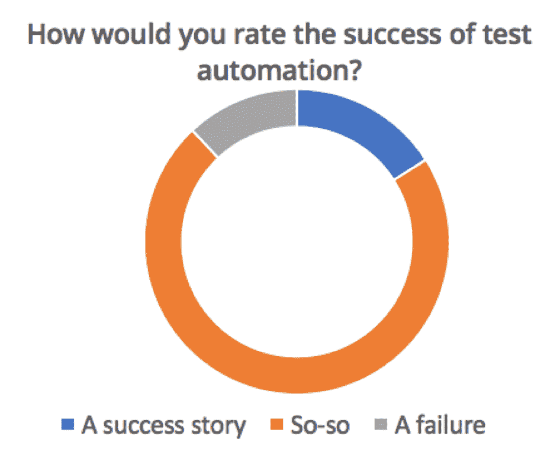

# 持续测试速成班

> 原文：<https://devops.com/a-crash-course-in-continuous-testing/>

有什么比这个“我爱 Lucy”的片段更好的方式来开始一个关于持续测试的博客呢，然后打个比方:

[https://www.youtube.com/embed/8NPzLBSBzPI?feature=oembed](https://www.youtube.com/embed/8NPzLBSBzPI?feature=oembed)

像 Lucy 和 Ethel 一样，许多软件测试人员一直在努力跟上加速的过程——然后主管说，“你做得非常好……加速吧！”

这种不断加快的速度只是驱动持续测试需求的**“完美风暴”**的四个方面之一。

## **什么是持续测试？**

**持续测试**是执行自动化测试的过程，作为软件交付管道的一部分，以尽快获得与软件发布候选相关的业务风险的反馈。

为什么我们需要重新思考我们的测试方法？

与测试相关的期望正在改变——但是[传统测试平台没有跟上](http://sdtimes.com/broken-promise-test-automation/)。遗留测试平台采用“繁重”的测试方法。他们依赖于**脆弱的脚本**，交付**缓慢的端到端回归测试**执行，并产生压倒性的**误报**。结果，他们在测试自动化方面取得了有限的成功。总体测试自动化率是 18 %,平均而言，企业是 8%。在一个投票问题中，观众确认了测试自动化的结果最多也就一般。

现在，软件测试人员正面临着**日益复杂的应用程序，以急剧加快的速度交付**——他们被期望以现代商业的新速度交付值得信赖的去/不去决策。更多同样的事情不会让我们成功。我们需要像改造开发过程一样，有意识地、显著地改造测试过程。

## 测试自动化和持续测试之间的区别

测试自动化和连续测试之间有三个主要的区别:

*   风险
*   宽度
*   时间

风险:向用户展示越来越多的创新功能现在是一个竞争优势，但它也增加了潜在故障点的数量、种类和复杂性。大多数测试被设计来提供关于用户故事是否正确地实现了需求的低级细节——而不是一个发布候选是否风险太大而不能发布的高级评估。你会根据测试结果立即停止发布吗？如果没有，您的测试就没有与业务风险恰当地结合。

**广度:**仅仅知道一个单元测试失败了或者一个 UI 测试通过了，并不能告诉你整体用户体验是否受到了最近应用程序变化的影响。为了保护最终用户体验，您需要足够广泛的测试来检测应用程序更改何时会无意中影响用户已经开始依赖的功能。

**时间:**如果您的组织已经采用了 DevOps 并且正在执行连续交付，软件可能每小时发布一次——甚至更频繁。在这种情况下，过程中每个阶段的反馈都不能只是“快”；它必须几乎是瞬间的。如果企业想要最小化错误软件到达最终用户的风险，您需要一些方法来实现必要的风险覆盖水平和测试广度——快速。

## **持续测试的要点是什么？**

*   持续测试的主要目标是**评估业务风险覆盖率**。
*   持续测试建立了一个**安全网**，帮助团队保护用户。
*   连续测试需要一个**稳定的测试环境**在需要时可用。
*   持续测试**无缝集成到软件交付管道**和 DevOps 工具链中。
*   持续测试交付适合交付管道每个阶段的**可操作反馈。**

您可以在[什么是持续测试](https://www.tricentis.com/what-is-continuous-testing/)页面找到更详细的列表(14 点)。

## 我在哪里可以了解更多关于持续测试的信息？

观看完整的持续测试网络研讨会，了解有关上述主题的更多详细信息，并了解:

*   持续测试如何影响组织
*   测试人员需要知道哪些实践才能成功地进行持续测试
*   探索性测试等非自动化实践如何适应持续测试

如果你想了解更多，下载白皮书“持续测试 vs 测试自动化:测试人员需要知道什么”或者访问[什么是持续测试页面](https://www.tricentis.com/what-is-continuous-testing/)。

辛西娅·邓洛普