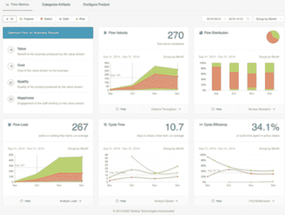

# 一个软件交付组织的每日 Gemba 行走？

> 原文：<https://devops.com/a-daily-gemba-walk-for-a-software-delivery-organization/>

精益思想对帮助企业改善他们的软件交付组织中的价值流产生了巨大的影响。然而，对于许多处于行业远见者 Brian Solis 所称的“新型经济”中的公司来说，[在这种经济中，市场条件尚未被识别或了解，适应并保持竞争力所需的响应度和敏捷性仍然不够](https://www.zdnet.com/article/get-ready-for-the-novel-economy-and-recovering-from-covid-19-fallout/)。

然而，通过测量价值如何在产品的价值流中流动，从实践者到商业领袖的每个人都可以发起“每日 Gemba 行走”，以获得对服务于内部和外部客户的软件交付价值流的实时连续洞察。您可以看到今天是什么在拖您的后腿，以及在哪些方面投入资源来持续改进对支持客户和员工体验至关重要的地方。

## 软件交付价值流中的独特挑战

软件交付价值流是一个组织为响应客户需求而进行的一系列活动，这些活动导致了价值的交付。然而，它们并不容易识别和衡量，因为大部分工作是知识共享。虽然[价值流图](https://devops.com/webinars/secrets-of-value-stream-mapping-for-future-state/)等精益实践帮助我们识别流程的当前状态，了解瓶颈在哪里，并通过实验改进以达到期望的未来状态，但仍存在巨大的挑战。

诸如安排时间、人员和合适类型的会议室等后勤工作，以及提取客观数据用于改进策略，使得保持评估价值流的常规步调变得困难。而且，在相对较短的时间内，我们捕获的信息会变得陈旧，因为优先级和战略计划是动态且不断变化的。

此外，由于从构思到操作的软件交付工作大部分是认知性的，并且通常是复杂的，因此很难准确地绘制价值流。流程不是线性的，它更像一个网络。相互关联的组件的复杂性和团队工作方式的可变性很难用一种可理解的方式来捕捉。因此，我们缺乏对端到端工作流程的完整、客观的了解，无法做出时间紧迫的决策来提高绩效。

## 去 Gemba

精益思想中有一个概念，即通过去实际工作发生的地方——“Gemba”——直接观察工作来学习。然而，在大规模的软件交付中，即使我们在价值流成员工作的大楼的楼层中漫步，我们也不会对正在发生的事情有太多的了解。我们可能会看到看板、会议和图表，但我们最常看到的是人们在多屏办公桌前用笔记本电脑工作。我们只看到了创造价值的活动的一小部分。

那么，我们如何以连续的节奏看到整个价值流中的所有活动，以帮助我们做出被动和主动的决策，从而改善最紧迫领域的流程？一种方法是流程度量，正如 Mik Kersten 的书《从[项目到产品](https://projecttoproduct.org/about-the-book/)》中所描述的，通过[流程框架](https://flowframework.org/)。

该框架是一种精简和规范的方法，指导组织在大规模软件交付中测量*什么*和*如何*，该框架使用流程度量向业务和 IT 领导提供对技术交付和业务成果之间关系的共享、实时洞察。它帮助你建立你的基线，看看你今天在哪里，并找出你需要集中精力的地方。

这些价值流指标通过将加速每个产品价值流的投资与期望的业务成果相关联，来跟踪业务价值流。我们可以使用这些指标，在不中断相关团队工作的情况下，根据客观数据，将我们过去在价值流映射会议中所做的工作扩展为日常的 Gemba 行走。

我们可以直接看到我们的团队创造价值的速度。我们看到了他们工作的效率和分配。我们看到了在制品(WIP)和创造价值的交付周期。我们看到了产品价值流贡献者的辛勤工作与最终业务结果之间的相关性(例如，收入的新特性；为产品质量/客户修复缺陷；偿还技术债务以提高交付速度，安全和风险工作以防止违规，等等)。

## 重要的业务级指标

流量指标包括:

*   流速衡量价值传递是否在加速。它是在特定时间段内完成的每种类型的流项目的数量(也称为吞吐量)。
*   流动时间可以识别价值实现时间何时变长。它测量流程项目从工作开始到工作完成所需的时间，包括活动时间和等待时间。
*   流动效率可以识别流程中的浪费何时增加或减少。它是总流程时间中活动时间与等待时间的比率。
*   流负载监控价值流的过度利用和利用不足，这可能导致生产力降低。它衡量价值流中当前正在进行(活动或等待)的流程项目的数量。

除了上面的一组流程度量，流程分布的度量有助于在特定的时间框架内对特定类型的工作进行优先级排序，以满足期望的业务结果。流程分布度量在一段时间内完成的四个流程项目(特性、缺陷、债务和风险)的比率。

理想情况下，流指标应该显示在单个仪表板中，为 IT 和业务领导提供价值交付的完整视图，以及对指标如何相互影响的理解。这里有一个例子:

流程度量打开了一个实时窗口，可以看到我们以前无法如此频繁和客观地看到的价值流活动。考虑每天进行软件交付的 Gemba 散步，以确保您满足您的内部和外部客户的最迫切的需求，以导航通过新经济的不透明性。