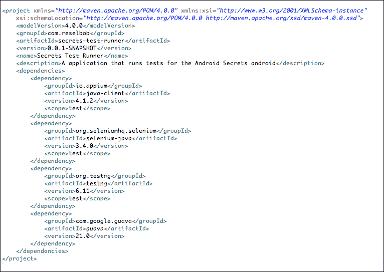
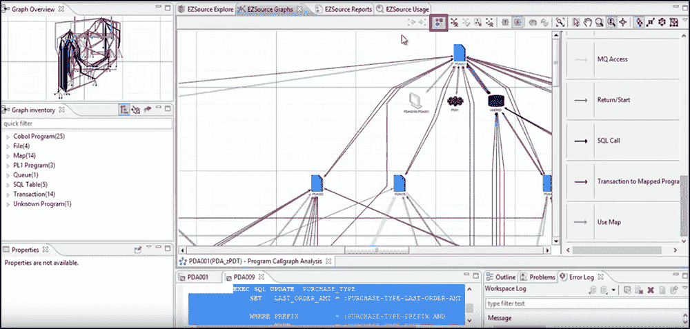

# ADDI 解决了依赖性管理的问题

> 原文：<https://devops.com/addi-addresses-the-problem-of-dependency-management/>

想知道糟糕的一天是什么样子吗？假设你是一名开发人员，在职业阶梯上努力向上爬。有一天，你的经理来到你的办公室，告诉你，你被指派在公司的 premiere 应用程序中实现一个关键的新功能。你兴高采烈。最后，你可以展示你的编码天赋了。

你花了接下来的两周时间夜以继日地工作来完成这个功能。终于到了发布的时候了。您发出一个 pull 请求，将您的代码合并到代码库中。一切都应该很好。你可以尝到即将成为明星的滋味。接下来你知道的是，你的收件箱开始被电子邮件填满，抱怨你的新代码破坏了构建。原来您的代码使用的第三方库是早已过时的旧版本。在您的本地系统上运行良好的代码正在对通用代码库造成破坏。一切都乱了套。本该是你荣耀的时刻却变成了尴尬和羞耻的插曲。

## 你已经进入了依赖地狱

任何一个已经编码了一段时间的人都已经陷入了依赖地狱。我们这些在 Windows 早期版本中编程的人把它叫做 [DLL 地狱](https://en.wikipedia.org/wiki/DLL_Hell)。Java 开发者已经被第三方烧伤了。随着代码在发布周期中的移动，jar 文件并不一致。时至今日，仍有大量 Python 开发人员在努力应对让 Python 2.7 代码在更新的 Python 3 环境中工作的挑战。节点开发人员面临着将遗留代码从 ECMA 版本 5 过渡到 ECMA 版本 6 的持续问题。依赖性不匹配问题在软件开发的历史中一直是个问题。自从早期的批处理作业在 [JCL](https://en.wikipedia.org/wiki/Job_Control_Language) 下运行以来，大型机开发人员就被未知的依赖关系弄得措手不及。依赖性不匹配是真实存在的，而且会造成伤害，有时伤害太大。

## 那么，该怎么办呢？

当谈到解决依赖管理的问题时，软件行业并没有在车轮上睡着。事实上，让依赖性管理变得更容易——把它从极端的牙痛降低到类似于恼人的肌肉疼痛的可解决的问题——是一项非常成功的事业。

的早期目标之一。NET 框架是为了消除 DLL 地狱。( [DLL Hell](https://en.wikipedia.org/wiki/DLL_Hell) 是在 Windows 注册表中声明的 COM 对象与调用代码不同步时导致的 DLL 依赖引用中的损坏情况。) .NET 完全避开注册表，直接使用文件系统或更易于管理的全局程序集缓存(GAC)来引用 dll。

Maven ，一个非常受欢迎的 Apache 项目，为 Java 开发人员的依赖性管理带来了很大程度的有序性。Maven 的项目对象模型(POM)允许开发人员确切地声明。他们的代码需要使用的 jar 文件。(参见图 1。)

**图 Java 开发的 Maven 框架允许项目声明依赖版本**

Babel 允许节点开发者在 ECMA 6 和 ECMA 5 之间移动。 [2to3](https://docs.python.org/2/library/2to3.html) 是一个将 Python 2 编写的代码转换成版本 3 的程序。

显然，大多数程序员在开发新代码时都会遇到依赖管理的问题。而且，当向现有代码库引入新代码时，业界一直在积极尝试减轻依赖性管理的负担。但是解决管理代码依赖性的方法并不局限于基于 PC 的计算；大型机社区也在积极解决这个问题。

## 这就把我们带到了大型机

随着时间的推移，代码质量会下降，这与其说是因为不称职的编程，不如说是因为需要不断的修改和快速的修复来满足当前的需求。有时，今天有效的简单代码比需要几个月才能实现的更优雅的方法更好。

在大型机领域，这种类型的快速修复可能会持续几十年。试图改进代码可能是一场赌博。通常，被打破的是远远超出编程活动直接范围的依赖性。如前所述，依赖性管理一直很难。这是坏消息。好消息是，大型机社区敏锐地意识到了依赖性管理的问题，并且已经采取了一些措施。IBM 的解决方案 System Z 的[应用程序发现和交付智能](https://www.ibm.com/us-en/marketplace/app-discovery-and-delivery-intelligence) (ADDI)尤其擅长解决这个问题。

ADDI 是一个有很多特色的大产品。更有趣的特性之一是[分析浏览器](https://www.youtube.com/watch?v=3lNxLBlawcY)，它允许大型机开发人员详细了解特定应用程序中的所有依赖关系。

**图 2: IBM Z ADDI 分析浏览器允许开发人员直观地理解代码依赖性并相应地编程。**

对大型机应用程序中的所有依赖关系有一个清晰、直观的了解是非常重要的。大型机代码本质上是繁重的。由于技术的庞大，有许多部分被隐藏了起来。利用人类的智慧试图找出所有的依赖关系需要太多的时间。因此，在解决依赖性管理的老问题时，像分析浏览器这样的工具是不可或缺的。

## 我们都在一起

在过去，识别依赖性问题通常会导致某人在凌晨 3 点被叫醒去解决一个关键问题。使用像 ADDI 的分析浏览器这样的主动工具可以让更多的人获得更多的睡眠。全面的依赖性管理不一定是生产中正在发生的灾难的结果；恰恰相反。

减少由代码中的依赖不匹配所导致的风险和灾难的第一步是承诺解决这个问题。软件开发的世界充满了团队，他们只想完成当前的版本，并非常乐意在下一个版本中再次重复疯狂依赖的地狱。借口各不相同，从“我们没有时间解决问题”，到“这可能不是最好的解决方法，但我总会有工作的。”

一旦做出承诺，接下来就是工具和过程的问题了。您使用这些工具来确定有风险的依赖关系。您遵循流程来改进发布。

无论您是在采用短暂的、按需供应的分布式企业中，还是在与 Big Iron 合作的更成熟的大型机企业中，事实是可靠的依赖关系管理对于企业的健康发展至关重要。是的，虽然从 IBM Z 到 AWS cloud 实例，编码和代码管理的细节会有所不同，但是将良好的依赖性管理结合在一起的基本思想是惊人地相似的。就像刚才说的，是工具和流程的问题。

就实现有效的依赖管理方式而言，我们可能在说不同的语言。但是，当你仔细研究有效的依赖管理背后的基本概念时，你会发现我们都在说同样的事情。

鲍勃·雷瑟曼