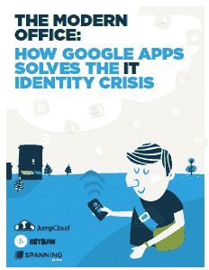

# 快速向 Google Apps 添加用户

> 原文：<https://devops.com/adding-users-google-apps-quickly/>

随着超过 500 万个组织使用 Google Apps(是的，确实有这么多)，市场需要企业级解决方案来管理 Google productivity suite。是的，当然你可以有一个不错的文字处理器，带有协作功能，甚至是一个电子表格和演示程序。但是如果你想和大人物一起玩，你需要围绕它建立管理和行政。只有这样，Google Apps 才能在主流市场上真正与 MS Office 匹敌。

除此之外，Google Apps 只是故事的一部分。这是整个“谷歌基础设施”。谷歌的目标之一似乎是给全世界的 IT 团队带来类似谷歌的能力。这是 Kubernetes 和 CoreOS constructive 的目标之一(见我们在 ContainerJournal 上的[文章)。](http://containerjournal.com/2015/07/21/coreos-tectonic-takes-another-stop-forward-with-kubernetes-1-0-release/)

那么是什么阻碍了你呢？根据 JumpCloud 最近的一本电子书，您需要关注 5 个方面:

1.  **安全性和合规性**
2.  **SSO**
3.  **设备和服务器**
4.  **WIFI**
5.  **目录服务**

目录服务可以通过与 JumpCloud 的“目录即服务”( DaaS)集成来添加。这使得 Google Apps 相当于微软的广告，只不过是在云中以服务的形式提供。想想看，你不只是设置一个用户使用谷歌应用程序，你希望他们在适当的地方使用你的整个基础设施。此外，您不希望在企业设置中一次设置一个用户。这两种使用情形都由 JumpClouds 这样的目录即服务解决方案来处理。

使用 Google 基础设施进行有效目录管理的两个关键是认证协议和设备管理。如果操作正确，目录即服务可以解决这两个问题。一旦你跨越了这个鸿沟，它就打开了与你的谷歌基础设施、其他基础设施、你的用户和你的设备的广泛使用和互动。

JumpCloud 的这本书以 DevOps.com 自己的 Ericka Chickowski 为特色，很好地解释了这一点，以及如何克服使用谷歌基础设施可能带来的一些安全问题。你可以在下面下载这本书。

 
这里还有一个很好的信息图，有一些关于这个话题的指标[。](https://jumpcloud.com/blog/the-future-of-it-infographic/)