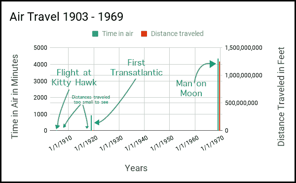

# 自动化:这一次，它是不同的

> 原文：<https://devops.com/agi-automation-this-time-different/>

人类花了大约 20 万年才弄清楚如何让飞机飞起来。这件事发生在 1903 年 12 月 17 日，在北卡罗来纳州基蒂霍克的一个场地上，维尔伯·莱特驾驶着他和他的兄弟奥维尔一起制作的飞机飞向空中。飞行持续了 12 秒。飞机飞行了 120 英尺的距离。接下来的两次飞行距离分别为 175 英尺和 200 英尺。当天的最后一次飞行距离 800 多英尺。飞机在空中停留了 59 秒，高度不超过 10 英尺，然后撞到地面并受到轻微损坏。

尽管这些飞行是一项重大的技术突破，但它们绝对没有商业价值。其他形式的交通工具可以走得更远，行驶时间更长。

差不多两年后，莱特兄弟从他们的错误中吸取了教训，能够让一架飞机以每小时 40 英里的速度飞行 38 分钟，航程 25 英里。这架飞机比全速奔跑的马快 30%，但仍比平均时速 60 英里的客运列车慢。商业可行性在望。

1919 年 6 月，在莱特首次在小鹰号上飞行 16 年后，英国的约翰·阿尔科克上尉和阿瑟·惠顿·布朗中尉在 16 个多小时内，从纽芬兰到爱尔兰的克利夫顿飞行了 1690 英里。五十年后，阿波罗 11 号的机组人员花了 73 小时 5 分钟，从佛罗里达州的卡纳维拉尔角飞行了 238，857 英里到达月球。

想想吧。人类花了 200，000 年的技术进步才让飞机飞上天，但之后只用了 63 年就能去月球旅行。在某种程度上，这是相当不可思议的。技术不仅仅是向前发展。它以指数形式向前倾斜。

**图 1:人类能够在 63 年内乘飞机从 12 英尺飞行到 238857 英里**

我童年时代科幻小说里的东西——想想视频会议——今天已经很平常了。而且比我们想象的要便宜。技术的未来可能性是无限的。只要有足够的时间，任何事情都有可能发生。

但是，当谈到人工智能和机器自主性时，仍然有很多人认为机器接管人类大部分工作的概念是牵强的，如果不是愚蠢的话。根据传统观点，历史的模式是，每一个被技术淘汰的工作岗位，都会产生更多的工作岗位。如果机器完全取代人类，那一天还很遥远。

我奶奶也是这么想的。她出生于 1900 年。如果你在她十几岁的时候告诉她，她在报纸上读到的飞行装置将会在她的一生中把一个人送上月球，她会认为你疯了，这是正确的。她没有不同想法的历史先例。记住，在她那个时代，马仍然拉着犁。除了鸟和热气球之外，一切都是陆地上的。然而，尽管她不相信，但有一次她坐在电视机前观看尼尔·阿姆斯特朗从阿波罗 11 号登月舱中走下来，在月球上留下人类的第一个脚印。她以为这永远不会发生。然而，它发生了。

是的，历史模式一直是技术消除工作，并为人类创造新的工作。当汽车取代了马，失业的铁匠们去了充满不断扩张的工业景观的工厂工作。而且，随着每一次技术创新浪潮的到来，都有厄运的预兆预示着人类劳动力的消亡。每一代唱反调的人都会说，“这一次不同了。”传统观点指出，它从来都不是。

那是过去，现在是现在。这是自主机器的时代。这次*与*不同。

## 自主机器的兴起

机器自主性是指设备独立于正在进行的指令做出决策和进行自我管理的能力，与人类非常相似。最能说明问题的例子是金融投资者使用的自动股票交易程序。该计划是在工作中不断购买和出售股票，以实现盈利的目标。某些安全措施是为了防止灾难而建立的。但在大多数情况下，应用程序是靠自己来实现它的目标:赚钱。

直到最近，机器的自主性还局限于软件应用，比如上面描述的股票交易例子。然而，现代机器人技术使得机器不仅可以自主“思考”，现在还可以自主移动。最明显的例子就是自动驾驶汽车。

将身体和认知自主性整合到机器行为中会改变游戏规则。在以前，出租车需要一名人类司机来获得乘客的目的地，找到最佳路线，驾驶车辆并收取费用。所有乘客需要做的就是跳上后座，告诉司机去哪里。人类司机解决了剩下的问题。随着技术的进步，乘客仍然会跳到后座，但在一辆自动驾驶的汽车里，它通过无线连接到互联网来获取路线信息和交通状况。

后果是深远的。

例如，让我们想象我们的前院有一棵有病的树需要移除。今天，我们打电话给一家景观美化公司。树木清除队出现了，我们指着病树，要求工头清除它。这是我们唯一需要给出的指令。园林队有能力自主行动，采取一切必要措施安全移除树木。

现在，想象一下工作人员带来一个机器人来帮助完成这项任务。在这一点上，可以肯定地说，目前的机器人技术需要大量的人类指导来移除这棵树；机器人与其说是独立的工人，不如说是助手。这个机器人可能除了捡起树木插枝并把它们带到卡车上拖走之外没有别的能力。或者，机器人可能能够操纵砍树工具来协助拆除。尽管如此，机器人的独立性还是受到了限制。要么它的活动仅限于范围有限的可重复任务，要么它可以通过一次接受一个人的指令以特定的方式行动。机器人依靠人类的指令来完成工作。

然而，让我们想象一下，机器人技术正处于指数创新的轨道上，这已成为历史常态。请记住，在智人 20 万年的活动中，从基蒂霍克的一块田地到月球的 63 年只是历史时间线中的一个小点。自主伐木机器人是完全可能的。

你打电话给一家景观美化公司。一个由三个伐木机器人组成的团队出现在一辆自动驾驶的汽车里。这些机器人知道所有关于移除树木的知识，它们可以做所有需要的体力活动。“领头”机器人会问你哪棵树需要移除。你指着那棵树。其余的由船员自己解决，包括从你的信用卡上收取费用。似是而非？如果你回答不，假装你是我的祖母，你刚刚被问及你是否认为在你有生之年一个人会在月球上行走是可信的。

所以问题依然存在，人类船员发生了什么？他们成为数据科学家了吗？先不要回答这个问题。我们一会儿就会谈到它。首先，我们需要谈谈完成机器自主道路上的下一个里程碑:人工通用智能(AGI)。

## 狭义的艾和 AGI

在上面描述的砍树场景中，所有的机器人活动——无论是自主的还是其他的——都被限制在一个单一的任务中:砍树。工作范围有限。在有限的行为范围内工作被称为[狭义 AI](https://en.wikipedia.org/wiki/Weak_AI) (人工智能)。

狭义人工智能的例子包括砍树、交易股票、在周五晚上寻找约会对象、作曲、做披萨等等。我们将在未来几年看到大量狭义人工智能的出现。科斯拉风险投资公司、格雷洛克伙伴公司和高盛公司等风险投资家已经在投资推进狭义人工智能技术。然而，狭义的人工智能只是跨过池塘到达最终目的地:通用人工智能的一块垫脚石。

这么想吧:如果小鹰号是 AI 的起点，那么第一次跨大西洋飞行就是狭义 AI。AGI 正在登陆月球。

AI 将军会是什么样子？让我们回到景观美化的例子。

在一个炎热的夏夜，我们回到了你的前院，坐在草坪的椅子上喝着冰茶。一辆无人驾驶汽车出现了。两个机器人出现了。一个人找到你，请求你允许他在你的 PayPal 账户上存入 500 美元，作为交换，他要砍掉你前院的一棵有病的树。“好吧，”你说，“但是你怎么知道这棵树有病，为什么要给我 500 美元？”

当第二个机器人开始工作时，第一个机器人回应道，“这个国家让无人机全天候在空中分析地形。一架无人机对你的财产进行了光谱分析，并注意到了那棵病树。除了报告树的位置，无人机还包括完整的生物特征。如果你不把树移走，疾病就会传播。这是坏消息。好消息是这是一棵樱桃树。看起来只有 10%的树生病了。其余的都是非常好的木材。现在商品市场上樱桃木的价格相当高。此外，有一项法律规定，当一个私人景观为了公共利益而被改变时，该县必须补偿财产所有者。所以，郡里卖了一份可以从你的树上回收木材的期货合同。我们希望存入您 PayPal 账户的 500 美元反映了您从期货合约中获得的收入份额，加上法律要求的报销金额。”

这就是 AGI 的样子。AGI 是机器使用众多知识领域进行广义思考的能力。将 AGI 与即将到来的机器人物理能力的进步结合起来，机器自主不仅是可能的，而且将超过人类的能力。

如果你认为 AGI 是一个很棒的想法，那就去和 [Novamente](http://novamente.ai/) 的首席执行官 Yves Bergquist 谈谈吧。该公司正积极致力于改善 AGI 的一般商业用途。Novamente 正在开发的一个应用程序使用 AGI 来确定(如果不是创作的话)盈利可能性很高的电影剧本。引用 Bergquist 的话:“一个故事就是一个算法。”

制作一部当代好莱坞大片是一项耗资数十亿美元的事业。如果有选择的话，电影公司宁愿不赌。然而，当谈到剧本时，预测赢家是困难的。在所有人工智能难以模仿的人类努力中，创造性的讲故事名列前茅。写剧本需要多方面的知识:故事、人物、情节、场景设计和历史连续性等等。狭隘的人工智能不适合这项任务。你需要 AGI。要考虑的太多了。在某种程度上，想到好莱坞是发展现实世界 AGI 的完美孵化器是令人惊讶的。但是有道理。AGI 可能会有几次失败。但是，在票房上失败比在战场上失败要安全得多。

考虑到像 Novamente 这样的公司，娱乐业很可能成为 AGI 得以完善的孵化器。然后，如果技术创新的趋势继续下去，最终 AGI 将变得无处不在。然后呢？当一台机器可以做人类所做的一切，而且做得更快更好时，会发生什么？

## 火鸡的生活

理解给定技术的长期影响并不是人类努力的重点之一。随着汽车变得普遍，很少有人考虑过多的汽车会产生过多的一氧化碳从而威胁地球人口健康的可能性。没有人真正考虑过这个被解雇的铁匠会怎么样，因为他不再需要为数量越来越少的马做鞋了。事情只是顺其自然，很少或根本没有预先考虑。

但是，情况正在好转。有些人确实会提前考虑。军事规划者和金融分析师都认为这不太可能。这叫做风险分析。可以说，这些人是靠跳出框框思考而获得报酬的。他们知道即使是很小的可能性也会发生。他们是否被重视是另一回事。

今天，机器自主是真实的。在我们的有生之年，自动化人工智能有可能真的能够做人类做的一切事情。而且，这台机器将以更低的成本做得更好。将不会有新的工作给人类去做，因为旧的工作被摧毁了。机器将能够更快、更便宜地完成新工作——甚至是那些需要大量 AGI 的工作。那么，人类会怎么样呢？

我们今天必须考虑一下！

可悲的是，很少有人是。随着机器自主和 AGI 在经济中变得越来越普遍，我们在一般行业或任何级别的政府中都没有听到任何关于解决自动化对人类就业的影响的想法。似乎大多数人都依赖于传统智慧的旧逻辑。

传统智慧很容易被接受。据报道，美国经济实际上处于充分就业水平。雇主们抱怨很难找到合格的工人。股票市场正达到历史最高点。鉴于历史和当前的事件，当然有理由说总会有人类要做的工作。

这种说法一直有效，直到完全自主的机器出现。那时，传统智慧将会是感恩节前一天火鸡发出的声音。

我什么意思？请允许我用一个以前写过的类比来详细说明。

想象你是农场里的一只火鸡。每天农夫都会过来喂你。这种情况会持续一周、两周、十周。鉴于你的历史，你完全有理由预测你的未来将是一顿令人满意的饭。一直都是这样；怎么可能不是呢？你日复一日地预测第二天会充满食物和阳光。你是正确的…直到感恩节的前一天。

换句话说，有些事情的发生与历史先例无关。诀窍是想象这样的事件可能是什么。

每个人都同意人工智能在这里，机器自主性在增长。传统观点认为，根据历史观察，随着技术的发展，总会有工作岗位。许多人认为自主机器完全取代人类劳动力是可能的，但这是在遥远的未来。当维尔伯·莱特在 1903 年起飞时，我祖母遥远的未来是 1969 年。这 63 年转瞬即逝。她活着看到了人类登上月球。我们今天活着的人正看到真正的机器自主开始出现在技术领域。在我们的子孙后代的有生之年，一个完全机器自主的世界很有可能实现。会发生的。会有什么影响？如果不再需要他们的劳动，他们会做什么？

回到 1903 年，当汽车开始在地球的道路上行驶时，我们没有预测到空气污染和全球变暖的可能性。今天，我们会允许传统智慧占上风，而没有为全机器自主将对人类就业产生的影响做好准备吗？还是我们要未雨绸缪？希望我们已经从错误中吸取了教训。

我将把它留给你来决定。

*作者注:历史优先预言的比喻来自纳西姆·尼古拉斯·塔勒布*的《黑天鹅》一书

鲍勃·雷瑟曼