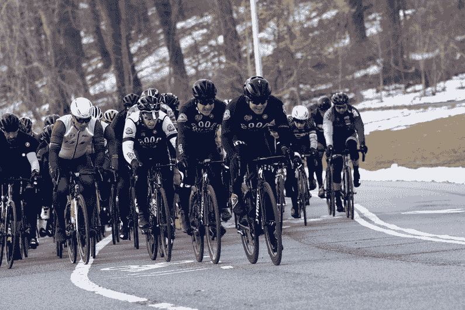

# 敏捷和 DevOps:橡胶(字面意思)与道路相遇的地方

> 原文：<https://devops.com/agile-and-devops-where-rubber-literally-meets-road/>

敏捷和 DevOps 方法在技术之外适用吗？更具体地说，我们能把它们应用到体育运动中吗？我决定通过分析敏捷和 DevOps 原则在我的公路自行车团队中的应用来回答这些问题。

对于那些不知道的人来说，骑自行车是一项非常数据驱动的运动。当我们训练和比赛的时候，我们有一个在我们的电脑上显示数据的实时反馈，它是连接在车把上的。我们看到的数据包括功率(瓦特)、心率(bpm)、步频(rpm)等等。**监控**和分析这些数据使我们能够在极限范围内工作，确保我们在发挥最大能力的同时不会超载。我们通过**测试**在 30 秒、5 分钟和 20 分钟的时间段内测量我们的极限。这些测试的结果形成了特定的阈值，我们在该阈值内工作，以最大限度地提高训练和比赛的效益。我们可以在自行车电脑中设置自动警报，提醒我们是否过度劳累，或者我们可以盯着屏幕自己测量。

在成熟的 DevOps 环境中，我们致力于在服务级别进行监控，以了解使用情况、性能、环境和应用运行状况等。这不仅有助于我们发现问题，如果监控工具报告任何警报，它还允许我们在基础架构内设置自我修复协议。

我们像创业公司一样经营自行车队，每个人都戴着许多帽子。我们在小的、松散耦合的单元中操作；每个人都在一起，没有筒仓，但我们也有在会议期间出现的专业。例如，攀岩者更擅长快速上坡，所以他们有时会一起工作，强大的短跑运动员也是如此。重要的一点是，我们不能把自己仅仅划分为这些责任——短跑运动员仍然需要爬坡，登山者仍然需要练习短跑。我们永远不知道什么时候我们中的一个人将不得不尝试代替队友。我们了解彼此的角色以及这个人在团队中的重要性。

我们边走边学。我们不能只依靠团队中的一个人，哪怕他们是最强的。假设 A 车手在终点前 2 公里发生车祸，我们该怎么办？出发的列车都移动了一个位置，所以那个被认为是最后一个支持短跑运动员的人，现在将成为短跑运动员。我们设置了一个**自我修复系统**，具有非常低的**平均修复时间**。回到 devo PS——一些糟糕的代码已经通过了你的管道。你不能仅仅依靠写代码的人来解决这个问题。在理想的情况下，我们使用版本控制来帮助团队中的其他人准确地找出如何修复这个问题。我们可以将系统设计为通过自动将失败的更改恢复到早期状态来进行自我修复。

团队中的每个人都明白他们有一个跨职能的角色。这并不意味着我们没有比别人更喜欢的专业或领域，这只是意味着我们是一个实干家团队。相比之下，团队按照 DevOps 原则有效地工作。无论您是从应用程序开发人员还是系统管理员开始您的职业生涯，您都必须为了组织的更大利益完成工作并解决问题。

## 自行车和 DevOps 自行车

从本质上来说，作为一个实践 DevOps 的人，你的整个角色就是通过实现有助于提高生产力和减少错误的过程和工具，使其他人的生活更容易。在一个自行车队中，每个人都在为整个组织的成功而努力，而不仅仅是为自己。DevOps 的角色可以比作自行车运动中的家务助理。

举个例子:在骑自行车时，我们直接坐在前面人的车轮后面，我们的前轮和另一个骑车人的后轮之间可能有一英寸的距离。我们这样做是因为它为后面的人节省了大约 30%的电力。家务负责使另一个人的工作更容易。他们不为个人荣誉而工作，而是为了团队的更大利益而牺牲自己。

您组织中的 DevOps 架构师或工程师(免责声明:是的，我相信实践 DevOps 方法是每个人的责任，但通常有一个人对 DevOps 以及如何在整个组织中实现 devo PS 有最强的了解)不会整天想着如何炫耀他们编写的一些很棒的代码或他们构建的系统。他们在考虑如何让你的日常流程变得更简单，为了团队的利益解决问题。

Pulling the pace at the front of the peloton. This is called the ‘lead out.’ The pace is kept so high that other teams can’t attack or ride ahead. The aim is to drop the final rider off ahead of the other sprinters and as close to the finish line as possible.

我们训练，快速失败，不断学习，共同成功。用 Kiichiro Toyoda(丰田汽车公司的创始人)的话说，“他们没有从生产原型车的失败中获得的专业知识。……窃贼也许能够按照设计方案生产织布机，但我们每天都在修改和改进。”所以，你可以窃取他们的计划，但不知道他们的失败和正在进行的开发，你就不会创造出同样的产品。相比之下，另一个自行车队可以找到我们如何训练的蓝图，并尝试做同样的事情，但他们不会理解我们如何作为一个整体运作。他们不会理解我们的失败，也不会理解我们从中学到了什么，从而走到了现在。

我们实践**持续改进**和**持续学习**。我们不断努力提高以前的成绩。如果我们赢得了自行车比赛，我们不会回家，举起我们的脚说，“我们是最好的团队，没有人会打败我们”——我们分析我们的表现，很可能有很多事情我们可以做得更好，即使我们赢得了比赛。我们为什么要这样做？因为在不同的一天，如果再次犯小错误，其他球队可能会击败我们。在技术领域，我们可能已经实现了迄今为止最快、最安全的部署，而且几乎没有失败，但是我们会固步自封，停止改进吗？这与我们在 DevOps 环境中应该做的事情正好相反——我们应该不断寻求改进我们以前的工作。在组织层面，业务本身需要保持竞争力，并确保客户需求得到满足；技术使企业能够跟上这些目标。

我们的流程运行得非常好，并且还在继续改进。这得益于为发展我们的文化和协作而实施的 **chatOps** 。当我加入球队时，我们通过电子邮件交流。这种方式既慢又笨拙，通常不是 16 人团队交流的最佳方式。我们的收件箱经常爆满，有时我们会错过邮件。输入时差。起初，有些人拒绝改变的想法——“我们为什么不用电子邮件呢？这简单多了，”他们说。用电子邮件代替 Slack 真的不容易；只是他们不想改变和学习使用一个新工具，即使只需要几个小时就能适应。

这是我在企业组织中尝试实现 DevOps 工具时看到的一个常见问题。即使与 Docker 或 Kubernetes 合作将为人们带来巨大的利益，有时他们只是不想改变他们所知道的。我们练习换位思考，解释好处，同时在短时间内展示改进。类似地，我们作为 DevOps 顾问在指导企业组织的文化和过程转换时也是这样做的。无论如何，我们最终使用了 Slack，在我意识到之前，整个团队文化已经变得更好了。我们使用各种渠道来组织事情，如“比赛”、“团队骑行”、“ICE”(在紧急情况下)、“教练”、“随机”等。这种文化得到了改善，因为我们能够团结一致，相互开玩笑，而不用担心会打断其他渠道的重要对话。我们的教练在圣莫尼卡，我们在纽约，但我们感觉他好像每次训练都和我们在一起。

我见过 Slack、Trello 和其他协作工具被用来改善分散在远处的团队的协作。那么，为什么改善文化很重要呢？人们不应该只专注于自己的工作吗？是的，他们当然应该。我不是说这应该分散注意力。但是把你的团队聚集在一起意味着他们更有可能在需要的时候合作。这将有助于您的全球团队进行沟通和协作。这也有助于提高员工的满意度，因为人们会有更大的归属感。

## 结论

总而言之，敏捷和 DevOps 方法可以在技术之外应用。这些原则和实践可以在整个组织中实施。他们可以帮助管理变革和转型，同时通过自动化和采用现代云计算技术来提高生产力。不要沉迷于 DevOps 工具。

Crossing the finish line @ The New York State Criterium Championships – March 2018

— [康纳·德兰班克](https://devops.com/author/conor-delanbaque/)