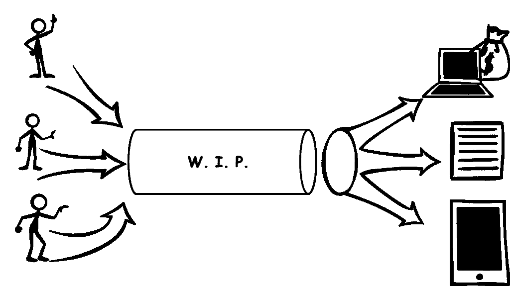

# 敏捷就是控制流程

> 原文：<https://devops.com/agile-controlling-flow/>

对于企业来说，敏捷是新的时尚计划，就像电子商务在 21 世纪初，六适马在 90 年代，全面质量管理(TQM)在 80 年代一样。如果我们回顾这些计划的范围，我们需要检查这些计划中有多少符合企业正在寻找的目标，更重要的是，如果它们被完全采用，记住许多偏离了轨道，它们是否提供了企业正在寻找的价值？

当然，我们不能笼统地回答这个问题——这是一个范围。对于一些企业来说，这些计划是转移注意力的，有些没有坚持到底，但作为这些计划的一部分，某些变革产生了非常积极的影响，而其他的则取得了巨大的成功。这是《哈佛商业评论》的一个案例研究，关于为什么一个企业会走到他们所做的那一步。

显然，贯穿所有这些计划的一个基本方面是企业拥抱变化的能力。在之前的博客“[云计算、DevOps 和业务速度](http://jpmorgenthal.com/wordpress/2014/05/01/cloud-computing-devops-and-business-velocity/)”中，我谈到了业务速度的问题——一个组织可以接受特定颠覆性技术变革的速度。低估你的企业采用新技术或流程的能力很可能会对结果产生强烈的负面影响。在最近与客户的交谈中，非 IT 业务领域在采用精益实践方面非常成功，但在开始后不久就短路了。它没有彻底失败，但在一个强劲的开始后，他们休息了一下，他们从来没有开始备份。没有事后分析，我们不知道为什么这个具体的计划失败了，但是我们可以暗示，如果某件事很难并且感觉不自然，我们更容易将注意力集中到其他地方——想想你自己生活中的节食和锻炼计划。

这似乎是敏捷的十年。企业希望变得更有活力和流动性。他们希望组织能够更快地对市场变化做出反应，更快地推出新产品，更快地对出现的问题做出反应。为了实现这一目标，企业必须放弃他们现在的一些做事方式。他们将不得不重新设计流程，使其更加可组合和组件化，从而减少静态性。例如，一个制造商通过大量的计划将一个新产品投放市场。他们经历了设计、原型、测试、采购、制造和分销等步骤。整个周期可能需要一年以上，一旦进入制造阶段，就会高度自动化。在不同批次之间调整产品会导致明显的延迟和痛苦，因为过程是静态的。这实际上相当于重新开始整个循环。那么，如果他们发现只要把身体拉长 2 厘米，产品对他们的目标受众就更有用了呢？在这种情况下，敏捷性可能等同于能够更快地完成从设计到制造的过程。

在前面的例子中，能够调整产品的后一步被称为持续改进，是培养敏捷性的关键要素。如果一个产品在市场上卖得不好，许多公司会因为与产品可行性相关的成本而完全放弃这个产品。原因是大多数制造商认为每个产品都是一个项目，当它到达制造阶段时，它就在操作的控制下移动。也就是说，包括营销、财务和其他利益相关者在内的创意团队认为他们的产品上市工作已经“完成”,然后他们会转移到其他项目上。在这种心态下，团队没有空间回顾过程，思考如何做得更好，然后重复改进。因此，他们只是继续把他们的“这是我们做事的方式”带到下一个项目中。

敏捷意味着能够控制流程。如果有一种一旦产品达到周期中的某个点就接受终结的文化，就没有办法改变产品上市的方式。

控制流程的另一个方面是管理产品和服务如何进入和退出开发管道。我花了很多时间来帮助 IT 组织释放他们的交付潜力，帮助他们理解在改进管理在制品(WIP)方面只能做这么多。超越某一点的唯一方法是对那些负责将工作插入管道或要求工作在某一时间完成并退出管道的人实现透明。

下面的两个数字很好地表达了透明度是一项要求的原因。我相信大多数人都会同意，管理生产在图 1 中比在图 2 中要容易得多。在图 1 中，有一个输入和一个预期输出。管理该流水线的 WIP 就是优化完成该可交付成果的过程。在图 2 中，有更多的变量在起作用。在支持多个输入的管道中可能存在资源争用。

同样，可能会有一个请求，要求在满足某些业务目标时，对完成的内容重新进行优先级排序。也许迫切需要一个特定的报告来支持一个关键的业务决策。几年前，当我工作的公司突然要收购另一家公司时，我就亲身经历过这种情况。所有的注意力都转移到了制作所需的财务报表上，其他的事情都被搁置了。在这种特殊情况下，CEO 和 CFO 是客户，因此没有人质疑他们项目的延迟，但对于许多 IT 组织来说，重新确定优先级的请求从来都不是那么明确，这使得管理流程控制变得非常困难。因此，使用管道服务的人和拥有管道流控制权的人之间的透明和沟通对于敏捷性来说是必不可少的。

像全面质量管理、六适马和电子商务一样，敏捷性要求改变企业运营的基本方式。这个过程的类比可以是良性的，就像一个人从膝盖手术中康复一样，也可以是复杂的，就像从中风中康复一样，这取决于企业想要实现的目标以及他们当前的组织方式。在这个过程中，人很可能是成功的最大障碍。

当这种巨大的变化发生时，员工往往会对自己的处境变得非常短视。为了降低这种风险，在变更之前、实施期间和实施之后，与员工一起审查变更是至关重要的。管理层必须判断员工是因为变革的复杂性还是因为他们个人不同意变革而陷入困境。前者可以通过教育和支持来克服，而后者应该通过清除来迅速解决。

如果企业在开始之前识别并减轻关键风险因素，并且愿意致力于以批判的眼光审视他们一直以来的业务运营方式，那么他们就可以成功地实施他们的敏捷性计划。在敏捷软件开发中，开发人员被训练去思考他们的代码可能出错的方式，然后编写单元测试来确保软件在这些可能性下是可持续的。创建敏捷企业意味着根据市场变化、新的竞争对手、供应商变化和不断变化的客户需求，寻找确保可持续性的方法。