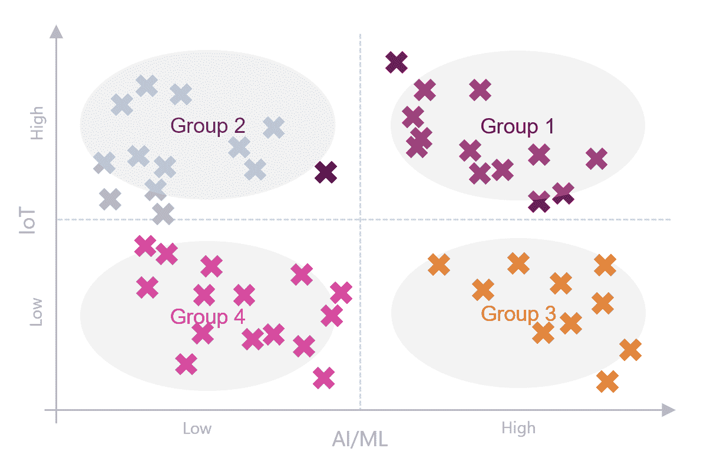

# AIoT 和智能处于边缘

> 原文：<https://devops.com/aiot-and-intelligence-on-the-edge/>

最近，最大的融合之一是在 AI/ML 和 IoT 领域之间，这使得人工智能物联网(AIoT)的兴起。AIoT 将传感器和其他设备收集的数据与 AI/ML 提供的智能相结合，在边缘实现实时智能。通过融合 AI/ML 和物联网功能，AIoT 通过将它们合并到一个解决方案中来解决两个问题。AIoT 的目标是实现更高效的物联网运营，改善人机交互，并增强数据的管理和分析方式。

Edge intelligence 允许处理和分析高级别的数据，并在本地做出决策，而无需发送到云。以一架自主导航的无人机为例，它不再依赖云上托管的服务来告诉无人机下一步要去哪里，而是现在无人机自己能够决定自己在野外的路径，即使与云托管服务的连接不可靠。

物联网向 AIoT 的演进经历了三个不同的阶段:

1.  在边缘实现核心能力，包括基本传感器开发、与可用设备集成等。
2.  收集从这些传感器生成的数据，并以结构化的形式将它们存储在中央数据存储中，通常存储在云上。
3.  实现 AI/ML 和 IoT 的协同，将它们结合在一起成为 AIoT。

换句话说，虽然物联网提供了对大量信息的访问，但人工智能/人工智能带来了智能和决策。

尽管 AIoT 取得了巨大进步，但在实现边缘智能方面仍有三大挑战需要考虑:

1.  **延迟:** 当决策发生在云上时，物联网设备唯一可用的选项是将数据(比如说，从摄像机捕获的图像)发送到运行在云上的服务，并从该服务获得选定的决策。这意味着大量数据通过缓慢或不可靠的网络传输，导致延迟——在许多情况下，这些延迟可能极其严重。
2.  **计算和数据传输的成本:** 除了延迟本身之外，大量的请求会大大增加来回传输数据的成本和云计算的成本，从而降低这些实施的可行性。
3.  **设计分歧** :虽然最初的人工智能/人工智能解决方案利用云的大量计算能力来训练模型，但移动或运行训练好的模型(以计算决策)的能力的进步导致了解决方案的设计与训练和决策组件所需的硬件之间的分歧。

与此同时，人工智能/人工智能学习方法也在发展——在计算能力的使用以及机器学习或决策所需的硬件类型方面，这些方法变得更加有效。结合人工智能和物联网是这一演变的下一个逻辑阶段。

## **AIoT 解决方案的设计**

AIoT 解决方案的物理组件与标准物联网实施并无太大不同；AI/ML 后端的设计也没有很大的变化。这些变化是针对边缘核心设备的几个特定部分——这些部分现在更加强大——并在可以处理的场景以及如何使用这些设备设计解决方案方面实现了巨大的灵活性。

## **对企业的影响**

希望从 AIoT 中获益的企业可能需要根据其当前的采用情况和解决方案的性质，重新调整路线图或进行一些渐进式的改变。

**对于 cxo**

根据 cxo 目前在物联网和人工智能/人工智能领域的投资水平，我们为他们建议了四种广泛的策略，如下图所示。

Strategies to follow for AIoT adoption depends on current levels of investment.

*   **第一组** :目前 AI/ML 和 IoT 的投资水平都很高。对于这些企业来说，最好的选择是评估当前的路线图，以确定边缘设备的增量添加/升级。这将利用 AI/ML 中的现有投资，同时在不增加风险的情况下尽早展示优势。
*   **第二组** :与 AI/ML 相比，物联网的投资水平更高。这些企业通过将投资比例转向 AI/ML，同时对边缘设备集进行微小的改变，将获得最大的收益。他们可能还需要重新评估他们当前的流程，以考虑将该步骤的决策部分移到边缘。
*   **第三组**:AI/ML 投资水平高于 IoT 投资水平。这些企业可能需要对其路线图进行最低限度的重新调整——快速查看一下训练 ML 模型的步骤的实施情况，就可以提供要采取的行动列表——需要边缘智能的史诗/故事可以在产品待办事项中移到更高的位置。
*   **Group 4** :这些企业拥有最大的自由度，可以选择他们的实施路线图。任何产品或平台路线图规划都可以轻松包含 AIoT 史诗和故事，对已经在进行的任务影响最小。 

**针对架构师/项目经理**

对于在公司内部从事此类计划的架构师和项目负责人来说，这主要是关于如何设计解决方案的思维方式的改变，包括边缘设备的功能以及流程中决策步骤发生的位置。无人机自动计算自己的路径而不是依赖云托管服务等场景的可行性现在比以前更好，一些演示或概念验证尝试现在可以将许多这些故事从积压中移走，并将实施日期提前。

## 【AIoT 的现实预测

虽然 AIoT 以其重新想象的融合形式可能是新的，但合并创建 AIoT 的两个原始领域(人工智能和物联网)都是成熟的，并被主流采用。AIoT 为当今企业提供的优势，加上上述小的增量变化所涉及的低风险，以及导致决策边缘的成本节约，形成了一个致命的组合，使 AIoT 能够彻底改变业务流程。

[IDC](https://www.sas.com/sas/offers/19/aiot-how-iot-leaders-are-breaking-away-emea.html) 预测，2023 年全球物联网支出将达到 1.1 万亿美元，高于 2019 年的 7260 亿美元。此外，IDC 预测，到 2025 年，将有大约 400 亿台物联网设备，导致大量数据涌入，这将使企业在推动运营洞察力和优化对大量可用数据的分析方面面临越来越大的挑战。AIoT 可以通过增加数据管理和全面分析的智能来帮助解决这个问题。

如果还没有，现在是 AIoT 成为首席 it 主管首要任务的理想时机。

[我的底线是](https://devops.com/author/rajamani-saravanan/)