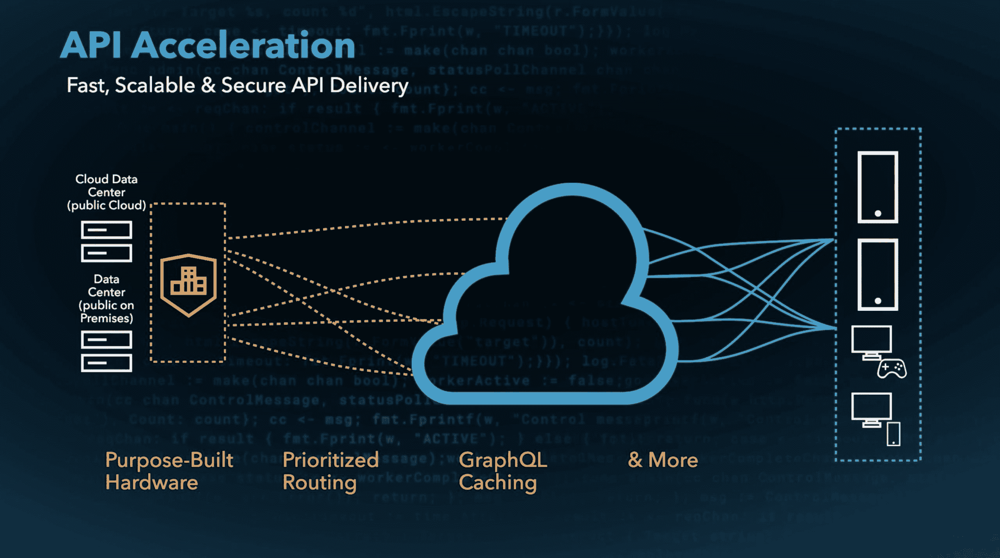

# Akamai 增加服务以优化 API 流量

> 原文：<https://devops.com/akamai-adds-service-to-optimize-api-traffic/>

Akamai 今天推出了一项 [API 加速](https://www.prnewswire.com/news-releases/akamai-boosts-edge-application-power-expanding-possibilities-for-developers-301311562.html)服务，专门用于使用专用硬件、预留容量和优先路由来加速应用编程接口(API)调用。

与此同时，该公司还提供了一个名为 EdgeKV 的全球分布式键值存储，使有状态应用程序能够部署在其 EdgeWorker 节点上。

最后，Akamai 还提供免费的服务层，每月提供总计 6000 万次无服务器 EdgeWorker 活动，每层最多 3000 万次 EdgeWorker 活动。这两个层由基本计算服务和动态计算服务组成，前者面向需要较低 CPU 和内存消耗的应用，后者面向需要额外资源的应用。

Akamai 的企业架构师 Josh Johnson 表示，Akamai 正在扩展其产品，此时许多组织开始使用部署在网络边缘的无服务器 EdgeWorker 节点在扩展的企业中部署基于微服务的应用程序。EdgeKV 提供对低延迟数据存储的访问，这也使这些边缘计算应用能够在更接近数据创建和消费点的地方处理数据。

总体而言，Akamai 报告称，2020 年，其平台处理了超过 300 万亿个 API 请求，同比增长 53%。许多增加的活动是由直接部署在 Akamai CDN 上的分布式应用程序驱动的，而不是部署在本地数据中心，以利用全球数据中心网络，使 IT 组织能够利用缓存。实际上，当部署使用 DevOps 最佳实践开发的应用时，CDN 成为目标平台。边缘计算的兴起增加了开发运维团队依赖 cdn 部署应用的用例数量。

自然，随着部署在边缘的应用数量不断增加，cdn 提供商之间的竞争也大大增加。随着越来越多的组织部署需要近实时处理和分析数据的应用程序，作为更大的数字业务转型计划的一部分，甚至可能有一天网络边缘部署的应用程序会比云中部署的应用程序还多。

当然，作为全球最大的 CDN 提供商，Akamai 正在押注它将能够利用其 CDN 的规模，说服开发者在它的平台上部署应用程序，而不是较小的竞争对手。

无论采用何种边缘计算方法，正在部署的应用将比以往任何时候都更加延迟敏感。每个 IT 组织都需要决定在应用程序超时或需要被重定向到另一个微服务之前，他们希望在多大程度上依靠基础架构来优化这些应用程序发出的 API 调用。不管怎样，物理定律仍然适用。没有一个边缘计算应用是孤岛。它依赖于一个复杂的基础设施网络，从路由器和交换机到在云中运行后端服务的服务器。挑战在于找到一种开发人员永远不必担心的方式来优化所有这些交互。