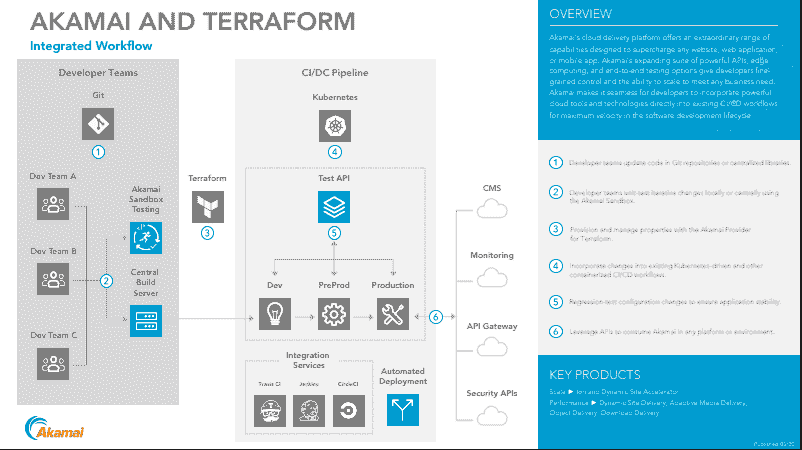

# Akamai 扩展了 DevOps 集成的范围

> 原文：<https://devops.com/akamai-extends-scope-of-devops-integrations/>

Akamai 今天扩展了其 DevOps 战略，为[提供更紧密的集成](https://blogs.akamai.com/2020/03/akamai-delivers-fast-deployment-and-edge-computing-for-developers-with-march-2020-release.html)持续集成/持续(CI/CD)平台和 IT 自动化工具，如 HashiCorp 的 Terraform。

此外，Akamai 正在向 Akamai EdgeWorkers 添加对无服务器计算功能的支持，这是一个基于 JavaScript 的框架，通过它可以在 Akamai 内容交付网络(CDN)的边缘执行应用逻辑，现在是一个微服务。

Akamai DevOps 解决方案的产品营销经理 Greg Griffiths 表示，最新的增加将使 devo PS 团队更容易将 Akamai CDN 视为部署应用程序的自然扩展。Akamai [去年推出了第一个 DevOps 计划](https://devops.com/akamai-extends-scope-of-devops-reach/)。他说，目标是使 DevOps 团队能够在其 CI/CD 工作流的上下文中开发新的属性并进行配置更改。

Griffiths 补充说，同时，Terraform 支持将使 DevOps 团队能够以编程方式提供和管理属性和 DNS 区域。

他指出，作为这一努力的一部分，Akamai Pipeline 现在可以与 Akamai 控制中心同步，以某种方式捕捉任何手动配置更改，然后允许它们被纳入 CI/CD 工作流。

Akamai 一直在利用其 CDN 尽可能靠近网络边缘部署应用程序，以减少网络延迟。作为这项工作的一部分，EdgeWorkers 允许开发人员根据需要增加微服务。这些微服务现在可以访问嵌入在函数中的数据，包括来自 HTTP 请求的所有数据，如 cookies、标题、URL 和查询参数。

除了通过根据客户位置或一天中的时间等变量修改缓存图像和其他内容的路径来提供不同的应用程序体验之外，DevOps 团队现在还可以使用缓存内容更轻松地进行 A/B 测试和功能实验。

Akamai 增加的其他新功能包括修改请求的路径和查询参数，以及确定任何请求应该路由到哪个源。

Griffiths 表示，现在越来越多的组织正在利用 Akamai CDN 作为在网络边缘交付应用的工具，下一个重大举措将是更容易利用公司的托管安全服务来支持 DevSecOps。

目前还不清楚 DevOps 团队在多大程度上将 CDNs 作为交付应用的工具。然而，组织已经利用 cdn 交付 web 应用多年了。通过提供与 CI/CD 平台的更紧密集成，Akamai 实质上使 CDN 成为在 DevOps 工作流结束时部署应用的另一个目标。随着组织开始在边缘计算平台上部署更多的应用程序代码，这种能力可能会被证明是至关重要的，这些平台涉及需要近实时处理和分析数据的用例。

当然，Akamai 不是唯一有类似雄心的 CDN 提供商。然而，它已经是最大的了，所以从 DevOps 的角度来看，大多数组织将很快在某个地方遇到 Akamai 的存在点，如果他们还没有遇到的话。

— [迈克·维扎德](https://devops.com/author/mike-vizard/)