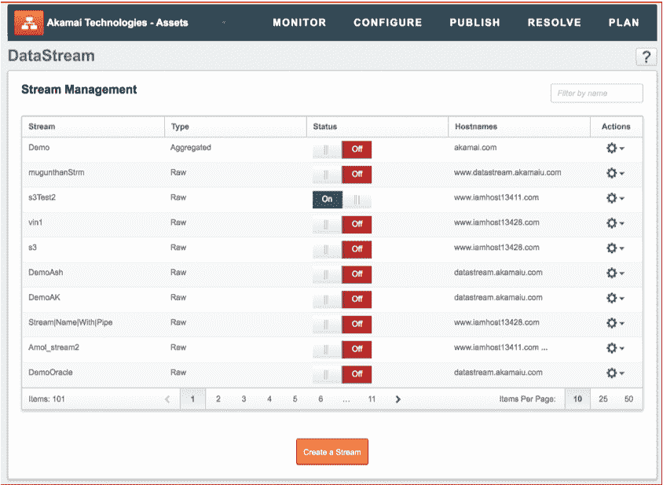

# Akamai 扩大了 DevOps 的覆盖范围

> 原文：<https://devops.com/akamai-extends-scope-of-devops-reach/>

Akamai 今天转向[进一步扩展其通过内容交付网络](https://www.akamai.com/us/en/about/news/press/2019-press/akamai-introduces-edge-platform-enhancements.jsp) (CDN)公开的功能数量，旨在吸引 DevOps 团队。

这些增强包括 HTTP/2 性能优化和自动加载字体库的能力，以及提供对“中间英里”日志的访问，这将使 DevOps 团队能够在将这些更改投入生产之前，更精确地调查性能问题并在本地开发环境中测试逻辑。

 Akamai 还重新设计了控制中心，以提供更详细的安全、加速和交付功能报告，并使 TLS 1.3 成为建立连接的标准机制。

最后，Akamai 还希望推进 DevSecOps 流程。其 CDN 现在可以在完全集成的虚拟专用网络和域名系统代理检测服务中优化或阻止对内容的访问。Akamai 的令牌认证功能已经扩展到包括不支持 cookies 的浏览器和设备。

Akamai 产品营销副总裁 Ari Weil 表示，这些最新的扩展是正在进行的努力的一部分，旨在使该公司的 CDN 成为任何 DevOps 过程的自然扩展。例如，今天的开发人员经常浪费大量的时间和精力编写代码来加载现在可以通过 Akamai CDN 自动使用的字体。他说，这些改进应该能让他们腾出手来编写代码，为企业增加更多价值。

Weil 补充说，Akamai 还向 DevOps 团队承诺，他们将在 Akamai CDN 上看到更快的激活时间，并对应用性能问题有更深入的了解，这是大多数应用性能管理(APM)工具所不能提供的。他说，Akamai 特别关注任何需要达到和维护服务水平协议的应用程序开发项目。

到目前为止，Weil 说 Akamai 发现 cdn 在 DevOps 中的作用得到了更高水平的认可。他说，通常负责实现应用交付目标的首席技术官和企业架构师现在特别注意到了 CDNs 的能力，因为大多数个人开发人员通常没有足够关注如何自动完成构建现代 web 应用程序的日常工作。

Akamai 将继续关注[使其 CDN 成为实施 DevOps 流程的持续集成/持续部署(CI/CD)平台](https://devops.com/akamai-gives-devops-teams-more-control/)的自然延伸，着眼于使其 CDN 成为 web 和移动应用的首选部署平台。DevOps 团队可能需要更长时间才能将 cdn 视为其应用的部署平台。过去，关于使用什么 CDN 的大部分决定都是由应用所有者做出的。但 Akamai 显然认为，如果更多的应用程序在构建时利用 CDN 功能，这些应用程序将更有可能分布在 Akamai 技术上。

— [迈克·维扎德](https://devops.com/author/mike-vizard/)