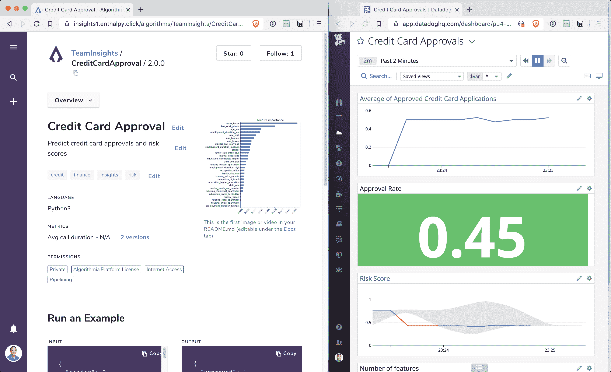

# Algorithmia 与 Datadog 在 MLOps 可观测性方面结盟

> 原文：<https://devops.com/algorithmia-allies-with-datadog-on-mlops-observability/>

Algorithmia 今天推出了一个用于机器学习(ML)模型的[性能监控](https://devops.com/?s=performance%20monitoring)，该模型由[跟踪由其同名平台的企业版生成的算法推理和操作指标](http://www.globenewswire.com/news-release/2020/11/05/2121138/0/en/Algorithmia-Solves-ML-Model-Performance-and-Drift-Detection-with-Application-Performance-Monitoring-for-ML-Systems.html)来构建这些模型。

公司首席执行官 Diego Oppenheimer 表示，Algorithmia Insights 提供了对 ML 模型的可观察性，这是 DevOps 团队对应用程序的期望。为了使这种监控功能更容易获得，Algorithmia 与 Datadog 合作，将操作和用户定义的推理指标从 Algorithmia 传输到开源 Kafka 数据流平台，Datadog 指标应用程序编程接口(API)可以从该平台使用这些数据。

Oppenheimer 说，这种能力将使采用 Datadog 监控平台的 DevOps 团队能够使用单一控制台来监控他们的 IT 环境，并通过 ML 模型检测数据漂移、模型漂移和模型偏差。

随着组织将 ML 模型注入到应用程序中，许多组织都面临着开发运维工作流的挑战。开发一个 ML 模型可能需要六个月或更长时间，然后需要嵌入一个应用程序，该应用程序通常一个月更新几次。与此同时，组织发现 ML 模型经常需要被替换，要么是因为对业务条件的假设已经改变，要么是因为额外的相关数据源变得可用。在许多情况下，数据科学家采用 DevOps 原则来创建一套称为 MLOps 的最佳实践，以更新他们的模型。

Oppenheimer 指出，与 Datadog 的联盟意义重大，因为它使 it 团队能够开始融合 DevOps 和 MLOps 流程。

在这个节骨眼上，很明显，几乎每个应用程序都将在不同程度上最终使用机器学习算法得到增强。然而，大多数创建这些模型的数据科学家都没有在生产环境中部署和更新 ML 模型的经验。ML 模型成为 DevOps 工作流中的另一个工件只是时间问题。然而，已经投资 ML 模型的组织将需要花费一些时间来整合数据科学家文化，这种文化目前与 IT 组织的其余部分截然不同。

为了进一步实现这一目标，Algorithmia 今年早些时候使得以共享本地数据文件的形式编写和运行算法的本地测试成为可能。已经与该流程集成的桌面工具包括 PyCharm、Jupyter Notebooks、R Shiny、Android、iOS、Cloudinary、Datarobot 和 H2O.AI。

最近由 Algorithmia 对 100 多名 IT 主管进行的一项调查发现，新冠肺炎疫情公司要求 40%的受访者对至少一半的人工智能/人工智能项目进行调整，无论是在优先级、人员配备还是资金方面。超过一半的受访者(54%)表示，在疫情之前，人工智能/人工智能项目侧重于财务分析和消费者洞察。在疫情之后，调查受访者表示，他们现在更多的人工智能重点是成本优化(59%)和客户体验(58%)。

该调查还指出，在疫情之前，受访者每年在人工智能/人工智能上的支出至少为 100 万美元，其中 50%的人表示，他们计划未来的支出会更多。总体而言，近三分之二(65%)的人表示，在疫情奖之前，人工智能/人工智能项目处于或接近其优先列表的顶部，现在有 33%的人表示，这些应用现在在他们的列表中处于更高的位置。

在每个 DevOps 团队定期遇到 ML 模型之前可能还需要一段时间，但是在这一点上，更大的问题是 DevOps 过程何时扩展到包括 ML 模型工件。