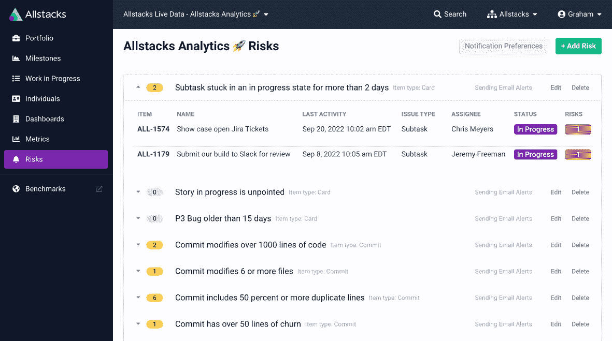

# Allstacks 为 VSM 平台增加了警报功能

> 原文：<https://devops.com/allstacks-adds-alert-capability-to-vsm-platform/>

Allstacks 为其软件即服务(SaaS)价值流管理平台增加了一个警报功能，当软件项目目标和期限可能会错过时，该功能会自动通知开发运维团队。

核心 Allstacks 平台采用机器学习算法和人工智能(AI)模型，通过一组旨在供组织中的任何人访问的仪表板来跟踪拉取请求、提交和卡更改。

通过 [Allstacks Alerts](https://www.allstacks.com/blog/allstacks-alerts?hsLang=en) 功能，可以在某个特定指标(如拉取请求)已经打开四天的任何时候，通过电子邮件或 Slack 通知这些利益相关方，这表明延迟风险已经增加。明年初将增加对微软团队的支持。

Allstacks 产品高级副总裁 Adam Dahlgren 表示，目标是利用该平台内置的高级分析来展现深思熟虑的[可观察性](https://devops.com/?s=observability)见解，而不是简单地发出一系列缺乏任何背景的通用警报。

价值流管理(VSM)平台(如 Allstacks)自动获取通过 DevOps 工具收集的技术指标，并将它们与业务领导定义的关键绩效指标(KPI)相关联。价值流管理的概念可以追溯到精益制造方法，这种方法要求对制造过程的每一步进行持续测量。随着软件开发从手工发展到使用 DevOps 最佳实践的高度自动化的过程，随着组织意识到他们对软件的依赖程度，对错过软件开发期限对业务的影响进行监控的价值的欣赏也在增长。

事实上，许多组织发现他们的业务目标和软件开发过程之间存在明显的脱节。在经济形势出现近年来最大的不确定性之际，企业领导人尤其渴望了解软件开发项目的延迟会如何影响未来的收入预测。

VSM 平台也使得跟踪跨越多个软件开发项目的 KPI 成为可能；希望这样做可以更容易地看到在遇到各种瓶颈时应该将资源重新分配到哪里。Dahlgren 补充说，从长远来看，Allstacks 还致力于增加场景规划工具，使 it 和业务领导更容易模拟“假设”场景。

目前还不清楚有多少组织愿意投资 VSM 平台，但对它们的需求正变得越来越迫切。许多组织仍然面临的挑战是确保他们有适当的工具来收集适当的技术指标。一个基于 SaaS 的平台应该会让实现这个目标变得更简单，并把算法应用于能够迅速成为大型数据语料库的东西。

当然，就采用 VSM 平台而言，现在仍处于早期阶段。但是毫无疑问，应用程序开发团队和业务的其他部分之间的鸿沟正在继续缩小。不太清楚的是，增加的可见性会在多大程度上导致开发团队和业务之间更高程度的共鸣。