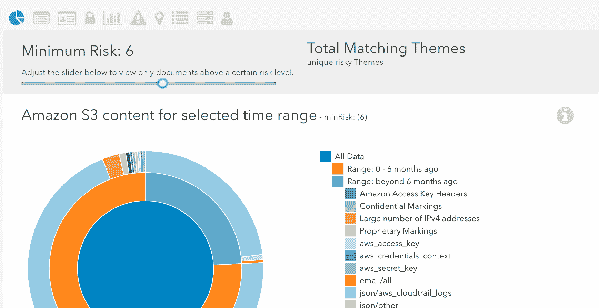

# 亚马逊的 Macie:机器学习保护 AWS 中的数据

> 原文：<https://devops.com/amazons-macie-uses-machine-learning-protect-sensitive-data-aws/>

Macie 是亚马逊最近为其 AWS 客户推出的安全服务。它的工作原理是识别和分类个人信息或知识产权等敏感数据，持续监控这些数据的异常情况，并向客户提供与数据访问或移动相关的详细警报和仪表板读数。据 AWS 称，Macie 目前能够保护存储在亚马逊 S3 的数据，今年晚些时候将支持更多的 AWS 数据存储。

Netlix 是 Macie 的早期采用者，到目前为止已经看到了不错的结果。网飞的云安全工程师 Patrick Kelley 表示:“自从我们开始使用 Amazon Macie 以来，我们发现它非常灵活，足以解决一系列信息安全挑战，而以前我们需要编写定制代码或构建内部工具，这有助于我们充满信心地快速前进。”。

除了网飞，亚马逊还将 Autodesk 和 Edmunds 列为 Macie 的早期用户。

亚马逊声称，Macie 使用机器学习来自动化发现、分类和保护存储在 AWS 中的数据的过程。Macie 首先创建数据访问行为的基线，然后监控可能指示风险的操作，例如大量数据被下载、敏感数据被配置为外部可访问或凭证存储不安全。Macie 提供了一个控制台前端。它还提供关于如何加强您的安全性的警报和建议。

Macie 对您的数据的分析结果可能会帮助您更好地了解敏感信息存储在哪里以及通常是如何访问的，包括用户身份验证、位置和时间。它可以识别具有高商业价值的数据，包括检测源代码的编程语言、日志格式、数据库备份格式、凭证和 API 密钥格式。这是它更强大的好处之一。任何有助于你理解数据的东西都是一大优势。

亚马逊新的 AWS 安全服务支持 20 种警报类别，旨在提供关于安全和合规性用例的早期警告，如高风险数据事件、存储在源代码中的 API 密钥和凭据、包含凭据的未加密备份和攻击的早期阶段，包括指示横向移动、持久性机制、后门帐户和角色权限枚举的行为。

Macie 的[定价](https://aws.amazon.com/macie/pricing/)对你的公司是否有意义将在很大程度上取决于你在 AWS 中使用的数据类型。定价还涉及到数据分析，所以当 Macie 分析你的数据存储时，价格会更高。另一方面，如果您不断添加大量新数据，成本可能会越来越高。查看详细的价格信息，了解更多信息。亚马逊让 AWS 客户在购买 Macie 之前用这个[试驾](https://us-east-1.redirection.macie.aws.amazon.com/)。你可能还会发现它的[常见问题](https://aws.amazon.com/macie/faq/)和[文档](https://docs.aws.amazon.com/macie/latest/userguide)对评估该工具很有用，以及关于 [AWS 安全性](https://aws.amazon.com/security/)的更多细节。

## 分析

如今，任何在其营销材料中提到人工智能或机器学习术语的企业应用程序都会敲响警钟。发现这种谎言更多的是炒作而不是现实并不罕见。企业买家，当心了。但 Macie 在风险方面对数据进行分类的能力完全在当今机器学习的最先进水平之内。没有明显的花哨或华丽的营销语言。亚马逊没有对其新的 AWS 安全服务做出不切实际的承诺。事实上，对于许多使用 AWS 的企业来说，Macie 看起来很有前途。

苏格兰人芬尼