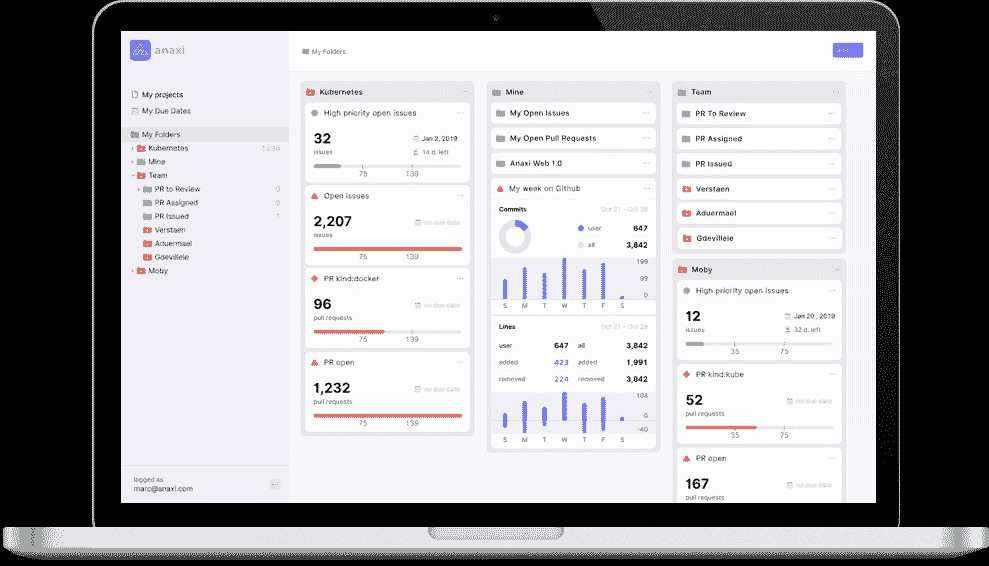

# Anaxi 为 DevOps 提供项目管理应用

> 原文：<https://devops.com/anaxi-delivers-project-management-app-for-devops/>

专为 DevOps 团队设计的项目管理软件提供商 Anaxi 已经[发布了其 web 应用程序](https://www.producthunt.com/posts/anaxi-web-app)。该网络应用程序补充了现有的 iPhone 应用程序，而该公司的项目管理应用程序的 Android 版本仍在开发中。

公司首席执行官 Marc Verstaen 表示，随着 DevOps 围绕多个存储库发展，IT 组织发现跟踪他们在哪些应用程序中使用的项目代码具有挑战性。Anaxi 的设计目的不仅是让浏览存储库变得更简单，还可以应用分析来跟踪单个开发人员的工作效率和团队绩效。例如，项目经理现在可以每周根据添加和删除的代码、重构和代码变动来分析工作。

Verstaen 说，有了这种智能，IT 运营团队将能够更好地根据组成应用程序的各种组件之间存在的依赖关系来优先考虑开发计划。随着组织越来越多地从构建单一应用转向更复杂的微服务架构，这些依赖的数量预计只会增加，微服务架构有望使整体业务更加敏捷。

GitHub 等存储库的基本项目管理问题是，没有办法对所有以文本形式输入的项目标签进行分类。Verstaen 说，这使得很难监控和跟踪与特定标签相关的所有任务，甚至很难从一个任务浏览到下一个任务。通过 Anaxi，项目经理可以编辑他们的问题和拉请求，然后这些请求被同步回他们的 GitHub 和吉拉项目。

尚不清楚缺乏复杂的项目管理工具在多大程度上阻碍了 DevOps 在企业中的采用。应用程序开发的遗留方法为项目经理提供了丰富的应用程序组合，这可能会使他们偏向于一种风格的应用程序开发而不是另一种。但是考虑到组织现在面临的变得更加敏捷的压力，项目经理需要与 IT 组织的其他部分一起发展。

用不了多久，许多组织也会发现他们自己试图管理跨越多个存储库的项目。开发团队偏爱一个存储库胜过另一个并不罕见。标准化一个存储库是首选，但是并不是每个项目经理都有政治资本在他们的组织内部强制这样的决定。许多项目现在还跨越多个公司，每个公司都有自己的存储库，项目经理可能会发现自己不得不导航。

与此同时，企业领导明确表示，只要应用程序有望产生收入或改善整体客户体验，他们就希望对应用程序的开发速度有更多的了解。事实上，能够确保项目在规定范围内持续按时交付的项目经理总是被认为是最有价值的员工。

— [迈克·维扎德](https://devops.com/author/mike-vizard/)