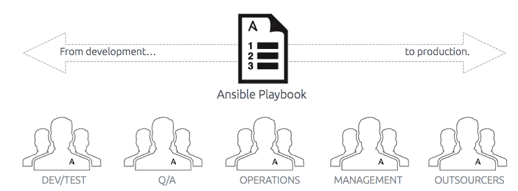
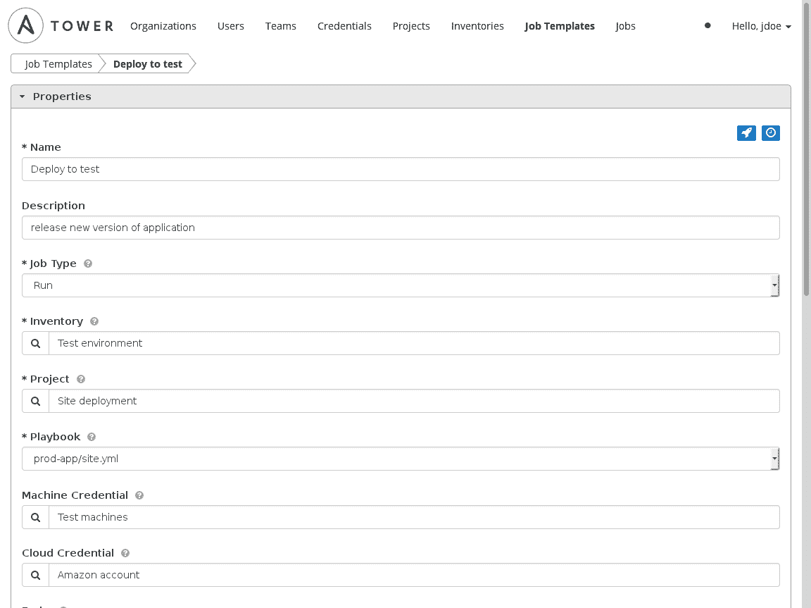
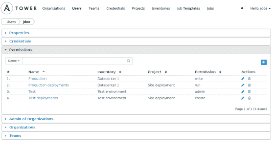

# 软件开发生命周期中的一座高塔

> 原文：<https://devops.com/ansible-tower-in-the-software-development-lifecycle/>

Ansible Tower 的使用方式多种多样，从传统的配置管理到定制应用程序部署，再到零停机滚动更新的编排。像 Gawker Media 这样的公司每小时使用 Ansible 部署他们的网站超过 10 次。美国宇航局使用 Ansible 更新安全漏洞，并修补管理 nasa.gov 周刊。通过 web 交付应用程序赚钱的企业发现 Ansible Tower 在消除 IT 瓶颈、自动化重复性任务和加速应用程序上市方面表现出色。

对于 IT 运营而言，零停机滚动更新是一种非常常见的编排模式，我们已经在[详细讨论过](https://docs.ansible.com/guide_rolling_upgrade.html)，但是让我们来看看 Ansible Tower 如何更早地融入[软件开发生命周期](https://en.wikipedia.org/wiki/Systems_development_life_cycle)，并消除运营、开发和测试中的瓶颈。

Ansible Tower 在 SDLC 中提供了许多优势，特别是:

*   推动环境之间的一致性
*   启用自助服务
*   改进自动化测试

**开发**

应用程序开发人员生活中典型的一天可能是:签出代码、做出更改、本地测试、签入更改。

在这项工作的过程中，开发环境可能会受到小的配置调整和手工制作的软件堆栈的影响，这些软件堆栈与生产代码最终部署到的环境有很大的不同。

事实上，许多组织中的一个常见问题是，开发环境可能与 QA、阶段和发布中的环境不完全匹配。一般来说，离生产越远，环境看起来越不一样。(不仅仅是像软件库版本这样明显的例子，还有像配置设置、认证细节等更微妙的项目。).

代码和支持应用程序的软件堆栈之间的不一致是软件错误和导致生产停机的常见原因。使用 Ansible，行动手册可以捕获堆栈甚至整个环境的理想状态。Ansible Tower 提供了一个按钮式界面，该界面模板化了行动手册的运行方式——一致且可重复地部署。

使用 Ansible Tower，可以从作业模板运行剧本，该模板指定了如何运行剧本的参数和环境细节，以及通常通过 Ansible 命令行传递的所有参数和选项。因为模板是通过按下按钮(或 API)来触发的，所以不必担心用户将选项或参数错误地键入 Ansible，潜在地部署到错误的环境或使用错误的剧本参数。)

这些模板不仅推动了部署之间的一致性——每次按下按钮都会得到相同的结果——而且它们还鼓励了大量的剧本重用:可以创建多个作业模板，以不同的参数启动相同的剧本。这使得同一个剧本可以在不同的环境或不同的发布阶段中使用。作业模板可以使用相同的剧本，但是针对不同的库存(对应于不同的发布阶段或不同的环境)，传递不同的选项，甚至使用不同的凭证。

通过确保在每个阶段之间遵循相同的步骤来自动化配置和部署，这推动了版本之间的一致性，甚至跨不同阶段。

Screenshot of how to use different job templates with the same playbook, passing different parameters from the user to deploy into different environments

当与 Ansible Tower 的基于角色的访问控制功能相结合时，只需按一下按钮，就可以部署行动手册，而且是以一种受控且易于审核的方式。这允许一个组织将 Ansible 的能力传播给它的任何用户。即使不熟悉 Ansible 的用户也可以运行其他人编写的剧本。

这些特性通常用于由开发人员自己实现开发环境的自助供应。

通常，开发人员手动构建一个开发环境，该环境开始时只是松散地耦合到生产软件堆栈，并且随着时间的推移越来越远。或者，开发人员被迫向运营团队请求新的开发环境，这通常会导致在整个软件开发生命周期中不断增加的延迟，并导致延迟部署、错过最后期限和丢失业务。

Tower 使开发人员能够检查和配置他们自己的开发环境，从头开始构建，与测试、试运行和生产中使用的软件堆栈 100%一致，因为它是用相同的剧本构建的。开发人员登录 Ansible Tower，在 RBAC 下，只能看到他们有权访问和部署的作业模板。

  开发者不需要任何 Ansible 或剧本的知识。他们可以提供新的参数和选项，指定可能要部署的应用程序的发布标签，或者微调部署以适应环境的约束。行动手册处理新服务器的供应(例如，通过调用 VMware 或 Amazon Web Services)、软件堆栈的部署和配置以及开发中的实际应用。开发人员按下 Ansible Tower 中的几个按钮，去喝杯咖啡，然后返回到一个新的 100%供应的环境。拆除和重新配置轻而易举，因此可以随时部署全新开发的新环境。

**QA**

QA 的一天可能是这样的:编写一个 CI 工具，定期自动构建代码库，部署到测试环境，运行测试，报告结果。

在大多数商店中，一些工作通常是自动化的，通常是构建最新的代码并将最新的代码工件部署到测试中。应用程序堆栈的部署可能不是自动化的(或者不容易在测试周期之间刷新)，导致与开发中相同的一致性问题，或者更糟，因为测试环境和工件可能在测试周期之间被重用。同样，通过 Ansible Tower 作业模板在环境之间重用剧本将促进发布阶段之间的一致性。

此外，可以提供给开发人员的相同 Ansible Tower 自助服务功能也可以提供给测试人员。QA 可以为自动化测试编写他们自己的行动手册，Ansible Tower 可以用来将责任委托给 QA 人员，他们不是 Ansible 专家或者不习惯在命令行上运行 Ansible。

除了自助服务之外，在 QA 中结合使用 Ansible Tower 和持续集成系统不仅可以自动执行测试中的应用程序部署，还可以自动提供应用程序堆栈，以在测试之间刷新测试环境，这是非常常见的。通过这种方式，Ansible Tower 提供了一个完整的 RESTful API，该 API 为 Ansible Tower 用户界面提供了支持，并使得以编程方式调用 Ansible Tower 来执行任何可以通过在 UI 中点击来执行的功能成为可能。这样，像 Jenkins 这样的 CI 工具可以连接到 Tower 来启动自动化测试的作业模板。Jenkins 被配置为调用 Ansible Tower API 来启动特定的作业模板，该作业模板调用 Ansible 剧本来供应新的 QA 环境、部署和配置适当的软件栈、应用的正确版本以及测试套件。可以在一次或多次行动手册运行中执行自动化测试和环境退役。

就像在开发中一样，这确保了测试环境与所有发布阶段一致——测试的内容与开发的内容以及部署到生产中的内容相同。测试环境可以从零开始 100%地快速配置和部署，从而提高您的测试能力，并加快应用程序的生产交付。

当与像 Jenkins 这样的 CI 工具结合使用时，这种组合比单独使用 CI 工具更强大:Jenkins 可以启动 Ansible playbooks 来配置环境和部署最新代码，作为任何 Jenkins CI 作业的一部分，但是是在 Ansible Tower 提供的基于角色的访问控制、库存管理和汇总作业输出的框架下。

当您在运营中采用 Ansible Tower 时，也要考虑 Ansible 和 Ansible Tower 在整个软件开发生命周期中的好处。应用自动化来消除每个发布阶段的瓶颈，并加速应用程序的上市。

让我知道你是如何在工作中使用 Ansible Tower 的——我们需要你的意见！

有关更多信息，请查看以下资源:

*   [http://www.ansible.com/continuous-delivery](https://www.ansible.com/continuous-delivery)
*   [http://docs.ansible.com/guide_rolling_upgrade.html](https://docs.ansible.com/guide_rolling_upgrade.html)

***作者简介/戴夫·约翰逊***

 Dave Johnson，Ansible 高级技术总监。Dave 在 Red Hat 上市前开始了他的职业生涯，最终建立并领导了渗透到美国石油天然气、电子设计自动化和托管服务提供商市场的销售工程组织。在加入 AnsibleWorks 之前，Dave 曾在 rPath 和 Bronto Software 担任管理职位，领导工程和服务组织，引领创新的定制解决方案向可重复产品的转变。Dave 拥有北卡罗来纳州立大学的电气工程学士学位和计算机工程学士学位。联系方式: [@thisdavejohnson](https://twitter.com/thisdavejohnson) ， [Linkedin](https://www.linkedin.com/in/thisdavejohnson)