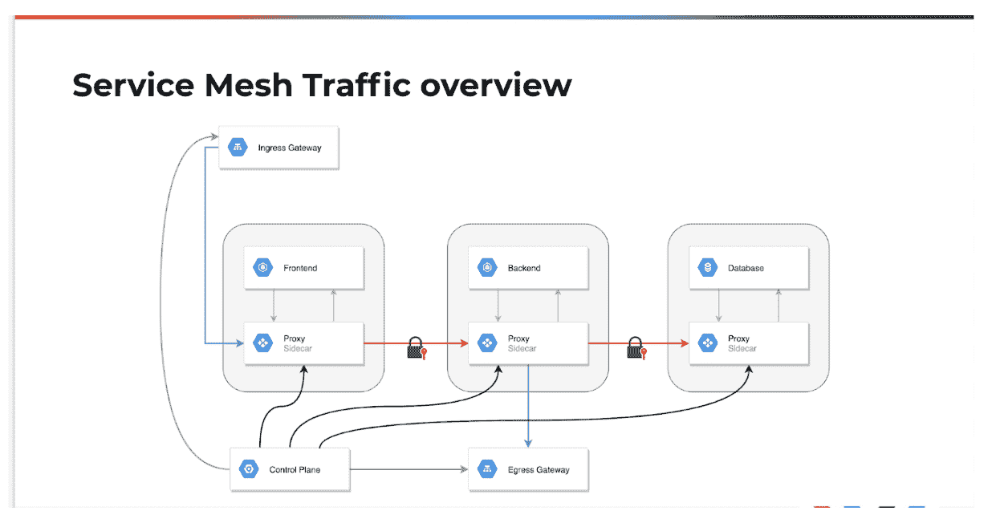
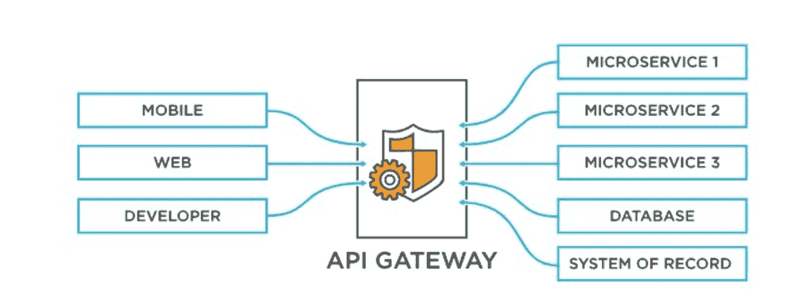

# API 网关与服务网格:有什么区别？

> 原文：<https://devops.com/api-gateway-vs-service-mesh-whats-the-difference/>

在一般的微服务架构中，应用程序用调用堆栈提供的稳定性和刚性来换取网络的灵活性。因此，以前不存在的延迟、安全性和可跟踪性问题变成了服务呼叫关注的问题。

服务网格是消除这些问题的最终解决方案，使开发人员能够专注于更重要的业务解决方案。警告是服务网格和 API 网关之间存在功能重叠。虽然两者相似，但两种选择之间也有关键的差异。以下是你需要知道的。

## 定义服务网格

服务网格是一个全面的架构模式集，旨在处理不稳定性、调试和安全性等企业问题。当团队从调用堆栈转移到网络调用时，就会出现这些问题。

例如，通过调用栈的函数调用识别所请求函数的持续可用性。另一方面，网络呼叫不提供这种功能。

[服务网格是优选选项](https://containerjournal.com/editorial-calendar/kubernetes-in-the-enterprise/when-is-service-mesh-worth-it/) ，因为它协助系统的客户端端点管理网络不稳定性。解决这种网络不稳定性的主要方法是从客户端应用程序的角度透明地提前运行重试。

服务网格还通过将传入请求重新路由到能够最好地处理传入请求的服务器节点来协助服务器的端点。服务器节点的选择是先前确定的用于路由输入流量的策略的功能。

理想的服务网格安装有两层:控制平面和数据平面。后者是任何连接的服务器和客户端端点的代理。

数据平面还执行前者的策略，同时向监控工具运行操作指标。相反，控制平面层在数据平面运行的同时管理所有相关的服务策略。

[图片来源](https://www.weave.works/blog/introduction-to-service-meshes-on-kubernetes-and-progressive-delivery)

## 服务网格的关键特征

平均服务网格有许多主要特征。

但是有几件事值得一提。假设您的应用程序开发团队正在开发一个 [小型商务电话系统](https://www.dialpad.com/blog/best-small-business-phone-systems/) 。这个特定的服务实现不需要下面列出的所有特性。这取决于你的团队的具体需求和交通设置。

### 交通路线

该特征使得服务网格能够基于预设配置或预定策略来路由请求。系统可以区分来自特定客户端应用的流量的优先级。或者，服务网格可以将流量重新路由到不同的服务版本:

*   A/B 测试
*   金丝雀释放
*   服务版本

### 可观察性

服务网格实现以代理为特征，这些代理记录单个客户端和服务的服务调用。这个特性减轻了开发人员手动处理呼叫记录过程的负担。

另外，团队可以利用下游分析和监控工具来报告系统可用性和整体性能。这些监控工具还为所有调用链的基本跟踪提供了一个框架。

服务网格的[可观察性](https://devops.com/?s=observability)能力超出了上述范围。例如，一些编码工作可以让开发人员改进调用链监控，以允许对企业业务事务的准确跟踪。

常见的服务网格可观察性特征包括:

*   延迟、错误率和吞吐量警报
*   描述单个服务之间联系的按需服务仪表盘和图表
*   通过服务网格跟踪业务交易或请求的过程

[图片来源](https://www.wallarm.com/what/what-is-service-mesh)

### 安全策略

具有多个独立服务的应用程序具有巨大的攻击面。本质上，每个独立的服务都是需要保护的易受攻击的入口点。服务网格在服务器和客户端端点上都有代理，以保护两个终端之间的任何通信。

服务网格还通过消除对开发人员手动将安全性编程到每个服务中的依赖来提高安全性。相反，服务器代理将为每个独立的服务处理授权、认证和加密。最终的结果是一个零信任安全的 T2 框架。

### 身份

服务网格管理谁可以访问单独的服务。它还维护访问每项服务的利益相关者的实时日志，以及他们何时访问的。该系统通过 JSON Web 令牌(jwt)验证身份，同时允许根据请求服务和涉众进行授权。

### 加密

合规性、安全性和数据保护是关键考虑因素 。服务网格中所有服务之间的通信都是完全加密的。控制平面负责证书管理功能，包括证书轮换和生成。

此外，服务网格使用相互 TLS，其中服务器和客户端端点都将可以在任何连接的另一端操作的证书列入白名单。服务网格提供强大的相互 TLS 认证，允许无缝的系统认证和加密。

### 弹性

该特性定义了服务网格在主要服务功能离线的情况下隔离开发人员的能力。在某些情况下，代理可以遵循替代服务路径或切换到备份框架。

举例来说，流媒体巨头网飞有一个个性化的用户推荐功能，向用户推荐标题。如果该服务离线，服务网格系统可以确保切换到零个性化的默认推荐特征。只有当备份失败时，系统才会返回错误代码。

服务网格向开发人员保证，当服务失败时，代理已经尽了最大努力来管理通信错误。在某些情况下，网状网络可以通过切换到具有最低延迟的不同服务来确保最佳性能。

服务网格的可配置弹性模式的示例包括

*   断路器模式
*   速率限制
*   重试策略

服务网格弹性的另一个例子是构建[混沌工程](https://devops.com/?s=chaos+engineering)能力的能力。服务网格可以将自身注入网络中的端点，提供监控混沌测试所需的可观察性。

[图片来源](https://www.devopsuniversity.org/api-gateway-vs-service-mesh/)

## API 网关需要什么

无论团队是在开发 [小型企业合同管理软件](https://www.pandadoc.com/blog/best-contract-management-software/) 还是费用计算器应用程序，API 的选择都可以决定团队应用程序开发的结果。但是除了选择 API 之外，适当的管理是另一个关键的话题。最好的结果来自于一个识别来电的系统，将它们引导到适当的资源。

API gateway i 是 DevOps 的 [未来，是满足该需求的 解决方案。它是将 API 客户端调用路由到理想应用程序的技术框架。它还处理调用，将结果响应转发到客户端的网络。](https://containerjournal.com/features/how-can-containers-help-you-use-microservices-in-devops/)

在技术层面，API 网关并不是必须的。找一个有 [数字名片](https://www.beaconstac.com/digital-business-card/with-qr-code/) 的开发者，雇佣他们，他们随时可以编写一个负责呼叫请求路由的嵌入式代码。对这种替代方案的唯一警告是为各个呼叫请求编程和插入代码所需的人力和资源。因此，最好有一个 API 网关来处理这个任务。

API 网关是一种更具创新性的解决方案，因为大量的编码总是存在风险和错误的可能性。此外，这些错误会使应用程序开发阶段变得复杂，如维护、错误修复和应用程序测试。

API 网关确保所有 API 请求以零分流的方式到达预期目的地。此外，它还提供了以下附加功能:

*   API 请求监控
*   在各个节点之间转移 API 请求
*   请求平衡多个实例的情况

## API 网关和服务网格之间的主要区别

区分两种框架的一个重要的 [数字工作场所定义](https://www.make.com/en/product) 就是放置位置。API 网关必须存在于面向公众的系统中。API 网关和服务网格不同的其他关键领域包括:

### 可观察性

观察普通 API 网关的性能是一项更具体的任务。该框架可以提供可操作的数据洞察，如 API 响应请求需要多长时间、有问题的功能及其对网络流量的影响。

有了服务网格，发现性能问题的能力是必然的。然而，系统无法确定性能滞后对最终用户响应和体验的任何影响。因此，尽管故障排除很容易，但衡量问题的影响程度却很复杂。

### 他们处理的通信

两个框架管理不同的沟通节点——一个处理内部讨论，另一个处理外部讨论。API 网关是负责路由外部通信的组件。例如，API 网关处理聊天机器人连接、购买订单和对特定页面的访问。

相反，服务网格负责系统中的内部通信。举例来说，同一个应用环境下的多个微服务之间的讨论将属于服务网格的范围。

换句话说，API 网关管理客户端-服务器的讨论。同时，服务到服务的通信是针对服务网格的。

### 管理

这两个框架可能有一些重叠的地方，但是它们所需要的管理并不相同。API 网关更易于管理和开发。因此，应用程序开发团队更容易管理它们。

无论服务应用程序如何，API 网关的部署只需进行一次。此外，部署后的集中化和监控也很容易。

相比之下，服务网格的管理更加复杂和繁琐。您的应用程序开发团队必须为单个应用程序系统部署服务网格功能。

### 兼容工具

大多数 API 网关工具和软件资源都非常昂贵。此外，它们兼容所有流行的应用架构。

等式的另一端提供了更多的可访问性。有数不清的服务网格工具和各种功能的资源。另外，这些支持工具大部分都是零成本的，因为它们是开源的。比如有特使 [Istio](https://containerjournal.com/features/google-petitions-to-donate-istio-service-mesh-to-cncf/) ，都是免费开源的。

然而，你不应该期望享受这些服务网格工具的跨平台兼容性。比如 Istio 只兼容谷歌。另一方面，另一个服务网格工具 AWS App Mesh 与 AWS Cloud 兼容。

[图片来源](https://itnext.io/api-management-and-service-mesh-e7f0e686090e)

| 差异 | API 网关 | 服务网格 |
| 现有功能 | 

*   Useful for API requests between client and server
*   Compatible with external API requests and internal calls.

 | 

*   Handle internal communication
*   is most suitable for improving the portability of service to service call

 |
| 数字转换功能 | 

*   Longer app delivery cycle
*   Zero security risk

 | 

*   Useful for effective microservice management
*   Accelerate the delivery cycle of the network
*   Security risks caused by opening vulnerabilities when the program runs alone

 |
| 操作 | 重新路由给定应用环境之外的 API 调用 | 在应用架构内工作 |
| 成熟度等级 | API 网关是成熟的技术。它已经成为核心开发工具好几年了 | 服务网格仍然是一项相对较新的技术，需要更多的研究和开发 |
| 安全处理 | 自动安全协议 | 手动安全系统 |
| 使用复杂度 | 应用程序复杂性保持不变，端点保持不变 | 业务可扩展性可能非常复杂，因为每次更新都会带来新的端点 |
|  |  |  |

## 服务网格和 API 网关可以一起使用吗？

最不可能的品牌往往形成 [的营销合作关系](https://affise.com/blog/partner-marketing-guide/) 。同样，在有些情况下，同时使用服务网格和 API 网关是一种合理可行的想法。

虽然 API 网关和服务网格之间存在差异，但这不是“非此即彼”的情况。

[云联络中心](https://www.dialpad.com/products/cloud-contact-center/) 寻求简化内部和外部沟通的团队已经在利用这两种技术。您还可以利用这两个系统来实现以下目标:

### 改进创新

有效的 API 使用，尤其是在外部交互过程中，需要内部资源优化，当团队在 API 网关旁边部署服务网格时，内部资源优化会更好。

[图片来源](https://www.aver.com/AVerExpert/what-is-accelerated-digital-transformation)

### 加速数字化转型

利用这两种资源提高企业的[数字化转型](https://digitalcxo.com)速度。此外，任何采用这两种技术的应用程序都将享受到统一的 API 网关，用于内部服务网格管理。如果有任何关联的应用程序，统一的 API 会使它们更容易处理。

### 增强的安全可扩展性

可扩展 [容器安全性](https://containerjournal.com/features/5-tricky-container-security-challenges/) 当您一起部署服务网格和 API 网关时，是可以实现的。服务机制将增强系统的服务间连接，而 API 网关充当所有客户端-服务器请求的中心点。

API 网关还为增强代理安全性提供了急需的技术支持。它还促进了代理级别的快速威胁检测和解决。

## API 网关和服务网格是不同的

API 网关和服务网格都旨在简化沟通，同时减少应用开发团队的任何编码责任。虽然这两个系统都可以确保网络呼叫通过 [企业联络中心](https://www.dialpad.com/products/enterprise-call-center-software/) 到达目标目的地，但它们在结构上是不同的。

上面，我们已经强调了两个框架之间的主要区别。尽管存在这些差异，但这两个系统是兼容的，可以协同工作来改进应用程序开发。我们建议同时利用服务网格和 API 网关，以获得更好的安全性、创新性和应用可扩展性。