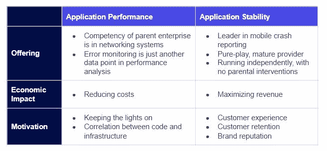
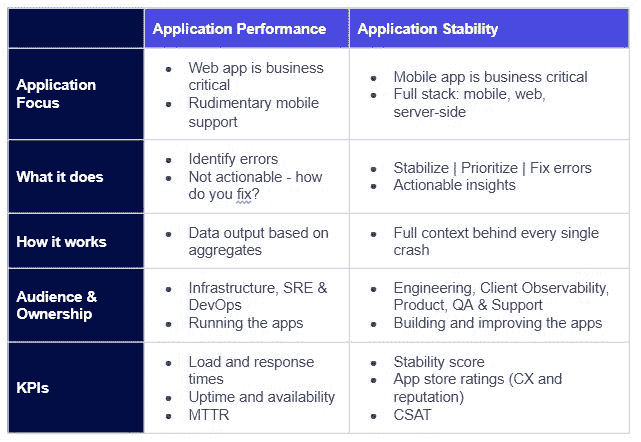

# APM 和应用程序稳定性:两条监控路径合并和分叉的地方

> 原文：<https://devops.com/apm-and-application-stability-where-two-monitoring-roads-merge-and-diverge/>

在软件开发中，应用性能管理(APM)是这个房间里的成年人之一。APM 不仅已经存在了很长时间，而且它的解决方案已经发展了好几代，使其成为更成熟的产品类别之一。

当你考虑到 APM 的基本目的时，它的长寿是完全有意义的，它为组织提供了一种理解其软件性能特征的方法。当应用程序运行缓慢或表现不佳时，通过提醒基础架构团队来实现价值，APM 拥有丰富的经验来做好这项工作。

如果 APM 是软件开发中的老古董之一，那么应用程序稳定性就是城里的新成员。随着移动应用和迭代开发版本的兴起，应用稳定性以一种新的方式满足了监控应用的广泛需求，将重点从服务器和网络转移到客户体验。

应用程序稳定性的出现让 APM 的铁杆粉丝们有些惊慌失措。然而，这两种解决方案体现了非常不同的监控重点，这使我相信这两种工具都有用武之地，而且两者都有不同的团队。

## **APM:基础设施和开发运维团队的引擎**

在云出现之前，组织提供自己的物理硬件，并监控 RAM、磁盘空间、CPU 和内存等组件。如果你用完了这些资源，你就完了。

这就是 APM 的魅力所在:它使运行应用程序的人能够预测他们何时需要更多的资源。

当然，今天的基础设施不是监控物理机器，而是由 SRE 和 DevOps 团队监控云实例。跑到百思买买新硬件的日子已经一去不复返了。取而代之的是，一个简单的新实例请求被提交给一个云提供商，并获得即时访问。

有些人担心 APM 会过时，但云并没有让 APM 过时，而是为继续依赖这一工具提供了两个很好的理由。

1.  **应用程序可能是资源消耗者** :云实例只是其他人电脑的一部分，这意味着你仍然需要知道你何时会耗尽这个虚拟机上的资源。事实上，现在需要格外小心，因为你可能会更快地用完空间。
2.  **钱还是不会长在树上** :对无限云资源的轻松访问意味着软件公司可能会养成把钱砸在问题上的习惯，而不是想出如何通过提高效率来精简使用和成本。如果公司在没有彻底考虑成本和需求的情况下不断增加云实例，最终可能会支付大量资金来运行应用程序。

这就是 APM 介入的地方。其主要目的是帮助基础设施团队制定容量规划。有了云，问题转变为包括:

*   我如何更好地管理我的云实例并优化使用？
*   如何确保我不会给云提供商太多的钱？
*   我们如何调整和优化云以降低成本？

这些都是 APM 做得非常好的事情。APM 会告诉您，无论何时您需要找出如何优化您当前的资源，或者何时购买新的服务器或云实例。这些信息对于运行应用程序的人员，即基础设施或 DevOps 团队来说是非常宝贵的。

## **应用稳定性:工程队轮胎与路面相遇的地方**

现在，说实话，当运行应用程序的人同时也是构建应用程序的人时，APM 并没有最强的表现。这正是移动开发和迭代编码所呈现的场景。

现在，软件每天都会被推送到网上，而移动应用往往会有一周或两周的发布周期，而不是经历漫长的开发周期。在敏捷软件开发中，这种发布速度不仅受到鼓励，而且是意料之中的。

这意味着构建和运行应用之间的鸿沟已经缩小，尤其是移动应用。通常，构建应用程序的人就是发布应用程序的人。没有差距。而且，有了移动设备，公司不再需要担心昂贵的物理硬件，而是担心最终用户体验。顾客成为焦点。

不幸的是，APM 在帮助你做到这一点方面可能有点太固定了。但这不是 APM 的错。这些要求并不是 APM 天生要做的。它在检测问题和警告基础设施团队方面非常出色，这样他们就可以将问题抛给开发团队。然而，它的核心优势并不是提供如何修复问题的信息，因为它不是为开发人员而设计的。

试图重构 APM 来帮助解决稳定性和错误问题就像当你的轮胎漏气时调整你的引擎一样。它们是汽车上完全独立的部件，用于不同的目的。你可以随心所欲地调整引擎，但它不会让汽车动起来，除非你专注于为什么轮胎里没有空气。

在当今的迭代世界中，开发团队更加关心应用程序如何运行。有修复可操作项目的需求。开发人员想知道到底出了什么问题，现在要修复什么，什么可以等一等。简而言之，开发人员想要错误的聚合和自动化。他们想知道，“我们是建造还是修复？”

构建新功能与修复缺陷之间的权衡是采用应用程序稳定性管理工具背后的关键因素之一。开发者需要几个问题的答案:

*   代码中的错误在哪里？
*   我们如何尽快找到并修复这些漏洞？
*   我们如何将修复 bug 与我们一周的计划联系起来？

无论是冲刺跑还是敏捷地构建，开发工作都是提前计划好的。开发人员想弄清楚 sprint 中会包含多少新功能，以及需要修复多少 bug。他们需要一个工具来帮助他们自动回答这个问题。

## **应用稳定性的优势**

应用程序稳定性的美妙之处在于它汇集了 APM 捕获的错误，使开发人员一眼就能看出哪些错误值得修复。结果，产生了五个主要的好处。

1.  提高效率 :公司消除了基础设施团队将问题抛给开发团队的问题。节省了宝贵的时间，因为应用程序稳定性工具消除了两个团队之间的电话游戏，并将错误直接交付给将修复它们的团队。
2.  **更强的 CSAT** :当写代码的人修复代码时，修复 bug 的时间急剧下降。有了来自应用程序稳定性工具的诊断信息，软件工程师天生就知道代码做什么，bug 意味着什么以及如何修复它。更快地解决影响最终用户体验的错误意味着客户满意度(CSAT)不太可能下降。
3.  **错误优先级** :应用程序稳定性工具根据根本原因对错误进行分组，让开发人员一眼就能看出问题的严重性。当开发人员可以看到哪些错误代价最大，哪些错误影响了大多数客户，以及哪些错误影响了关键客户时，确定首先修复什么就容易多了。
4.  **工具同步** :更进一步，应用程序稳定性工具被捆绑到项目管理套件中。bug 直接映射到在吉拉(或任何使用的工具)中创建的票据，票据会随着优先级的改变而自动更新。
5.  **发布版本的稳定性分数** :应用程序稳定性使产品和开发团队能够看到发布版本的稳定性分数。由于多个应用程序版本同时存在是很常见的，尤其是移动应用程序(DevOps 并不真正参与其中)，公司不能依赖单一的稳定性分数。团队需要通过发布看到稳定性，这样就能清楚地知道错误在哪里，以及它们对用户有什么影响。

## 您的开发团队中有百分之多少的人登录过您的 APM？

经常有人问我是否认为应用程序稳定性会取代 APM，我的回答很简单:不，我认为不会。APM 仍然是开发软件的一个重要部分，组织仍然需要了解他们什么时候会耗尽资源，什么时候会出现糟糕的性能。

相反，我认为这两种解决方案作为相邻的类别共存，但帮助不同的团队。应用程序稳定性为开发人员提供优先的错误以供修复，而 APM 能够很好地帮助运营团队对高错误率发出警告并减少云支出。

你们中的一些人可能会对自己说，“嗯，我的 APM 产品在应用程序稳定性方面做了你所描述的事情，所以我确信我的开发人员可以很好地使用它。” 对此我准备了以下挑战:你的开发团队中有百分之多少的人登录了你的 APM？每天登录的百分比是多少？如果他们真的使用它，你的开发者喜欢它吗？

这些问题的答案可能会让你吃惊。毕竟， [APM](https://devops.com/cloud-confessions-full-stack-apm-is-a-necessity/) 并不是真正为开发者或者让最终用户满意而构建的。相比之下，应用程序稳定性诞生于客户层，专门用于监控前端，并确保 web 和移动应用程序的强大客户体验。

一旦你有机会听到你的开发团队的消息，如果你发现他们对镇上的新成员非常兴奋，我不会感到惊讶。

— [詹姆斯·史密斯](https://devops.com/author/james-smith/)